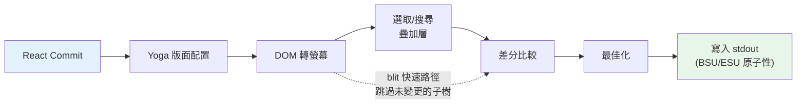
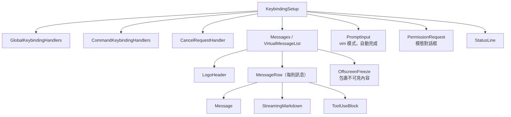

# 第十三章：終端 UI

## 為什麼要打造自訂渲染器？

終端不是瀏覽器。沒有 DOM，沒有 CSS 引擎，沒有合成器，沒有保留模式的圖形管線。只有一串位元組流向 stdout，以及一串位元組來自 stdin。這兩個串流之間的一切——版面配置、樣式、差分比較、命中測試、捲動、選取——都必須從零開始自行實作。

Claude Code 需要一個響應式 UI。它有提示輸入、串流 markdown 輸出、權限對話框、進度旋轉器、可捲動的訊息列表、搜尋高亮，以及 vim 模式編輯器。React 是宣告這類元件樹的顯然選擇。但 React 需要一個宿主環境來渲染，而終端並不提供這樣的環境。

Ink 是標準答案：一個基於 Yoga flexbox 版面配置的終端 React 渲染器。Claude Code 從 Ink 開始，然後將其 fork 得面目全非。原版每幀每格分配一個 JavaScript 物件——在 200x120 的終端上，這意味著每 16ms 建立並回收 24,000 個物件。它在字串層級進行差分比較，逐行比較 ANSI 編碼文字。它沒有 blit 最佳化的概念，沒有雙緩衝，沒有格級別的髒追蹤。對於每秒刷新一次的簡單 CLI 儀表板，這沒問題。但對於在使用者捲動包含數百則訊息的對話時、以 60fps 串流 token 的 LLM agent，這是行不通的。

Claude Code 中留下的是一個自訂渲染引擎，它共享 Ink 的概念基因——React reconciler、Yoga 版面配置、ANSI 輸出——但重新實作了關鍵路徑：緊湊的 typed array 取代逐格物件，基於池的字串內化取代逐幀字串，帶格級差分的雙緩衝渲染，以及一個將相鄰終端寫入合併為最少 escape sequence 的最佳化器。

結果是在 200 欄終端上以 60fps 從 Claude 串流 token 時仍能流暢運行。要理解其中原理，我們需要檢視四個層次：React 進行 reconcile 的自訂 DOM、將該 DOM 轉換為終端輸出的渲染管線、讓系統在數小時 session 中不因垃圾回收而崩潰的基於池的記憶體管理，以及將所有這些串連起來的元件架構。

---

## 自訂 DOM

React 的 reconciler 需要一個可以 reconcile 的目標。在瀏覽器中，那是 DOM。在 Claude Code 的終端中，它是一個自訂的記憶體內樹，有七種元素類型和一種文字節點類型。

元素類型直接映射到終端渲染概念：

- **`ink-root`** -- 文件根節點，每個 Ink 實例一個
- **`ink-box`** -- flexbox 容器，終端等效的 `<div>`
- **`ink-text`** -- 帶有 Yoga 測量函式的文字節點，用於自動換行
- **`ink-virtual-text`** -- 另一個文字節點內的嵌套樣式文字（當在文字上下文中時自動從 `ink-text` 晉升）
- **`ink-link`** -- 超連結，透過 OSC 8 escape sequence 渲染
- **`ink-progress`** -- 進度指示器
- **`ink-raw-ansi`** -- 已知尺寸的預渲染 ANSI 內容，用於語法高亮的程式碼區塊

每個 `DOMElement` 攜帶渲染管線所需的狀態：

```typescript
// 示意性的 -- 實際介面顯著擴展了這部分
interface DOMElement {
  yogaNode: YogaNode;           // Flexbox 版面配置節點
  style: Styles;                // 類 CSS 屬性，映射到 Yoga
  attributes: Map<string, DOMNodeAttribute>;
  childNodes: (DOMElement | TextNode)[];
  dirty: boolean;               // 需要重新渲染
  _eventHandlers: EventHandlerMap; // 與 attributes 分離
  scrollTop: number;            // 命令式捲動狀態
  pendingScrollDelta: number;
  stickyScroll: boolean;
  debugOwnerChain?: string;     // 用於除錯的 React 元件堆疊
}
```

`_eventHandlers` 與 `attributes` 的分離是刻意的。在 React 中，除非手動 memoize，否則每次渲染時處理器身份都會改變。如果處理器儲存為 attributes，每次渲染都會將節點標記為 dirty 並觸發完整重繪。透過將它們分開儲存，reconciler 的 `commitUpdate` 可以在不標記節點為 dirty 的情況下更新處理器。

`markDirty()` 函式是 DOM 變更與渲染管線之間的橋樑。當任何節點的內容改變時，`markDirty()` 沿所有祖先節點向上遍歷，對每個元素設置 `dirty = true`，並在葉子文字節點上呼叫 `yogaNode.markDirty()`。這就是深度嵌套文字節點中的單個字元變更如何排程對根節點整條路徑的重新渲染——但只有那條路徑。兄弟子樹保持乾淨，可以從上一幀 blit。

`ink-raw-ansi` 元素類型值得特別說明。當程式碼區塊已經過語法高亮（生成 ANSI escape sequence）時，重新解析這些 sequence 來提取字元和樣式是浪費的。相反，預高亮的內容被包裝在帶有 `rawWidth` 和 `rawHeight` attributes 的 `ink-raw-ansi` 節點中，告知 Yoga 確切的尺寸。渲染管線直接將原始 ANSI 內容寫入輸出緩衝區，而不將其分解為單個樣式字元。這使語法高亮的程式碼區塊在初次高亮後幾乎零成本——UI 中最昂貴的視覺元素也是渲染成本最低的。

`ink-text` 節點的測量函式值得理解，因為它在 Yoga 的版面配置過程中運行，這是同步且阻塞的。函式接收可用寬度，必須返回文字的尺寸。它執行自動換行（遵循 `wrap` 樣式屬性：`wrap`、`truncate`、`truncate-start`、`truncate-middle`），考慮字素群邊界（因此不會在多碼位 emoji 的中間換行），正確測量 CJK 雙寬字元（每個計為 2 欄），並從寬度計算中剝離 ANSI escape code（escape sequence 的視覺寬度為零）。這一切必須在每個節點的微秒內完成，因為有 50 個可見文字節點的對話意味著每次版面配置過程要呼叫 50 次測量函式。

---

## React Fiber 容器

reconciler 橋接使用 `react-reconciler` 建立自訂宿主配置。這與 React DOM 和 React Native 使用的 API 相同。主要區別：Claude Code 在 `ConcurrentRoot` 模式下運行。

```typescript
createContainer(rootNode, ConcurrentRoot, ...)
```

ConcurrentRoot 啟用 React 的並發特性——用於延遲載入語法高亮的 Suspense，以及用於串流時非阻塞狀態更新的 transitions。另一個選擇 `LegacyRoot` 將強制同步渲染，並在繁重的 markdown 重新解析時阻塞事件迴圈。

宿主配置方法將 React 操作映射到自訂 DOM：

- **`createInstance(type, props)`** 透過 `createNode()` 建立 `DOMElement`，應用初始樣式和 attributes，附加事件處理器，並捕獲 React 元件擁有者鏈以供除錯歸因。擁有者鏈儲存為 `debugOwnerChain`，在 `CLAUDE_CODE_DEBUG_REPAINTS` 模式下用於將全螢幕重置歸因到特定元件
- **`createTextInstance(text)`** 建立 `TextNode`——但只有在文字上下文中才行。reconciler 強制要求原始字串必須用 `<Text>` 包裝。在文字上下文外嘗試建立文字節點時會拋出異常，在 reconcile 時而非渲染時捕捉一類 bug
- **`commitUpdate(node, type, oldProps, newProps)`** 透過淺比較對舊和新 props 進行差分比較，然後只應用改變的部分。樣式、attributes 和事件處理器各有自己的更新路徑。如果沒有任何改變，差分函式返回 `undefined`，完全避免不必要的 DOM 變更
- **`removeChild(parent, child)`** 從樹中移除節點，遞迴釋放 Yoga 節點（在 `free()` 之前呼叫 `unsetMeasureFunc()` 以避免存取已釋放的 WASM 記憶體），並通知焦點管理器
- **`hideInstance(node)` / `unhideInstance(node)`** 切換 `isHidden` 並在 `Display.None` 和 `Display.Flex` 之間切換 Yoga 節點。這是 React 用於 Suspense fallback 過渡的機制
- **`resetAfterCommit(container)`** 是關鍵鉤子：它呼叫 `rootNode.onComputeLayout()` 來運行 Yoga，然後呼叫 `rootNode.onRender()` 來排程終端繪製

reconciler 每次 commit 週期追蹤兩個效能計數器：Yoga 版面配置時間（`lastYogaMs`）和總 commit 時間（`lastCommitMs`）。這些流入 Ink 類報告的 `FrameEvent`，在生產環境中啟用效能監控。

事件系統模仿瀏覽器的捕獲/冒泡模型。一個 `Dispatcher` 類實現了完整的事件傳播，有三個階段：捕獲（根到目標）、目標處，以及冒泡（目標到根）。事件類型映射到 React 排程優先順序——鍵盤和點擊的離散事件（最高優先順序，立即處理），捲動和調整大小的連續事件（可延遲）。dispatcher 將所有事件處理包裝在 `reconciler.discreteUpdates()` 中以正確的 React 批次處理。

當你在終端按下一個鍵時，產生的 `KeyboardEvent` 透過自訂 DOM 樹分發，從聚焦元素向上冒泡到根節點，就像鍵盤事件在瀏覽器 DOM 元素中冒泡一樣。路徑上的任何處理器都可以呼叫 `stopPropagation()` 或 `preventDefault()`，其語義與瀏覽器規範相同。

---

## 渲染管線

每一幀遍歷七個階段，每個階段單獨計時：



每個階段單獨計時，並在 `FrameEvent.phases` 中報告。這種逐階段的儀表化對於診斷效能問題至關重要：當一幀耗時 30ms 時，你需要知道瓶頸是在 Yoga 重新測量文字（第 2 階段）、渲染器遍歷大型 dirty 子樹（第 3 階段），還是來自慢速終端的 stdout 背壓（第 7 階段）。答案決定了修復方案。

**第 1 階段：React commit 和 Yoga 版面配置。** reconciler 處理狀態更新並呼叫 `resetAfterCommit`。這將根節點的寬度設置為 `terminalColumns` 並運行 `yogaNode.calculateLayout()`。Yoga 在一次遍歷中計算整個 flexbox 樹，遵循 CSS flexbox 規範：解析 flex-grow、flex-shrink、padding、margin、gap、對齊和換行。結果——`getComputedWidth()`、`getComputedHeight()`、`getComputedLeft()`、`getComputedTop()`——每個節點快取一次。對於 `ink-text` 節點，Yoga 在版面配置期間呼叫自訂測量函式（`measureTextNode`），透過自動換行和字素測量計算文字尺寸。這是最昂貴的逐節點操作：它必須處理 Unicode 字素群、CJK 雙寬字元、emoji 序列，以及嵌入在文字內容中的 ANSI escape code。

**第 2 階段：DOM 轉螢幕。** 渲染器以深度優先方式遍歷 DOM 樹，將字元和樣式寫入 `Screen` 緩衝區。每個字元成為一個緊湊的格。輸出是完整的一幀：終端上的每個格都有定義的字元、樣式和寬度。

**第 3 階段：疊加層。** 文字選取和搜尋高亮就地修改螢幕緩衝區，翻轉匹配格的樣式 ID。選取應用反色以建立熟悉的「高亮文字」外觀。搜尋高亮對當前匹配應用更積極的視覺處理：反色 + 黃色前景色 + 粗體 + 底線，對其他匹配僅應用反色。這污染了緩衝區——由 `prevFrameContaminated` 標誌追蹤，以便下一幀知道跳過 blit 快速路徑。這種污染是刻意的取捨：就地修改緩衝區避免了分配單獨的疊加緩衝區（在 200x120 終端上節省 48KB），代價是在疊加清除後有一個全損壞幀。

**第 4 階段：差分比較。** 新螢幕與前幀螢幕逐格比較。只有發生變化的格才產生輸出。比較是每格兩次整數比較（兩個緊湊的 `Int32` 字），差分遍歷損壞矩形而非整個螢幕。在穩態幀（只有旋轉器在計時）上，這可能只為 24,000 格中的 3 格產生補丁。每個補丁是一個包含游標移動序列和 ANSI 編碼格內容的 `{ type: 'stdout', content: string }` 物件。

**第 5 階段：最佳化。** 同一行上相鄰的補丁合併為單個寫入。消除冗餘的游標移動——如果補丁 N 在第 10 欄結束而補丁 N+1 在第 11 欄開始，游標已在正確位置，不需要移動序列。樣式轉換透過 `StylePool.transition()` 快取預先序列化，因此從「粗體紅色」改為「暗淡綠色」是單個快取字串查找，而非差分和序列化操作。最佳化器通常比逐格輸出減少 30-50% 的位元組數。

**第 6 階段：寫入。** 最佳化的補丁被序列化為 ANSI escape sequence，並在支援的終端上包裹在同步更新標記（BSU/ESU）中，以單個 `write()` 呼叫寫入 stdout。BSU（開始同步更新，`ESC [ ? 2026 h`）告知終端緩衝後續所有輸出，ESU（`ESC [ ? 2026 l`）告知其刷新。這在支援該協定的終端上消除了可見的撕裂——整幀原子性地出現。

每幀透過 `FrameEvent` 物件報告其時序分解：

```typescript
interface FrameEvent {
  durationMs: number;
  phases: {
    renderer: number;    // DOM 轉螢幕
    diff: number;        // 螢幕比較
    optimize: number;    // 補丁合併
    write: number;       // stdout 寫入
    yoga: number;        // 版面配置計算
  };
  yogaVisited: number;   // 遍歷的節點數
  yogaMeasured: number;  // 運行了 measure() 的節點數
  yogaCacheHits: number; // 有快取版面配置的節點數
  flickers: FlickerEvent[];  // 全重置歸因
}
```

當 `CLAUDE_CODE_DEBUG_REPAINTS` 啟用時，全螢幕重置透過 `findOwnerChainAtRow()` 歸因到其來源 React 元件。這是終端等效的 React DevTools「Highlight Updates」——它顯示哪個元件導致了整個螢幕重繪，這是渲染管線中最昂貴的事情。

blit 最佳化值得特別關注。當節點不 dirty 且其位置自上一幀以來未改變（透過節點快取檢查），渲染器直接從 `prevScreen` 複製格到當前螢幕，而非重新渲染子樹。這使穩態幀極其廉價——在只有旋轉器在計時的典型幀上，blit 覆蓋了 99% 的螢幕，只有旋轉器的 3-4 格從頭重新渲染。

blit 在三種條件下停用：

1. **`prevFrameContaminated` 為 true** -- 選取疊加層或搜尋高亮就地修改了前幀的螢幕緩衝區，因此這些格不能作為「正確的」上一狀態
2. **移除了絕對定位節點** -- 絕對定位意味著節點可能繪製在非兄弟格上，這些格需要從實際擁有它們的元素重新渲染
3. **版面配置偏移** -- 任何節點的快取位置與其當前計算位置不同，意味著 blit 會將格複製到錯誤的座標

損壞矩形（`screen.damage`）追蹤渲染期間所有寫入格的邊界框。差分只檢查這個矩形內的行，完全跳過未改變的區域。在串流訊息佔用第 80-100 行的 120 行終端上，差分檢查 20 行而非 120 行——比較工作減少了 6 倍。

---

## 雙緩衝渲染和幀排程

Ink 類維護兩個幀緩衝區：

```typescript
private frontFrame: Frame;  // 當前在終端上顯示的
private backFrame: Frame;   // 正在渲染的
```

每個 `Frame` 包含：

- `screen: Screen` -- 格緩衝區（緊湊的 `Int32Array`）
- `viewport: Size` -- 渲染時的終端尺寸
- `cursor: { x, y, visible }` -- 游標停放位置
- `scrollHint` -- 用於 alt-screen 模式的 DECSTBM（捲動區域）最佳化提示
- `scrollDrainPending` -- ScrollBox 是否有待處理的捲動增量

每次渲染後，幀交換：`backFrame = frontFrame; frontFrame = newFrame`。舊的前幀成為下一個後幀，為 blit 最佳化提供 `prevScreen`，並為格級差分提供基準。

這種雙緩衝設計消除了分配。渲染器重用後幀的緩衝區，而不是每幀建立新的 `Screen`。交換是指標賦值。該模式借鑒自圖形程式設計，在那裡雙緩衝透過確保顯示器從完整幀讀取而渲染器寫入另一幀來防止撕裂。在終端上下文中，撕裂不是問題（BSU/ESU 協定處理了這個問題）；問題是每 16ms 分配和丟棄包含 48KB+ typed array 的 `Screen` 物件所帶來的 GC 壓力。

渲染排程使用 lodash `throttle` 在 16ms（約 60fps），啟用前導和拖尾邊：

```typescript
const deferredRender = () => queueMicrotask(this.onRender);
this.scheduleRender = throttle(deferredRender, FRAME_INTERVAL_MS, {
  leading: true,
  trailing: true,
});
```

microtask 延遲不是偶然的。`resetAfterCommit` 在 React 的版面配置效果階段之前運行。如果渲染器在這裡同步運行，它會錯過在 `useLayoutEffect` 中設置的游標宣告。microtask 在版面配置效果之後但在同一事件迴圈 tick 內運行——終端看到單個一致的幀。

對於捲動操作，單獨的 4ms `setTimeout`（FRAME_INTERVAL_MS >> 2）提供更快的捲動幀，而不干擾節流。捲動變更完全繞過 React：`ScrollBox.scrollBy()` 直接修改 DOM 節點屬性，呼叫 `markDirty()`，並透過 microtask 排程渲染。沒有 React 狀態更新，沒有 reconciliation 開銷，沒有因為單個滾輪事件而重新渲染整個訊息列表。

**調整大小處理**是同步的，而非防抖的。當終端調整大小時，`handleResize` 立即更新尺寸以保持版面配置一致。對於 alt-screen 模式，它重置幀緩衝區並將 `ERASE_SCREEN` 延遲到下一個原子性 BSU/ESU 繪製區塊中，而不是立即寫入。同步寫入清除會讓螢幕在渲染大約需要的 80ms 內顯示為空白；將其延遲到原子性區塊中意味著舊內容在新幀完全準備好之前保持可見。

**Alt-screen 管理**增加了另一層。`AlternateScreen` 元件在掛載時進入 DEC 1049 備用螢幕緩衝區，將高度限制為終端行數。它使用 `useInsertionEffect`——而非 `useLayoutEffect`——確保 `ENTER_ALT_SCREEN` escape sequence 在第一個渲染幀之前到達終端。使用 `useLayoutEffect` 會太晚：第一幀會渲染到主螢幕緩衝區，在切換之前產生可見的閃爍。`useInsertionEffect` 在版面配置效果之前運行，使過渡無縫。

---

## 基於池的記憶體：為什麼內化很重要

200 欄 120 行的終端有 24,000 個格。如果每個格是一個帶有 `char` 字串、`style` 字串和 `hyperlink` 字串的 JavaScript 物件，那就是每幀 72,000 次字串分配，加上格本身的 24,000 次物件分配。在 60fps 時，每秒約 576 萬次分配。V8 的垃圾回收器可以處理這個問題，但不是沒有暫停——暫停會表現為丟幀。GC 暫停通常是 1-5ms，但是不可預測的：它們可能在串流 token 更新時出現，在使用者正在觀看輸出時造成可見的卡頓。

Claude Code 透過緊湊的 typed array 和三個內化池完全消除了這個問題。結果：格緩衝區零逐幀物件分配。唯一的分配在池本身（攤薄的，因為大多數字元和樣式在第一幀內化後會被重用）以及差分產生的補丁字串（不可避免，因為 stdout.write 需要字串或 Buffer 參數）。

**格佈局**每格使用兩個 `Int32` 字，儲存在連續的 `Int32Array` 中：

```
word0: charId        (32 位元，CharPool 的索引)
word1: styleId[31:17] | hyperlinkId[16:2] | width[1:0]
```

同一緩衝區上的並行 `BigInt64Array` 視圖啟用批量操作——清除一行是對 64 位元字的單個 `fill()` 呼叫，而不是將各個欄位清零。

**CharPool** 將字元字串內化為整數 ID。ASCII 有快速路徑：128 項 `Int32Array` 將字元碼直接映射到池索引，完全避免 `Map` 查找。多位元組字元（emoji、CJK 表意文字）退回到 `Map<string, number>`。索引 0 始終是空格，索引 1 始終是空字串。

```typescript
export class CharPool {
  private strings: string[] = [' ', '']
  private ascii: Int32Array = initCharAscii()

  intern(char: string): number {
    if (char.length === 1) {
      const code = char.charCodeAt(0)
      if (code < 128) {
        const cached = this.ascii[code]!
        if (cached !== -1) return cached
        const index = this.strings.length
        this.strings.push(char)
        this.ascii[code] = index
        return index
      }
    }
    // 多位元組字元的 Map 回退
    ...
  }
}
```

**StylePool** 將 ANSI 樣式碼陣列內化為整數 ID。巧妙之處：每個 ID 的第 0 位元編碼樣式是否對空格字元有可見效果（背景色、反色、底線）。純前景色樣式得到偶數 ID；在空格上可見的樣式得到奇數 ID。這讓渲染器用單個位元遮罩檢查跳過不可見的空格——`if (!(styleId & 1) && charId === 0) continue`——而無需查找樣式定義。該池還快取任意兩個樣式 ID 之間預先序列化的 ANSI 過渡字串，因此從「粗體紅色」過渡到「暗淡綠色」是快取的字串連接，而非差分和序列化操作。

**HyperlinkPool** 內化 OSC 8 超連結 URI。索引 0 表示無超連結。

所有三個池在前幀和後幀之間共享。這是一個關鍵設計決策。因為池是共享的，內化的 ID 在幀之間有效：blit 最佳化可以直接從 `prevScreen` 複製緊湊的格字到當前螢幕，而無需重新內化。差分可以將 ID 比較為整數，而無需字串查找。如果每幀都有自己的池，blit 需要重新內化每個複製的格（透過舊 ID 查找字串，然後在新池中內化它），這將抵消 blit 的大部分效能優勢。

池定期重置（每 5 分鐘）以防止長 session 期間無限增長。遷移過程將前幀的活格重新內化到新池中。

**CellWidth** 用 2 位元分類處理雙寬字元：

| 值 | 含義 |
|----|------|
| 0 (Narrow) | 標準單欄字元 |
| 1 (Wide) | CJK/emoji 頭格，佔兩欄 |
| 2 (SpacerTail) | 寬字元的第二欄 |
| 3 (SpacerHead) | 軟換行連續標記 |

這儲存在 `word1` 的低 2 位元中，使緊湊格上的寬度檢查免費——常見情況不需要欄位提取。

每格額外的元數據存在並行陣列中，而非緊湊格中：

- **`noSelect: Uint8Array`** -- 逐格標誌，將內容從文字選取中排除。用於不應出現在複製文字中的 UI 外框（邊框、指示器）
- **`softWrap: Int32Array`** -- 逐行標記，指示自動換行延續。當使用者跨軟換行行選取文字時，選取邏輯知道不在換行點插入換行符
- **`damage: Rectangle`** -- 當前幀中所有寫入格的邊界框。差分只檢查這個矩形內的行，完全跳過未改變的區域

這些並行陣列避免了擴大緊湊格格式（這會增加差分內迴圈中的快取壓力），同時提供選取、複製和最佳化所需的元數據。

---

## REPL 元件

REPL（`REPL.tsx`）約 5,000 行。它是程式碼庫中最大的單個元件，原因充分：它是整個互動體驗的協調者。一切都流經它。

該元件組織為大約九個部分：

1. **Imports**（約 100 行）——引入 bootstrap 狀態、命令、歷史、hooks、元件、按鍵綁定、成本追蹤、通知、群集/團隊支援、語音整合
2. **Feature-flagged imports** -- 透過 `feature()` guard 和 `require()` 條件載入語音整合、主動模式、brief tool 和協調器 agent
3. **狀態管理** -- 廣泛的 `useState` 呼叫，涵蓋訊息、輸入模式、待處理權限、對話框、成本閾值、session 狀態、工具狀態和 agent 狀態
4. **QueryGuard** -- 管理活動 API 呼叫生命週期，防止並發請求相互干擾
5. **訊息處理** -- 處理來自 query loop 的傳入訊息，標準化排序，管理串流狀態
6. **工具權限流** -- 協調工具使用區塊和 PermissionRequest 對話框之間的權限請求
7. **Session 管理** -- 繼續、切換、匯出對話
8. **按鍵綁定設置** -- 連接按鍵綁定提供者：`KeybindingSetup`、`GlobalKeybindingHandlers`、`CommandKeybindingHandlers`
9. **渲染樹** -- 從以上所有部分組合最終 UI

其渲染樹在全螢幕模式下組合完整介面：



`OffscreenFreeze` 是終端渲染特有的效能最佳化。當訊息捲動到視窗之外時，其 React 元素被快取，其子樹被凍結。這防止了螢幕外訊息中基於計時器的更新（旋轉器、已過時間計數器）觸發終端重置。如果沒有這個，訊息 3 中的旋轉指示器會導致完整重繪，即使使用者正在看訊息 47。

整個元件由 React Compiler 編譯。編譯器使用 slot 陣列插入逐表達式 memoization，而不是手動的 `useMemo` 和 `useCallback`：

```typescript
const $ = _c(14);  // 14 個 memoization 槽位
let t0;
if ($[0] !== dep1 || $[1] !== dep2) {
  t0 = expensiveComputation(dep1, dep2);
  $[0] = dep1; $[1] = dep2; $[2] = t0;
} else {
  t0 = $[2];
}
```

這個模式出現在程式碼庫中的每個元件中。它比 `useMemo`（在 hook 層級 memoize）提供更細的粒度——渲染函式中的單個表達式獲得自己的依賴追蹤和快取。對於像 REPL 這樣的 5,000 行元件，這消除了每次渲染中數百個潛在的不必要重新計算。

---

## 選取和搜尋高亮

文字選取和搜尋高亮作為螢幕緩衝疊加層操作，在主渲染之後但在差分之前應用。

**文字選取**僅限 alt-screen。Ink 實例持有一個 `SelectionState`，追蹤錨點和焦點位置、拖拽模式（字元/單詞/行），以及已捲動出螢幕的捕獲行。當使用者點擊並拖拽時，選取處理器更新這些座標。在 `onRender` 期間，`applySelectionOverlay` 遍歷受影響的行，使用 `StylePool.withSelectionBg()` 就地修改格樣式 ID，返回添加了反色的新樣式 ID。這種對螢幕緩衝的直接修改是 `prevFrameContaminated` 標誌存在的原因——前幀的緩衝已被疊加層修改，所以下一幀不能信任它進行 blit 最佳化，必須進行全損壞差分。

滑鼠追蹤使用 SGR 1003 模式，報告帶有欄/行座標的點擊、拖拽和移動。`App` 元件實現多次點擊偵測：雙擊選取單詞，三擊選取行。偵測使用 500ms 超時和 1 格位置容差（滑鼠可以在兩次點擊之間移動一格而不重置多次點擊計數器）。超連結點擊刻意被這個超時延遲——在連結上雙擊選取單詞而非開啟瀏覽器，符合使用者對文字編輯器的預期行為。

失去釋放恢復機制處理使用者在終端內開始拖拽、將滑鼠移到視窗外，然後釋放的情況。終端報告按下和拖拽，但不報告釋放（發生在其視窗外）。如果沒有恢復，選取會永久卡在拖拽模式。恢復的工作原理是偵測沒有按鈕按下的滑鼠移動事件——如果我們處於拖拽狀態並收到無按鈕移動事件，我們推斷按鈕在視窗外釋放並最終確定選取。

**搜尋高亮**有兩個並行運行的機制。基於掃描的路徑（`applySearchHighlight`）遍歷可見格尋找查詢字串並應用 SGR 反色樣式。基於位置的路徑使用來自 `scanElementSubtree()` 的預先計算的 `MatchPosition[]`，以訊息相對方式儲存，在已知偏移處應用，使用疊加 ANSI 碼（反色 + 黃色前景色 + 粗體 + 底線）進行「當前匹配」黃色高亮。黃色前景色結合反色在終端啟用反色時變成黃色背景——終端交換前景/背景。底線是主題中黃色與現有背景色衝突時的備用可見性標記。

**游標宣告**解決了一個微妙問題。終端模擬器在實體游標位置渲染 IME（輸入法編輯器）預編輯文字。正在輸入字元的 CJK 使用者需要游標位於文字輸入的插入號，而不是終端自然停放的螢幕底部。`useDeclaredCursor` hook 讓元件宣告每幀之後游標應該在哪裡。Ink 類從 `nodeCache` 讀取宣告節點的位置，將其轉換為螢幕座標，並在差分後發出游標移動序列。螢幕閱讀器和放大鏡也追蹤實體游標，因此這個機制同時有益於無障礙和 CJK 輸入。

在主螢幕模式下，宣告的游標位置與 `frame.cursor`（必須停留在內容底部，用於 log-update 的相對移動不變量）分開追蹤。在 alt-screen 模式下，問題更簡單：每幀以 `CSI H`（游標歸位）開始，因此宣告的游標只是在幀末尾發出的絕對位置。

---

## 串流 Markdown

渲染 LLM 輸出是終端 UI 面臨的最苛刻任務。Token 一次到達一個，每秒 10-50 個，每個都改變了可能包含程式碼區塊、列表、粗體文字和行內程式碼的訊息內容。樸素的方法——每個 token 重新解析整個訊息——在大規模情況下將是災難性的。

Claude Code 使用三個最佳化：

**Token 快取。** 一個模組級別的 LRU 快取（500 項）按內容雜湊儲存 `marked.lexer()` 結果。快取在虛擬捲動期間的 React 卸載/重新掛載循環中存活。當使用者捲動回之前可見的訊息時，markdown token 從快取提供，而非重新解析。

**快速路徑偵測。** `hasMarkdownSyntax()` 透過單個正規表達式檢查前 500 個字元中的 markdown 標記。如果沒有找到語法，它直接建構單段落 token，繞過完整的 GFM 解析器。這在純文字訊息上每次渲染節省約 3ms——在每秒渲染 60 幀時很重要。

**延遲語法高亮。** 程式碼區塊高亮透過 React `Suspense` 延遲載入。`MarkdownBody` 元件立即以 `highlight={null}` 作為 fallback 渲染，然後與 cli-highlight 實例非同步解析。使用者立即看到程式碼（未樣式化），然後一兩幀後就變成彩色。

串流情況增加了一個複雜性。當 token 從模型到達時，markdown 內容逐漸增長。每個 token 重新解析整個內容會是訊息過程中的 O(n^2)。快速路徑偵測有所幫助——大多數串流內容是純文字段落，完全繞過解析器——但對於有程式碼區塊和列表的訊息，LRU 快取提供了真正的最佳化。快取鍵是內容雜湊，因此當 10 個 token 到達而只有最後一段改變時，未改變前綴的快取解析結果被重用。markdown 渲染器只重新解析改變的尾部。

`StreamingMarkdown` 元件與靜態 `Markdown` 元件不同。它處理內容仍在生成的情況：未完成的程式碼柵欄（沒有結束柵欄的 ` ``` `）、部分粗體標記和截斷的列表項。串流變體在解析中更寬容——它不因未閉合語法而報錯，因為閉合語法尚未到達。訊息完成串流時，元件過渡到靜態 `Markdown` 渲染器，後者應用帶有嚴格語法檢查的完整 GFM 解析。

程式碼區塊的語法高亮是渲染管線中最昂貴的逐元素操作。100 行程式碼區塊用 cli-highlight 高亮可能需要 50-100ms。載入高亮庫本身需要 200-300ms（它捆綁了數十種語言的文法定義）。兩種成本都隱藏在 React `Suspense` 後面：程式碼區塊立即渲染為純文字，高亮庫非同步載入，解析後程式碼區塊以彩色重新渲染。使用者立即看到程式碼，稍後看到顏色——比庫載入時的 300ms 空白幀體驗好得多。

---

## 應用實踐：高效渲染串流輸出

終端渲染管線是消除工作的案例研究。三個原則驅動設計：

**內化一切。** 如果你有一個出現在數千個格中的值——樣式、字元、URL——就儲存一次，用整數 ID 引用它。整數比較是一條 CPU 指令。字串比較是一個迴圈。當你的內迴圈每幀運行 24,000 次，以 60fps 運行時，整數 `===` 和字串 `===` 之間的差異就是流暢捲動和可見延遲之間的差異。

**在正確的層級差分比較。** 格級差分聽起來很昂貴——每幀 24,000 次比較。但每格是兩次整數比較（緊湊字），在穩態幀上，差分在檢查第一個格後就從大多數行退出。另一個選擇——重新渲染整個螢幕並將其寫入 stdout——每幀會產生 100KB+ 的 ANSI escape sequence。差分通常產生不到 1KB。

**將熱路徑與 React 分離。** 捲動事件以滑鼠輸入頻率到達（每秒可能數百次）。透過 React 的 reconciler 路由每個事件——狀態更新、reconciliation、commit、版面配置、渲染——每個事件增加 5-10ms 延遲。透過直接修改 DOM 節點並透過 microtask 排程渲染，捲動路徑保持在 1ms 以下。React 只在最終繪製時參與，而那時它本來就會運行。

這些原則適用於任何串流輸出系統，而不僅僅是終端。如果你在建構一個渲染實時數據的 Web 應用——日誌查看器、聊天客戶端、監控儀表板——同樣的取捨適用。內化重複值。與上一幀差分比較。讓熱路徑遠離你的響應式框架。

第四個原則，特定於長時間運行的 session：**定期清理。** Claude Code 的池隨著新字元和樣式的內化而單調增長。在多小時 session 中，池可能積累數千個不再被任何活格引用的條目。5 分鐘重置循環限制了這種增長：每 5 分鐘，建立新池，前幀的格被遷移（重新內化到新池中），舊池成為垃圾。這是一種世代收集策略，在應用層級應用，因為 JavaScript GC 對池條目的語義活性沒有可見性。

選擇 `Int32Array` 而非普通物件的決定有一個更微妙的優勢，超越了 GC 壓力：記憶體局部性。當差分比較 24,000 個格時，它遍歷連續的 typed array。現代 CPU 預取順序記憶體存取，因此整個螢幕比較在 L1/L2 快取內運行。逐格物件佈局會將格分散在堆上，將每次比較變成快取未命中。效能差異是可測量的：在 200x120 螢幕上，typed array 差分在 0.5ms 以內完成，而等效的基於物件的差分需要 3-5ms——與管線其他階段組合時足以超過 16ms 幀預算。

第五個原則適用於任何渲染到固定大小網格的系統：**追蹤損壞邊界。** 每個螢幕上的 `damage` 矩形記錄渲染期間寫入格的邊界框。差分查閱這個矩形，完全跳過其外的行。當串流訊息佔據 120 行終端的底部 20 行時，差分檢查 20 行，而非 120 行。結合 blit 最佳化（只為重新渲染的區域而不是 blit 的區域填充損壞矩形），這意味著常見情況——一則訊息串流而對話其餘部分靜止——觸碰的是螢幕緩衝的一小部分。

更廣泛的教訓是：渲染系統中的效能不是讓任何單個操作變快。而是完全消除操作。blit 消除了重新渲染。損壞矩形消除了差分。池共享消除了重新內化。緊湊格消除了分配。每個最佳化移除了整個工作類別，它們相乘疊加。
