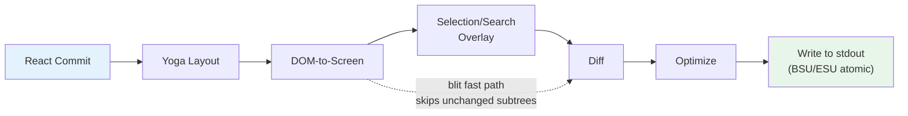
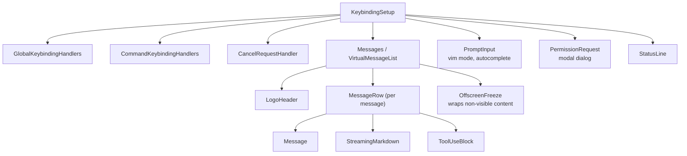

# 第十三章：終端機 UI

## 為什麼要打造自訂渲染器？

終端機不是瀏覽器。沒有 DOM、沒有 CSS 引擎、沒有合成器、沒有保留模式的圖形管線。只有一道寫入 stdout 的位元組串流和一道來自 stdin 的位元組串流。在這兩道串流之間的一切——排版、樣式、差異比對、命中測試、捲動、選取——都必須從零開始發明。

Claude Code 需要一個反應式 UI。它有提示輸入、串流式 Markdown 輸出、權限對話框、進度旋轉指示器、可捲動的訊息清單、搜尋高亮顯示，以及一個 vim 模式編輯器。React 是宣告這類元件樹的不二之選。但 React 需要一個宿主環境來渲染，而終端機並不提供這樣的環境。

Ink 是標準答案：一個為終端機打造的 React 渲染器，基於 Yoga 實現 flexbox 排版。Claude Code 最初使用 Ink，後來將其 fork 改造到面目全非。原版每一幀對每個儲存格分配一個 JavaScript 物件——在 200x120 的終端機上，這意味著每 16ms 建立並垃圾回收 24,000 個物件。它在字串層級做差異比對，比較整行 ANSI 編碼的文字。它沒有 blit 最佳化的概念，沒有雙緩衝，沒有儲存格層級的髒標記追蹤。對於一個每秒重新整理一次的簡易 CLI 儀表板，這沒問題。但對於一個以 60fps 串流輸出 token、同時使用者在包含數百則訊息的對話中捲動的 LLM 代理來說，這完全行不通。

Claude Code 中保留的是一個自訂渲染引擎，它繼承了 Ink 的概念基因——React reconciler、Yoga 排版、ANSI 輸出——但重新實作了關鍵路徑：使用打包的型別陣列取代逐格物件、使用基於池的字串駐留取代逐幀字串、使用雙緩衝渲染搭配儲存格層級差異比對，以及一個將相鄰終端機寫入合併為最少跳脫序列的最佳化器。

結果是在 200 欄的終端機上串流 Claude 的 token 時能達到 60fps。要了解其原理，我們需要檢視四個層次：React 用來做 reconcile 的自訂 DOM、將該 DOM 轉換為終端機輸出的渲染管線、讓系統在數小時的長時間工作階段中不被垃圾回收淹沒的基於池的記憶體管理，以及將這一切串聯起來的元件架構。

---

## 自訂 DOM

React 的 reconciler 需要一個可以 reconcile 的對象。在瀏覽器中，那是 DOM。在 Claude Code 的終端機中，那是一個自訂的記憶體內樹，具有七種元素類型和一種文字節點類型。

這些元素類型直接對應到終端機渲染概念：

- **`ink-root`**——文件根節點，每個 Ink 實例一個
- **`ink-box`**——flexbox 容器，終端機等價於 `<div>`
- **`ink-text`**——文字節點，帶有用於自動換行的 Yoga 測量函式
- **`ink-virtual-text`**——在另一個文字節點內的巢狀樣式文字（在文字上下文內時自動從 `ink-text` 提升）
- **`ink-link`**——超連結，透過 OSC 8 跳脫序列渲染
- **`ink-progress`**——進度指示器
- **`ink-raw-ansi`**——具有已知尺寸的預渲染 ANSI 內容，用於語法高亮的程式碼區塊

每個 `DOMElement` 攜帶渲染管線所需的狀態：

```typescript
// Illustrative — actual interface extends this significantly
interface DOMElement {
  yogaNode: YogaNode;           // Flexbox layout node
  style: Styles;                // CSS-like properties mapped to Yoga
  attributes: Map<string, DOMNodeAttribute>;
  childNodes: (DOMElement | TextNode)[];
  dirty: boolean;               // Needs re-rendering
  _eventHandlers: EventHandlerMap; // Separated from attributes
  scrollTop: number;            // Imperative scroll state
  pendingScrollDelta: number;
  stickyScroll: boolean;
  debugOwnerChain?: string;     // React component stack for debug
}
```

將 `_eventHandlers` 與 `attributes` 分離是刻意的設計。在 React 中，處理器的身分在每次渲染時都會改變（除非手動做 memoize）。如果處理器被儲存為屬性，每次渲染都會將節點標記為髒並觸發完整重繪。透過將它們分開儲存，reconciler 的 `commitUpdate` 可以更新處理器而不弄髒節點。

`markDirty()` 函式是 DOM 變動與渲染管線之間的橋樑。當任何節點的內容改變時，`markDirty()` 會向上遍歷每個祖先節點，對每個元素設定 `dirty = true`，並在葉子文字節點上呼叫 `yogaNode.markDirty()`。這就是一個深層巢狀文字節點中的單一字元變更如何排程整條路徑到根節點的重新渲染——但僅限於該路徑。兄弟子樹保持乾淨，可以從前一幀 blit 過來。

`ink-raw-ansi` 元素類型值得特別一提。當一個程式碼區塊已經經過語法高亮處理（產生了 ANSI 跳脫序列），重新解析這些序列以提取字元和樣式會是浪費。取而代之的是，預先高亮的內容被包裝在一個 `ink-raw-ansi` 節點中，帶有 `rawWidth` 和 `rawHeight` 屬性告知 Yoga 確切的尺寸。渲染管線直接將原始 ANSI 內容寫入輸出緩衝區，而無需將其分解為個別的帶樣式字元。這使得語法高亮的程式碼區塊在初始高亮處理後的渲染成本本質上為零——UI 中視覺上最昂貴的元素同時也是渲染成本最低的。

`ink-text` 節點的測量函式值得了解，因為它在 Yoga 的排版過程中執行，而該過程是同步且阻塞的。該函式接收可用寬度並必須回傳文字的尺寸。它執行自動換行（遵循 `wrap` 樣式屬性：`wrap`、`truncate`、`truncate-start`、`truncate-middle`），考慮字形叢集邊界（因此不會將多碼位的 emoji 拆分到不同行），正確測量 CJK 雙寬字元（每個計為 2 欄），並從寬度計算中剝除 ANSI 跳脫碼（跳脫序列的視覺寬度為零）。所有這些都必須在每個節點的微秒級內完成，因為一段包含 50 個可見文字節點的對話意味著每次排版過程中有 50 次測量函式呼叫。

---

## React Fiber 容器

reconciler 橋接器使用 `react-reconciler` 建立自訂的 host config。這與 React DOM 和 React Native 使用的是相同的 API。關鍵差異在於：Claude Code 以 `ConcurrentRoot` 模式運行。

```typescript
createContainer(rootNode, ConcurrentRoot, ...)
```

ConcurrentRoot 啟用了 React 的並行功能——用於延遲載入語法高亮的 Suspense、用於串流期間非阻塞狀態更新的 transitions。另一個選項 `LegacyRoot` 會強制同步渲染，在繁重的 Markdown 重新解析期間阻塞事件迴圈。

host config 的方法將 React 操作對應到自訂 DOM：

- **`createInstance(type, props)`** 透過 `createNode()` 建立 `DOMElement`，套用初始樣式和屬性，附加事件處理器，並擷取 React 元件的擁有者鏈用於除錯歸因。擁有者鏈儲存為 `debugOwnerChain`，由 `CLAUDE_CODE_DEBUG_REPAINTS` 模式用來將全螢幕重置歸因到特定元件
- **`createTextInstance(text)`** 建立 `TextNode`——但只在文字上下文內。reconciler 強制要求原始字串必須包裝在 `<Text>` 中。在文字上下文外嘗試建立文字節點會拋出例外，在 reconciliation 階段而非渲染階段就捕捉到這類錯誤
- **`commitUpdate(node, type, oldProps, newProps)`** 透過淺層比較對舊屬性和新屬性做差異比對，然後只套用變更的部分。樣式、屬性和事件處理器各有自己的更新路徑。如果沒有任何變更，差異比對函式回傳 `undefined`，完全避免不必要的 DOM 變動
- **`removeChild(parent, child)`** 從樹中移除節點，遞迴釋放 Yoga 節點（在 `free()` 之前先呼叫 `unsetMeasureFunc()` 以避免存取已釋放的 WASM 記憶體），並通知焦點管理器
- **`hideInstance(node)` / `unhideInstance(node)`** 切換 `isHidden` 並將 Yoga 節點在 `Display.None` 和 `Display.Flex` 之間切換。這是 React 用於 Suspense fallback 轉場的機制
- **`resetAfterCommit(container)`** 是關鍵的 hook：它呼叫 `rootNode.onComputeLayout()` 執行 Yoga，然後呼叫 `rootNode.onRender()` 排程終端機繪製

reconciler 在每個 commit 週期追蹤兩個效能計數器：Yoga 排版時間（`lastYogaMs`）和總 commit 時間（`lastCommitMs`）。這些數據流入 Ink 類別回報的 `FrameEvent`，實現生產環境中的效能監控。

事件系統模擬瀏覽器的捕獲/冒泡模型。`Dispatcher` 類別實作了完整的事件傳播，包含三個階段：捕獲（根到目標）、目標處、和冒泡（目標到根）。事件類型對應到 React 排程優先級——離散事件用於鍵盤和點擊（最高優先級，立即處理），連續事件用於捲動和視窗大小調整（可以延遲）。dispatcher 將所有事件處理包裝在 `reconciler.discreteUpdates()` 中以確保正確的 React 批次處理。

當你在終端機中按下一個鍵時，產生的 `KeyboardEvent` 會通過自訂 DOM 樹進行分派，從有焦點的元素冒泡到根節點，完全如同鍵盤事件在瀏覽器 DOM 元素中冒泡一樣。沿途的任何處理器都可以呼叫 `stopPropagation()` 或 `preventDefault()`，其語意與瀏覽器規範完全相同。

---

## 渲染管線

每一幀經過七個階段，每個階段分別計時：



每個階段分別計時並回報在 `FrameEvent.phases` 中。這種逐階段的檢測工具對於診斷效能問題至關重要：當一幀耗時 30ms 時，你需要知道瓶頸是 Yoga 重新測量文字（第 2 階段）、渲染器遍歷大型髒子樹（第 3 階段），還是來自慢速終端機的 stdout 背壓（第 7 階段）。答案決定了修復方式。

**第 1 階段：React commit 與 Yoga 排版。** reconciler 處理狀態更新並呼叫 `resetAfterCommit`。這會將根節點的寬度設為 `terminalColumns` 並執行 `yogaNode.calculateLayout()`。Yoga 在一次遍歷中計算整個 flexbox 樹，遵循 CSS flexbox 規範：它解析所有節點的 flex-grow、flex-shrink、padding、margin、gap、alignment 和 wrapping。結果——`getComputedWidth()`、`getComputedHeight()`、`getComputedLeft()`、`getComputedTop()`——會被快取在每個節點上。對於 `ink-text` 節點，Yoga 在排版期間呼叫自訂測量函式（`measureTextNode`），該函式透過自動換行和字形測量計算文字尺寸。這是每個節點最昂貴的操作：它必須處理 Unicode 字形叢集、CJK 雙寬字元、emoji 序列，以及嵌入在文字內容中的 ANSI 跳脫碼。

**第 2 階段：DOM 到螢幕。** 渲染器以深度優先方式遍歷 DOM 樹，將字元和樣式寫入 `Screen` 緩衝區。每個字元成為一個打包的儲存格。輸出是完整的一幀：終端機上的每個儲存格都有定義好的字元、樣式和寬度。

**第 3 階段：覆蓋層。** 文字選取和搜尋高亮就地修改螢幕緩衝區，翻轉匹配儲存格上的 style ID。選取套用反轉影像以產生我們熟悉的「高亮文字」外觀。搜尋高亮套用更強烈的視覺處理：對當前匹配項使用反轉 + 黃色前景 + 粗體 + 底線，對其他匹配項僅使用反轉。這會汙染緩衝區——透過 `prevFrameContaminated` 旗標追蹤，讓下一幀知道要跳過 blit 快速路徑。汙染是一個刻意的折衷：就地修改緩衝區避免分配另一個覆蓋層緩衝區（在 200x120 的終端機上節省 48KB），代價是在清除覆蓋層後需要一幀全損壞更新。

**第 4 階段：差異比對。** 新螢幕與前景幀的螢幕逐格比較。只有變更的儲存格才會產生輸出。比較是每個儲存格兩次整數比較（兩個打包的 `Int32` 字組），且差異比對遍歷的是損壞矩形而非整個螢幕。在穩定狀態的一幀中（只有旋轉指示器在跳動），這可能只對 24,000 個儲存格中的 3 個產生修補。每個修補是一個 `{ type: 'stdout', content: string }` 物件，包含游標移動序列和 ANSI 編碼的儲存格內容。

**第 5 階段：最佳化。** 同一行上相鄰的修補被合併為單一寫入。多餘的游標移動被消除——如果修補 N 結束在第 10 欄且修補 N+1 從第 11 欄開始，游標已經在正確位置，不需要移動序列。樣式轉換透過 `StylePool.transition()` 快取預先序列化，因此從「粗體紅色」轉換為「暗淡綠色」是單一快取字串查找，而非差異比對加序列化操作。最佳化器通常比起逐格逐一輸出可減少 30-50% 的位元組數。

**第 6 階段：寫入。** 最佳化後的修補被序列化為 ANSI 跳脫序列，並在單一 `write()` 呼叫中寫入 stdout，在支援的終端機上包裝在同步更新標記（BSU/ESU）中。BSU（Begin Synchronized Update，`ESC [ ? 2026 h`）告訴終端機緩衝所有後續輸出，ESU（`ESC [ ? 2026 l`）告訴它刷新。這在支援該協定的終端機上消除了可見的撕裂——整幀以原子方式出現。

每一幀透過 `FrameEvent` 物件回報其時間分解：

```typescript
interface FrameEvent {
  durationMs: number;
  phases: {
    renderer: number;    // DOM-to-screen
    diff: number;        // Screen comparison
    optimize: number;    // Patch merging
    write: number;       // stdout write
    yoga: number;        // Layout computation
  };
  yogaVisited: number;   // Nodes traversed
  yogaMeasured: number;  // Nodes that ran measure()
  yogaCacheHits: number; // Nodes with cached layout
  flickers: FlickerEvent[];  // Full-reset attributions
}
```

當啟用 `CLAUDE_CODE_DEBUG_REPAINTS` 時，全螢幕重置會透過 `findOwnerChainAtRow()` 歸因到其來源 React 元件。這是終端機版的 React DevTools「高亮更新」——它顯示哪個元件導致了整個螢幕的重繪，這是渲染管線中最昂貴的操作。

blit 最佳化值得特別關注。當一個節點未被標記為髒且其位置自前一幀以來未改變（透過節點快取檢查），渲染器直接從 `prevScreen` 複製儲存格到當前螢幕，而非重新渲染子樹。這使得穩定狀態的幀極為廉價——在典型的一幀中，只有旋轉指示器在跳動，blit 覆蓋了 99% 的螢幕，只有旋轉指示器的 3-4 個儲存格從頭重新渲染。

blit 在三種條件下被停用：

1. **`prevFrameContaminated` 為 true**——選取覆蓋層或搜尋高亮就地修改了前景幀的螢幕緩衝區，因此那些儲存格不能被信任為「正確的」先前狀態
2. **一個絕對定位的節點被移除**——絕對定位意味著該節點可能繪製在非兄弟儲存格上，而那些儲存格需要從實際擁有它們的元素重新渲染
3. **排版發生偏移**——任何節點的快取位置與其當前計算位置不同，意味著 blit 會將儲存格複製到錯誤的座標

損壞矩形（`screen.damage`）追蹤渲染期間所有已寫入儲存格的邊界框。差異比對只檢查此矩形內的行，跳過完全未改變的區域。在一個 120 行的終端機上，當串流訊息佔據第 80-100 行時，差異比對檢查 20 行而非 120 行——減少了 6 倍的比較工作量。

---

## 雙緩衝渲染與幀排程

Ink 類別維護兩個幀緩衝區：

```typescript
private frontFrame: Frame;  // Currently displayed on terminal
private backFrame: Frame;   // Being rendered into
```

每個 `Frame` 包含：

- `screen: Screen`——儲存格緩衝區（打包的 `Int32Array`）
- `viewport: Size`——渲染時的終端機尺寸
- `cursor: { x, y, visible }`——終端機游標停放位置
- `scrollHint`——用於替代螢幕模式的 DECSTBM（捲動區域）最佳化提示
- `scrollDrainPending`——ScrollBox 是否還有剩餘的捲動差量待處理

每次渲染後，幀交換：`backFrame = frontFrame; frontFrame = newFrame`。舊的前景幀成為下一個背景幀，提供用於 blit 最佳化的 `prevScreen` 和用於儲存格層級差異比對的基準。

這種雙緩衝設計消除了記憶體分配。渲染器不是每幀建立一個新的 `Screen`，而是重用背景幀的緩衝區。交換只是一個指標賦值。這個模式借鑑自圖形程式設計，其中雙緩衝透過確保顯示器從完整的幀讀取、而渲染器寫入另一幀來防止撕裂。在終端機的脈絡中，撕裂不是問題（BSU/ESU 協定處理了這個問題）；問題是每 16ms 分配和丟棄包含 48KB+ 型別陣列的 `Screen` 物件所造成的 GC 壓力。

渲染排程使用 lodash 的 `throttle`，間隔 16ms（約 60fps），啟用前沿和後沿觸發：

```typescript
const deferredRender = () => queueMicrotask(this.onRender);
this.scheduleRender = throttle(deferredRender, FRAME_INTERVAL_MS, {
  leading: true,
  trailing: true,
});
```

microtask 延遲並非偶然。`resetAfterCommit` 在 React 的 layout effects 階段之前執行。如果渲染器在此處同步執行，它會錯過在 `useLayoutEffect` 中設定的游標宣告。microtask 在 layout effects 之後但在同一個事件迴圈 tick 內執行——終端機看到的是單一、一致的幀。

對於捲動操作，一個單獨的 `setTimeout` 以 4ms（FRAME_INTERVAL_MS >> 2）提供更快的捲動幀，而不干擾節流。捲動變動完全繞過 React：`ScrollBox.scrollBy()` 直接修改 DOM 節點屬性，呼叫 `markDirty()`，並透過 microtask 排程渲染。沒有 React 狀態更新，沒有 reconciliation 開銷，不會因為單一滾輪事件就重新渲染整個訊息清單。

**視窗大小調整處理**是同步的，不做 debounce。當終端機調整大小時，`handleResize` 立即更新尺寸以保持排版一致。對於替代螢幕模式，它重置幀緩衝區並將 `ERASE_SCREEN` 延遲到下一個原子 BSU/ESU 繪製區塊中，而非立即寫入。同步寫入清除指令會使螢幕在渲染所需的約 80ms 期間保持空白；將其延遲到原子區塊中意味著舊內容會持續可見，直到新幀完全準備好。

**替代螢幕管理**增加了另一層。`AlternateScreen` 元件在掛載時進入 DEC 1049 替代螢幕緩衝區，將高度限制為終端機行數。它使用 `useInsertionEffect`——而非 `useLayoutEffect`——以確保 `ENTER_ALT_SCREEN` 跳脫序列在第一個渲染幀之前到達終端機。使用 `useLayoutEffect` 會太遲：第一幀會渲染到主螢幕緩衝區，在切換前產生一個可見的閃爍。`useInsertionEffect` 在 layout effects 之前和瀏覽器（或終端機）繪製之前執行，使轉場無縫。

---

## 基於池的記憶體管理：為什麼字串駐留很重要

一個 200 欄 x 120 行的終端機有 24,000 個儲存格。如果每個儲存格都是一個包含 `char` 字串、`style` 字串和 `hyperlink` 字串的 JavaScript 物件，那就是每幀 72,000 次字串分配——加上儲存格本身的 24,000 次物件分配。以 60fps 計算，這是每秒 576 萬次分配。V8 的垃圾回收器可以處理這些，但不是沒有代價的——暫停會表現為掉幀。GC 暫停通常為 1-5ms，但它們是不可預測的：它們可能在串流 token 更新期間發生，在使用者正注視輸出時造成可見的卡頓。

Claude Code 透過打包的型別陣列和三個駐留池完全消除了這個問題。結果：儲存格緩衝區零逐幀物件分配。唯一的分配發生在池本身（攤銷成本，因為大多數字元和樣式在第一幀就被駐留並在之後重用）和差異比對產生的修補字串中（無法避免，因為 stdout.write 需要字串或 Buffer 引數）。

**儲存格佈局**使用每個儲存格兩個 `Int32` 字組，儲存在一個連續的 `Int32Array` 中：

```
word0: charId        (32 bits, index into CharPool)
word1: styleId[31:17] | hyperlinkId[16:2] | width[1:0]
```

在同一個緩衝區上的平行 `BigInt64Array` 視圖支援批量操作——清除一行是對 64 位元字組的單一 `fill()` 呼叫，而非逐一歸零個別欄位。

**CharPool** 將字元字串駐留為整數 ID。它對 ASCII 有一個快速路徑：一個 128 個項目的 `Int32Array` 將字元碼直接對應到池索引，完全避免了 `Map` 查找。多位元組字元（emoji、CJK 表意文字）則回退到 `Map<string, number>`。索引 0 永遠是空格，索引 1 永遠是空字串。

```typescript
export class CharPool {
  private strings: string[] = [' ', '']
  private ascii: Int32Array = initCharAscii()

  intern(char: string): number {
    if (char.length === 1) {
      const code = char.charCodeAt(0)
      if (code < 128) {
        const cached = this.ascii[code]!
        if (cached !== -1) return cached
        const index = this.strings.length
        this.strings.push(char)
        this.ascii[code] = index
        return index
      }
    }
    // Map fallback for multi-byte characters
    ...
  }
}
```

**StylePool** 將 ANSI 樣式碼陣列駐留為整數 ID。巧妙之處在於：每個 ID 的位元 0 編碼該樣式是否對空格字元有可見效果（背景色、反轉、底線）。僅前景色的樣式得到偶數 ID；對空格可見的樣式得到奇數 ID。這讓渲染器可以用單一位元遮罩檢查跳過不可見的空格——`if (!(styleId & 1) && charId === 0) continue`——而無需查找樣式定義。該池也快取任意兩個 style ID 之間的預序列化 ANSI 轉換字串，因此從「粗體紅色」轉換為「暗淡綠色」是一次快取字串串接，而非差異比對加序列化操作。

**HyperlinkPool** 駐留 OSC 8 超連結 URI。索引 0 表示沒有超連結。

三個池在前景幀和背景幀之間共享。這是一個關鍵的設計決策。因為池是共享的，駐留的 ID 在跨幀時保持有效：blit 最佳化可以直接將打包的儲存格字組從 `prevScreen` 複製到當前螢幕，而無需重新駐留。差異比對可以將 ID 作為整數比較，而無需字串查找。如果每幀有自己的池，blit 就需要重新駐留每個複製的儲存格（透過舊 ID 查找字串，然後在新池中駐留），這將抵消 blit 大部分的效能優勢。

池會定期重置（每 5 分鐘），以防止在長時間工作階段中無限增長。遷移過程會將前景幀的存活儲存格重新駐留到新池中。

**CellWidth** 使用 2 位元分類處理雙寬字元：

| 值 | 意義 |
|-------|---------|
| 0 (Narrow) | 標準單欄字元 |
| 1 (Wide) | CJK/emoji 頭部儲存格，佔兩欄 |
| 2 (SpacerTail) | 寬字元的第二欄 |
| 3 (SpacerHead) | 軟換行延續標記 |

這儲存在 `word1` 的低 2 位元中，使得對打包儲存格的寬度檢查是免費的——常見情況不需要欄位提取。

額外的逐格後設資料存放在平行陣列中，而非打包的儲存格內：

- **`noSelect: Uint8Array`**——逐格旗標，將內容排除在文字選取之外。用於不應出現在複製文字中的 UI 裝飾（邊框、指示器）
- **`softWrap: Int32Array`**——逐行標記，指示自動換行延續。當使用者選取跨越軟換行行的文字時，選取邏輯知道不要在換行點插入換行符
- **`damage: Rectangle`**——當前幀所有已寫入儲存格的邊界框。差異比對只檢查此矩形內的行，跳過完全未改變的區域

這些平行陣列避免了擴展打包儲存格的格式（這會增加差異比對內迴圈的快取壓力），同時提供了選取、複製和最佳化所需的後設資料。

`Screen` 也暴露了一個 `createScreen()` 工廠函式，接收尺寸和池參考。建立螢幕時透過在 `BigInt64Array` 視圖上的 `fill(0n)` 將 `Int32Array` 歸零——一次原生呼叫在微秒內清除整個緩衝區。這在調整視窗大小時（需要新的幀緩衝區）和池遷移時（舊螢幕的儲存格被重新駐留到新池中）使用。

---

## REPL 元件

REPL（`REPL.tsx`）大約有 5,000 行。它是程式碼庫中最大的單一元件，而且有充分的理由：它是整個互動體驗的協調者。所有東西都流經它。

該元件大致分為九個部分：

1. **匯入**（約 100 行）——引入啟動狀態、命令、歷史記錄、hooks、元件、快捷鍵綁定、費用追蹤、通知、swarm/團隊支援、語音整合
2. **功能旗標匯入**——透過 `feature()` 守衛搭配 `require()` 條件載入語音整合、主動模式、簡要工具和協調代理
3. **狀態管理**——大量的 `useState` 呼叫，涵蓋訊息、輸入模式、待處理權限、對話框、費用閾值、工作階段狀態、工具狀態和代理狀態
4. **QueryGuard**——管理活躍的 API 呼叫生命週期，防止並行請求互相干擾
5. **訊息處理**——處理來自查詢迴圈的傳入訊息，標準化順序，管理串流狀態
6. **工具權限流程**——在工具使用區塊和 PermissionRequest 對話框之間協調權限請求
7. **工作階段管理**——恢復、切換、匯出對話
8. **快捷鍵設定**——連接快捷鍵提供者：`KeybindingSetup`、`GlobalKeybindingHandlers`、`CommandKeybindingHandlers`
9. **渲染樹**——從以上所有元素組合最終 UI

其渲染樹在全螢幕模式下組合完整介面：



`OffscreenFreeze` 是一個專屬於終端機渲染的效能最佳化。當一則訊息捲動到視窗上方時，其 React 元素會被快取，子樹被凍結。這防止了畫面外訊息中基於計時器的更新（旋轉指示器、經過時間計數器）觸發終端機重置。沒有這個機制，訊息 3 中的旋轉指示器即使使用者正在看訊息 47，也會導致完整重繪。

該元件全程由 React Compiler 編譯。不需要手動 `useMemo` 和 `useCallback`，編譯器使用插槽陣列插入逐表達式的記憶化：

```typescript
const $ = _c(14);  // 14 memoization slots
let t0;
if ($[0] !== dep1 || $[1] !== dep2) {
  t0 = expensiveComputation(dep1, dep2);
  $[0] = dep1; $[1] = dep2; $[2] = t0;
} else {
  t0 = $[2];
}
```

這個模式出現在程式碼庫的每個元件中。它提供比 `useMemo` 更細的粒度（`useMemo` 在 hook 層級做記憶化）——渲染函式中的個別表達式都有自己的依賴追蹤和快取。對於像 REPL 這樣的 5,000 行元件，這消除了每次渲染中數百次潛在的不必要重新計算。

---

## 選取與搜尋高亮

文字選取和搜尋高亮作為螢幕緩衝區覆蓋層運作，在主渲染之後但在差異比對之前套用。

**文字選取**僅在替代螢幕中運作。Ink 實例持有一個 `SelectionState`，追蹤錨點和焦點位置、拖曳模式（字元/單字/行），以及已捲動到畫面外的已擷取行。當使用者點擊並拖曳時，選取處理器更新這些座標。在 `onRender` 期間，`applySelectionOverlay` 遍歷受影響的行，使用 `StylePool.withSelectionBg()` 就地修改儲存格的 style ID，該方法回傳一個加入了反轉影像的新 style ID。這種對螢幕緩衝區的直接修改就是 `prevFrameContaminated` 旗標存在的原因——前景幀的緩衝區已被覆蓋層修改，因此下一幀不能信任它進行 blit 最佳化，必須做全損壞的差異比對。

滑鼠追蹤使用 SGR 1003 模式，它回報點擊、拖曳和移動的欄/行座標。`App` 元件實作多次點擊偵測：雙擊選取一個單字，三擊選取一行。偵測使用 500ms 逾時和 1 格位置容差（滑鼠可以在兩次點擊之間移動一格而不重置多次點擊計數器）。超連結點擊被這個逾時刻意延遲——雙擊連結會選取單字而非開啟瀏覽器，這符合使用者從文字編輯器中預期的行為。

失去釋放事件的復原機制處理了以下情況：使用者在終端機內開始拖曳，將滑鼠移到視窗外，然後釋放。終端機回報了按下和拖曳，但沒有回報釋放（因為發生在視窗外）。沒有復原機制的話，選取會永遠停留在拖曳模式。復原機制透過偵測沒有按鈕按下的滑鼠移動事件來運作——如果我們處於拖曳狀態且收到一個無按鈕的移動事件，我們推斷按鈕在視窗外被釋放並完成選取。

**搜尋高亮**有兩個平行運行的機制。基於掃描的路徑（`applySearchHighlight`）遍歷可見儲存格尋找查詢字串並套用 SGR 反轉樣式。基於位置的路徑使用從 `scanElementSubtree()` 預先計算的 `MatchPosition[]`，以訊息相對位置儲存，並在已知偏移處套用「當前匹配」的黃色高亮，使用堆疊的 ANSI 碼（反轉 + 黃色前景 + 粗體 + 底線）。黃色前景結合反轉變成黃色背景——終端機在反轉啟用時交換前景/背景。底線是在主題中黃色與現有背景色衝突時的備用可見性標記。

**游標宣告**解決了一個微妙的問題。終端機模擬器在實體游標位置渲染 IME（輸入法編輯器）預編輯文字。正在組合字元的 CJK 使用者需要游標在文字輸入的插入符號處，而非終端機自然會將其停放的螢幕底部。`useDeclaredCursor` hook 讓元件在每幀後宣告游標應該在哪裡。Ink 類別從 `nodeCache` 讀取宣告節點的位置，將其轉換為螢幕座標，並在差異比對後發出游標移動序列。螢幕閱讀器和放大鏡也追蹤實體游標，因此這個機制同時有益於無障礙功能和 CJK 輸入。

在主螢幕模式中，宣告的游標位置與 `frame.cursor` 分開追蹤（後者必須停在內容底部以滿足 log-update 的相對移動不變量）。在替代螢幕模式中，問題更簡單：每幀以 `CSI H`（游標歸位）開始，因此宣告的游標只是在幀結尾發出的絕對位置。

---

## 串流 Markdown

渲染 LLM 輸出是終端機 UI 面臨的最高要求的任務。token 逐一到達，每秒 10-50 個，每個都會改變一則可能包含程式碼區塊、清單、粗體文字和行內程式碼的訊息內容。天真的做法——每個 token 都重新解析整個訊息——在規模上將是災難性的。

Claude Code 使用三個最佳化：

**Token 快取。** 一個模組層級的 LRU 快取（500 個項目）儲存以內容雜湊為鍵的 `marked.lexer()` 結果。快取在虛擬捲動期間的 React 卸載/重新掛載週期中存活。當使用者捲動回到先前可見的訊息時，Markdown token 從快取提供而非重新解析。

**快速路徑偵測。** `hasMarkdownSyntax()` 透過單一正規表達式檢查前 500 個字元中的 Markdown 標記。如果未找到語法，它直接建構一個單段落 token，繞過完整的 GFM 解析器。這在純文字訊息上每次渲染節省約 3ms——當你以每秒 60 幀渲染時，這很重要。

**延遲語法高亮。** 程式碼區塊高亮透過 React `Suspense` 載入。`MarkdownBody` 元件立即以 `highlight={null}` 作為 fallback 渲染，然後以 cli-highlight 實例非同步解析。使用者立即看到程式碼（無樣式），然後一兩幀後顏色出現。

串流情境增加了一個複雜度。當 token 從模型到達時，Markdown 內容逐步增長。每個 token 都重新解析整個內容在訊息的過程中會是 O(n²) 的。快速路徑偵測有所幫助——大多數串流內容是純文字段落，完全繞過解析器——但對於包含程式碼區塊和清單的訊息，LRU 快取提供了真正的最佳化。快取鍵是內容雜湊，因此當 10 個 token 到達且只有最後一段改變時，未改變前綴的快取解析結果會被重用。Markdown 渲染器只重新解析改變的尾部。

`StreamingMarkdown` 元件與靜態 `Markdown` 元件是不同的。它處理內容仍在生成的情況：不完整的程式碼圍欄（一個 ` ``` ` 沒有結尾圍欄）、部分粗體標記，以及截斷的清單項目。串流變體在解析上更為寬容——它不會因為未關閉的語法而報錯，因為結尾語法尚未到達。當訊息完成串流時，元件轉換為靜態 `Markdown` 渲染器，套用完整的 GFM 解析和嚴格的語法檢查。

程式碼區塊的語法高亮是渲染管線中每元素最昂貴的操作。一個 100 行的程式碼區塊使用 cli-highlight 可能需要 50-100ms 來高亮。載入高亮程式庫本身需要 200-300ms（它捆綁了數十種語言的語法定義）。兩項成本都被 React `Suspense` 隱藏：程式碼區塊立即以純文字渲染，高亮程式庫非同步載入，當它解析完成時，程式碼區塊以帶顏色重新渲染。使用者立即看到程式碼，隨後片刻顏色出現——比在程式庫載入期間出現 300ms 空白幀好得多。

---

## 實戰應用：高效渲染串流輸出

終端機渲染管線是消除工作的案例研究。三個原則驅動了設計：

**駐留一切。** 如果你有一個出現在數千個儲存格中的值——一個樣式、一個字元、一個 URL——只儲存一次並透過整數 ID 參照。整數比較是一條 CPU 指令。字串比較是一個迴圈。當你的內迴圈以 60fps 每幀執行 24,000 次時，整數上的 `===` 和字串上的 `===` 之間的差異就是流暢捲動和可見延遲之間的差異。

**在正確的層級做差異比對。** 儲存格層級的差異比對聽起來很昂貴——每幀 24,000 次比較。但每個儲存格只是兩次整數比較（打包的字組），而且在穩定狀態的幀中，差異比對在檢查第一個儲存格後就跳出了大多數行。替代方案——重新渲染整個螢幕並寫入 stdout——每幀會產生 100KB+ 的 ANSI 跳脫序列。差異比對通常產生不到 1KB。

**將熱路徑從 React 分離。** 捲動事件以滑鼠輸入頻率到達（可能每秒數百次）。將每一個都路由通過 React 的 reconciler——狀態更新、reconciliation、commit、排版、渲染——每個事件增加 5-10ms 的延遲。透過直接修改 DOM 節點並透過 microtask 排程渲染，捲動路徑保持在 1ms 以下。React 只在最終繪製時參與，而那時它無論如何都會執行。

這些原則適用於任何串流輸出系統，不僅限於終端機。如果你正在建構一個渲染即時資料的 Web 應用程式——日誌檢視器、聊天客戶端、監控儀表板——同樣的折衷適用。駐留重複的值。與前一幀做差異比對。將熱路徑保持在你的反應式框架之外。

第四個原則，專屬於長時間運行的工作階段：**定期清理。** Claude Code 的池隨著新字元和樣式被駐留而單調增長。在多小時的工作階段中，池可能累積數千個不再被任何存活儲存格參照的項目。5 分鐘的重置週期限制了這種增長：每 5 分鐘建立新池，前景幀的儲存格被遷移（重新駐留到新池中），舊池變成垃圾。這是在應用層級套用的世代回收策略，因為 JavaScript 的 GC 無法看到池項目的語意存活性。

使用 `Int32Array` 而非普通物件的決定還有一個超越 GC 壓力的更微妙好處：記憶體局部性。當差異比對比較 24,000 個儲存格時，它遍歷的是一個連續的型別陣列。現代 CPU 會預取順序記憶體存取，因此整個螢幕比較都在 L1/L2 快取中執行。逐格物件的佈局會將儲存格分散在堆積各處，使每次比較都成為快取未命中。效能差異是可測量的：在 200x120 的螢幕上，型別陣列差異比對在 0.5ms 以內完成，而等效的基於物件的差異比對需要 3-5ms——足以在與其他管線階段組合時超出 16ms 的幀預算。

第五個原則適用於任何渲染到固定大小網格的系統：**追蹤損壞邊界。** 每個螢幕上的 `damage` 矩形記錄渲染期間已寫入儲存格的邊界框。差異比對查詢此矩形並完全跳過外部的行。當串流訊息佔據 120 行終端機的底部 20 行時，差異比對檢查 20 行，而非 120 行。結合 blit 最佳化（它僅對重新渲染的區域而非 blit 的區域填充損壞矩形），這意味著常見情況——一則訊息正在串流而其餘對話保持靜態——只觸及螢幕緩衝區的一小部分。

更廣泛的啟示：渲染系統中的效能不在於使任何單一操作變快，而在於完全消除操作。blit 消除了重新渲染。損壞矩形消除了差異比對。池共享消除了重新駐留。打包的儲存格消除了記憶體分配。每個最佳化移除了一整個類別的工作，而且它們以乘法方式疊加。

用數字來說明：在 200x120 的終端機上，最壞情況的幀（所有東西都髒、沒有 blit、全螢幕損壞）大約需要 12ms。最好情況的幀（一個髒節點、blit 其他所有東西、3 行損壞矩形）不到 1ms。系統大部分時間處於最好情況。串流 token 的到達觸發一個髒文字節點，該節點使其祖先到訊息容器都變髒，通常是螢幕的 10-30 行。blit 處理其他 90-110 行。損壞矩形將差異比對限制在髒區域。池查找是整數操作。串流一個 token 的穩態成本由 Yoga 排版（重新測量髒文字節點及其祖先）和 Markdown 重新解析主導——而非渲染管線本身。

---
