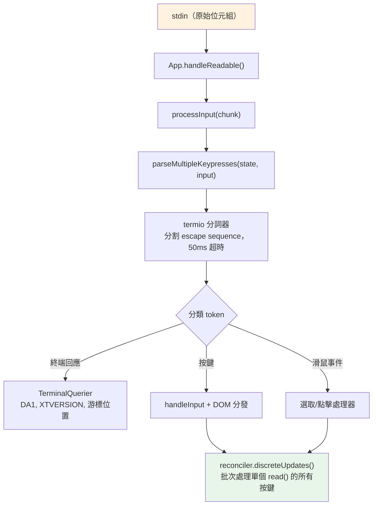
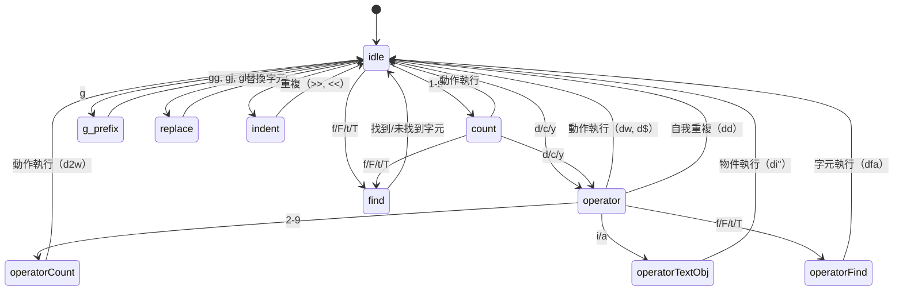

# 第十四章：輸入與互動

## 原始位元組，有意義的動作

當你在 Claude Code 中按下 Ctrl+X 後接著按 Ctrl+K 時，終端發送兩個位元組序列，間隔可能約 200 毫秒。第一個是 `0x18`（ASCII CAN）。第二個是 `0x0B`（ASCII VT）。這兩個位元組本身除了「控制字元」之外沒有任何固有含義。輸入系統必須識別這兩個在超時視窗內按序到達的位元組，構成和弦 `ctrl+x ctrl+k`，映射到動作 `chat:killAgents`，也就是終止所有運行中的子 agent。

從原始位元組到被終止的 agent 之間，六個系統激活：一個分詞器分割 escape sequence，一個解析器跨五種終端協定對其分類，一個按鍵綁定解析器將序列與特定上下文的綁定匹配，一個和弦狀態機管理多鍵序列，一個處理器執行動作，React 將產生的狀態更新批次處理成單個渲染。

難度不在任何單個系統。而在於終端多樣性的組合爆炸。iTerm2 發送 Kitty 鍵盤協定序列。macOS Terminal 發送傳統 VT220 序列。透過 SSH 的 Ghostty 發送 xterm modifyOtherKeys。tmux 可能根據其配置吃掉、轉換或透傳這些序列。Windows Terminal 的 VT 模式有自己的怪癖。輸入系統必須從所有這些產生正確的 `ParsedKey` 物件，因為使用者不應該需要知道他們的終端使用哪種鍵盤協定。

本章追蹤從原始位元組到有意義動作的路徑，跨越這個多樣的環境。

設計理念是漸進式增強與優雅降級。在支援 Kitty 鍵盤協定的現代終端上，Claude Code 獲得完整的修飾鍵偵測（Ctrl+Shift+A 與 Ctrl+A 不同）、super 鍵報告（Cmd 快捷鍵）和不含糊的鍵識別。在透過 SSH 的傳統終端上，它退回到最佳可用協定，失去一些修飾鍵區分但保持核心功能完整。使用者永遠不會看到關於其終端不受支援的錯誤訊息。他們可能無法使用 `ctrl+shift+f` 進行全局搜尋，但 `ctrl+r` 用於歷史搜尋在任何地方都有效。

---

## 按鍵解析管線

輸入以 stdin 的位元組塊形式到達。管線分階段處理它們：



分詞器是基礎。終端輸入是混合了可列印字元、控制碼和多位元組 escape sequence 的位元組流，沒有明確的框架。從 stdin 的單個 `read()` 可能返回 `\x1b[1;5A`（Ctrl+上箭頭），也可能在一次讀取中返回 `\x1b`，在下一次讀取中返回 `[1;5A`，取決於位元組從 PTY 到達的速度。分詞器維護一個狀態機，緩衝部分 escape sequence 並發出完整 token。

不完整序列問題是根本性的。當分詞器看到孤立的 `\x1b` 時，它不知道這是 Escape 鍵還是 CSI 序列的開始。它緩衝位元組並啟動 50ms 計時器。如果沒有延續到達，緩衝區被刷新，`\x1b` 成為 Escape 按鍵。但在刷新之前，分詞器檢查 `stdin.readableLength`——如果位元組在核心緩衝區中等待，計時器重新激活而非刷新。這處理了事件迴圈超過 50ms 被阻塞而延續位元組已緩衝但尚未讀取的情況。

對於貼上操作，超時延長到 500ms。貼上的文字可能很大，以多個塊到達。

來自單個 `read()` 的所有解析按鍵在一個 `reconciler.discreteUpdates()` 呼叫中處理。這批次處理 React 狀態更新，使貼上 100 個字元產生一次重新渲染，而非 100 次。批次處理至關重要：如果沒有它，貼上中的每個字元都會觸發完整的 reconciliation 循環——狀態更新、reconciliation、commit、Yoga 版面配置、渲染、差分、寫入。每個循環 5ms，100 個字元的貼上需要 500ms 處理。有了批次處理，同樣的貼上只需一個 5ms 循環。

### stdin 管理

`App` 元件透過引用計數管理原始模式。當任何元件需要原始輸入（提示、對話框、vim 模式）時，它呼叫 `setRawMode(true)`，遞增計數器。當它不再需要原始輸入時，呼叫 `setRawMode(false)`，遞減計數器。只有當計數器達到零時，原始模式才停用。這防止了終端應用中常見的 bug：元件 A 啟用原始模式，元件 B 啟用原始模式，元件 A 停用原始模式，突然元件 B 的輸入中斷了，因為原始模式被全局停用。

首次啟用原始模式時，App：

1. 停止早期輸入捕獲（在 React 掛載之前收集按鍵的 bootstrap 階段機制）
2. 將 stdin 置於原始模式（無行緩衝，無回顯，無信號處理）
3. 附加 `readable` 監聽器用於非同步輸入處理
4. 啟用括號貼上（使貼上的文字可識別）
5. 啟用焦點報告（使應用知道終端視窗何時獲得/失去焦點）
6. 啟用擴展按鍵報告（Kitty 鍵盤協定 + xterm modifyOtherKeys）

停用時，這些以相反順序反轉。謹慎的順序防止 escape sequence 洩漏——在停用原始模式之前停用擴展按鍵報告確保終端在應用停止解析它們後不會繼續發送 Kitty 編碼的序列。

`onExit` 信號處理器（透過 `signal-exit` 套件）確保即使在意外終止時也進行清理。如果程序收到 SIGTERM 或 SIGINT，處理器停用原始模式，恢復終端狀態，如果活動就退出備用螢幕，並在程序退出前重新顯示游標。沒有這個清理，崩潰的 Claude Code session 會讓終端處於原始模式，沒有游標，沒有回顯——使用者需要盲目輸入 `reset` 才能恢復終端。

---

## 多協定支援

終端對如何編碼鍵盤輸入沒有共識。像 Kitty 這樣的現代終端模擬器發送帶有完整修飾鍵資訊的結構化序列。透過 SSH 的傳統終端發送需要上下文解釋的模糊位元組序列。Claude Code 的解析器同時處理五種不同的協定，因為使用者的終端可能是其中任何一種。

**CSI u（Kitty 鍵盤協定）**是現代標準。格式：`ESC [ codepoint [; modifier] u`。例子：`ESC[13;2u` 是 Shift+Enter，`ESC[27u` 是沒有修飾鍵的 Escape。碼位無歧義地識別按鍵——Escape 鍵與 Escape 序列前綴之間沒有模糊性。修飾鍵字編碼 shift、alt、ctrl 和 super（Cmd）作為各個位元。Claude Code 在啟動時透過 `ENABLE_KITTY_KEYBOARD` escape sequence 在支援它的終端上啟用此協定，並在退出時透過 `DISABLE_KITTY_KEYBOARD` 停用。協定透過查詢/回應握手偵測：應用發送 `CSI ? u`，終端回應 `CSI ? flags u`，其中 `flags` 表示支援的協定級別。

**xterm modifyOtherKeys** 是 Ghostty 透過 SSH 等終端的回退，Kitty 協定未協商的情況。格式：`ESC [ 27 ; modifier ; keycode ~`。注意參數順序與 CSI u 相反——修飾鍵在按鍵碼之前，然後才是按鍵碼。這是常見的解析器 bug 來源。協定透過 `CSI > 4 ; 2 m` 啟用，由 Ghostty、tmux 和 xterm 在未偵測到終端的 TERM 識別時發出（在 SSH 連線中 `TERM_PROGRAM` 未轉發時常見）。

**傳統終端序列**涵蓋其他所有情況：透過 `ESC O` 和 `ESC [` 序列的功能鍵、箭頭鍵、數字鍵盤、Home/End/Insert/Delete，以及 40 年終端演進中積累的完整 VT100/VT220/xterm 變體動物園。解析器使用兩個正規表達式匹配這些：`FN_KEY_RE` 用於 `ESC O/N/[/[[` 前綴模式（匹配功能鍵、箭頭鍵及其修飾變體），`META_KEY_CODE_RE` 用於 meta 鍵碼（`ESC` 後跟單個字母數字，傳統的 Alt+鍵編碼）。

傳統序列的挑戰是模糊性。`ESC [ 1 ; 2 R` 可能是 Shift+F3 或游標位置報告，取決於上下文。解析器用私有標記檢查解決：游標位置報告使用 `CSI ? row ; col R`（帶有 `?` 私有標記），而修飾功能鍵使用 `CSI params R`（沒有它）。這種消歧義是 Claude Code 請求 DECXCPR（擴展游標位置報告）而非標準 CPR 的原因——擴展形式是無歧義的。

終端識別增加了另一層複雜性。在啟動時，Claude Code 發送 `XTVERSION` 查詢（`CSI > 0 q`）來發現終端的名稱和版本。回應（`DCS > | name ST`）在 SSH 連接中存活——不像 `TERM_PROGRAM`，它是一個環境變數，不透過 SSH 傳播。知道終端身份允許解析器處理終端特定的怪癖。例如，xterm.js（VS Code 整合終端使用的）的 escape sequence 行為與原生 xterm 不同，識別字串（`xterm.js(X.Y.Z)`）允許解析器考慮這些差異。

**SGR 滑鼠事件**使用格式 `ESC [ < button ; col ; row M/m`，其中 `M` 是按下，`m` 是釋放。按鈕碼編碼動作：0/1/2 用於左/中/右點擊，64/65 用於向上/向下滾輪（0x40 OR 滾輪位），32+ 用於拖拽（0x20 OR 移動位）。滾輪事件轉換為 `ParsedKey` 物件，以便流經按鍵綁定系統；點擊和拖拽事件成為 `ParsedMouse` 物件，路由到選取處理器。

**括號貼上**將貼上的內容包裹在 `ESC [200~` 和 `ESC [201~` 標記之間。標記之間的所有內容成為帶有 `isPasted: true` 的單個 `ParsedKey`，無論貼上的文字可能包含什麼 escape sequence。這防止貼上的程式碼被解釋為命令——當使用者貼上包含 `\x03`（原始位元組形式的 Ctrl+C）的程式碼片段時，這是關鍵的安全特性。

解析器的輸出類型形成了乾淨的識別聯合：

```typescript
type ParsedKey = {
  kind: 'key';
  name: string;        // 'return', 'escape', 'a', 'f1' 等
  ctrl: boolean; meta: boolean; shift: boolean;
  option: boolean; super: boolean;
  sequence: string;    // 用於除錯的原始 escape sequence
  isPasted: boolean;   // 在括號貼上中
}

type ParsedMouse = {
  kind: 'mouse';
  button: number;      // SGR 按鈕碼
  action: 'press' | 'release';
  col: number; row: number;  // 1 索引的終端座標
}

type ParsedResponse = {
  kind: 'response';
  response: TerminalResponse;  // 路由到 TerminalQuerier
}
```

`kind` 識別符確保下游程式碼明確處理每種輸入類型。按鍵不能被意外處理為滑鼠事件；終端回應不能被意外解釋為按鍵。`ParsedKey` 類型也攜帶原始 `sequence` 字串用於除錯——當使用者報告「按下 Ctrl+Shift+A 沒有反應」時，除錯日誌可以顯示終端發送了什麼位元組序列，使診斷問題是在終端的編碼、解析器的識別還是按鍵綁定的配置成為可能。

`ParsedKey` 上的 `isPasted` 標誌對安全至關重要。當括號貼上啟用時，終端將貼上的內容包裹在標記序列中。解析器在產生的按鍵事件上設置 `isPasted: true`，按鍵綁定解析器對貼上的按鍵跳過按鍵綁定匹配。沒有這個，貼上包含 `\x03`（原始位元組形式的 Ctrl+C）或 escape sequence 的文字將觸發應用命令。有了它，貼上的內容被視為字面文字輸入，無論其位元組內容如何。

解析器也識別終端回應——終端本身回答查詢時發送的序列。這些包括設備屬性（DA1、DA2）、游標位置報告、Kitty 鍵盤標誌回應、XTVERSION（終端識別）和 DECRPM（模式狀態）。這些被路由到 `TerminalQuerier` 而非輸入處理器。

**修飾鍵解碼**遵循 XTerm 慣例：修飾鍵字是 `1 + (shift ? 1 : 0) + (alt ? 2 : 0) + (ctrl ? 4 : 0) + (super ? 8 : 0)`。`ParsedKey` 中的 `meta` 欄位映射到 Alt/Option（位元 2）。`super` 欄位是獨立的（位元 8，macOS 上的 Cmd）。這種區分很重要，因為 Cmd 快捷鍵被 OS 保留，無法被終端應用捕獲——除非終端使用 Kitty 協定，它報告其他協定靜默吞噬的 super 修飾鍵。

stdin 間隙偵測器在無輸入超過 5 秒後觸發終端模式重新聲明。這處理 tmux 重新附加和筆記型電腦喚醒場景，其中終端的鍵盤模式可能已被多路復用器或 OS 重置。重新聲明觸發時，它重新發送 `ENABLE_KITTY_KEYBOARD`、`ENABLE_MODIFY_OTHER_KEYS`、括號貼上和焦點報告序列。沒有這個，從 tmux session 分離然後重新附加將靜默地將鍵盤協定降級為傳統模式，破壞剩餘 session 的修飾鍵偵測。

### 終端 I/O 層

解析器下方是 `ink/termio/` 中的結構化終端 I/O 子系統：

- **csi.ts** -- CSI（控制序列引介）序列：游標移動、清除、捲動區域、括號貼上啟用/停用、焦點事件啟用/停用、Kitty 鍵盤協定啟用/停用
- **dec.ts** -- DEC 私有模式序列：備用螢幕緩衝區（1049）、滑鼠追蹤模式（1000/1002/1003）、游標可見性、括號貼上（2004）、焦點事件（1004）
- **osc.ts** -- 作業系統命令：剪貼板存取（OSC 52）、標籤狀態、iTerm2 進度指示器、tmux/screen 多路復用器包裝（DCS 透傳，用於需要跨越多路復用器邊界的序列）
- **sgr.ts** -- 選擇圖形呈現：ANSI 樣式碼系統（顏色、粗體、斜體、底線、反色）
- **tokenize.ts** -- 用於 escape sequence 邊界偵測的有狀態分詞器

多路復用器包裝值得說明。當 Claude Code 在 tmux 內運行時，某些 escape sequence（如 Kitty 鍵盤協定協商）必須透傳到外部終端。tmux 使用 DCS 透傳（`ESC P ... ST`）轉發它不理解的序列。`osc.ts` 中的 `wrapForMultiplexer` 函式偵測多路復用器環境並適當包裝序列。沒有這個，Kitty 鍵盤模式將在 tmux 內靜默失敗，使用者永遠不知道為什麼他們的 Ctrl+Shift 綁定停止工作了。

### 事件系統

`ink/events/` 目錄實現了帶有六種事件類型的瀏覽器相容事件系統：`KeyboardEvent`、`ClickEvent`、`FocusEvent`、`InputEvent`、`TerminalFocusEvent` 和基礎 `TerminalEvent`。每個攜帶 `target`、`currentTarget`、`eventPhase`，並支援 `stopPropagation()`、`stopImmediatePropagation()` 和 `preventDefault()`。

包裝 `ParsedKey` 的 `InputEvent` 存在是為了與傳統 `EventEmitter` 路徑向下相容，舊元件可能仍在使用它。新元件使用帶有捕獲/冒泡階段的 DOM 式鍵盤事件分發。兩條路徑從相同的解析按鍵觸發，因此它們始終一致——到達 stdin 的按鍵產生恰好一個 `ParsedKey`，它同時產生 `InputEvent`（用於傳統監聽器）和 `KeyboardEvent`（用於 DOM 式分發）。這種雙路徑設計允許在不破壞現有元件的情況下，從 EventEmitter 模式逐步遷移到 DOM 事件模式。

---

## 按鍵綁定系統

按鍵綁定系統分離了三個常常糾纏在一起的關注點：什麼鍵觸發什麼動作（綁定）、動作觸發時發生什麼（處理器），以及哪些綁定現在是活動的（上下文）。

### 綁定：宣告式配置

預設綁定在 `defaultBindings.ts` 中定義為 `KeybindingBlock` 物件的陣列，每個都限定在一個上下文中：

```typescript
export const DEFAULT_BINDINGS: KeybindingBlock[] = [
  {
    context: 'Global',
    bindings: {
      'ctrl+c': 'app:interrupt',
      'ctrl+d': 'app:exit',
      'ctrl+l': 'app:redraw',
      'ctrl+r': 'history:search',
    },
  },
  {
    context: 'Chat',
    bindings: {
      'escape': 'chat:cancel',
      'ctrl+x ctrl+k': 'chat:killAgents',
      'enter': 'chat:submit',
      'up': 'history:previous',
      'ctrl+x ctrl+e': 'chat:externalEditor',
    },
  },
  // ... 另外 14 個上下文
]
```

平台特定的綁定在定義時處理。在 macOS/Linux 上，圖片貼上是 `ctrl+v`，但在 Windows 上是 `alt+v`（在那裡 `ctrl+v` 是系統貼上）。模式循環在支援 VT 模式的終端上是 `shift+tab`，但在沒有它的 Windows Terminal 上是 `meta+m`。Feature-flagged 的綁定（快速搜尋、語音模式、終端面板）有條件地包含。

使用者可以透過 `~/.claude/keybindings.json` 覆蓋任何綁定。解析器接受修飾鍵別名（`ctrl`/`control`，`alt`/`opt`/`option`，`cmd`/`command`/`super`/`win`）、按鍵別名（`esc` -> `escape`，`return` -> `enter`）、和弦表示法（空格分隔的步驟，如 `ctrl+k ctrl+s`），以及解除綁定預設鍵的 null 動作。null 動作與未定義綁定不同——它明確阻止預設綁定觸發，這對想要為終端使用保留某個鍵的使用者很重要。

### 上下文：16 個活動範圍

每個上下文代表一種特定綁定集適用的互動模式：

| 上下文 | 何時活動 |
|--------|---------|
| Global | 始終 |
| Chat | 提示輸入聚焦 |
| Autocomplete | 補全選單可見 |
| Confirmation | 權限對話框顯示 |
| Scroll | 帶可捲動內容的 Alt-screen |
| Transcript | 唯讀記錄查看器 |
| HistorySearch | 反向歷史搜尋（ctrl+r） |
| Task | 背景任務運行中 |
| Help | 幫助疊加層顯示 |
| MessageSelector | 回溯對話框 |
| MessageActions | 訊息游標導航 |
| DiffDialog | 差異查看器 |
| Select | 通用選擇列表 |
| Settings | 配置面板 |
| Tabs | 標籤頁導航 |
| Footer | 頁腳指示器 |

當按鍵到達時，解析器從當前活動的上下文（由 React 元件狀態決定）建立上下文列表，去重並保留優先順序，然後搜尋匹配的綁定。最後匹配的綁定獲勝——這就是使用者覆蓋優先於預設的方式。上下文列表在每次按鍵時重建（成本很低：最多 16 個字串的陣列連接和去重），因此上下文變化立即生效，無需任何訂閱或監聽器機制。

上下文設計處理了一個棘手的互動模式：嵌套模態。當在運行任務期間出現權限對話框時，`Confirmation` 和 `Task` 上下文可能都是活動的。`Confirmation` 上下文優先（它在元件樹中更晚被註冊），因此 `y` 觸發「核准」而非任何任務級別的綁定。當對話框關閉時，`Confirmation` 上下文停用，`Task` 綁定恢復。這種疊加行為自然地從上下文列表的優先順序中浮現——不需要特殊的模態處理程式碼。

### 保留的快捷鍵

並非所有按鍵都可以重新綁定。系統強制執行三個保留層：

**不可重新綁定**（硬編碼行為）：`ctrl+c`（中斷/退出）、`ctrl+d`（退出）、`ctrl+m`（在所有終端中與 Enter 相同——重新綁定它會破壞 Enter）。

**終端保留**（警告）：`ctrl+z`（SIGTSTP）、`ctrl+\`（SIGQUIT）。這些技術上可以綁定，但在大多數配置中終端會在應用看到它們之前攔截它們。

**macOS 保留**（錯誤）：`cmd+c`、`cmd+v`、`cmd+x`、`cmd+q`、`cmd+w`、`cmd+tab`、`cmd+space`。OS 在這些到達終端之前攔截它們。綁定它們會建立一個永遠不會觸發的快捷鍵。

### 解析流程

當按鍵到達時，解析路徑是：

1. 建立上下文列表：元件注冊的活動上下文加上 Global，去重並保留優先順序
2. 針對合併的綁定表呼叫 `resolveKeyWithChordState(input, key, contexts)`
3. 在 `match` 時：清除任何待處理的和弦，呼叫處理器，在事件上呼叫 `stopImmediatePropagation()`
4. 在 `chord_started` 時：儲存待處理的按鍵，停止傳播，啟動和弦超時
5. 在 `chord_cancelled` 時：清除待處理的和弦，讓事件通過
6. 在 `unbound` 時：清除和弦——這是明確的解綁定（使用者將動作設置為 `null`），因此傳播被停止，但不執行任何處理器
7. 在 `none` 時：通過到其他處理器

「最後獲勝」的解析策略意味著如果預設綁定和使用者綁定都在 `Chat` 上下文中定義了 `ctrl+k`，使用者的綁定優先。這在匹配時透過按定義順序迭代綁定並保留最後匹配來評估，而非在載入時建立覆蓋映射。優勢：特定上下文的覆蓋自然組合。使用者可以在 `Chat` 中覆蓋 `enter` 而不影響 `Confirmation` 中的 `enter`。

---

## 和弦支援

`ctrl+x ctrl+k` 綁定是一個和弦：兩個按鍵共同形成一個動作。解析器用狀態機管理這個。

當按鍵到達時：

1. 解析器將其附加到任何待處理的和弦前綴
2. 它檢查任何綁定的和弦是否以這個前綴開始。如果是，返回 `chord_started` 並儲存待處理的按鍵
3. 如果完整和弦恰好匹配一個綁定，返回 `match` 並清除待處理狀態
4. 如果和弦前綴什麼都不匹配，返回 `chord_cancelled`

一個 `ChordInterceptor` 元件在和弦等待狀態期間攔截所有輸入。它有 1000ms 超時——如果第二次按鍵在一秒內未到達，和弦被取消，第一次按鍵被丟棄。`KeybindingContext` 提供一個 `pendingChordRef` 用於同步存取待處理狀態，避免 React 狀態更新延遲可能導致第二次按鍵在第一次的狀態更新完成之前被處理。

和弦設計避免了遮蔽 readline 編輯鍵。沒有和弦，「終止 agent」的按鍵綁定可能是 `ctrl+k`——但那是 readline 的「刪除到行尾」，使用者在終端文字輸入中期望它。透過使用 `ctrl+x` 作為前綴（匹配 readline 自己的和弦前綴慣例），系統獲得了一個不與單鍵編輯快捷鍵衝突的綁定命名空間。

實現處理了大多數和弦系統遺漏的邊緣情況：當使用者按下 `ctrl+x` 但然後輸入的字元不是任何和弦的一部分時會發生什麼？沒有仔細處理，那個字元會被吞噬——和弦攔截器消耗了輸入，和弦被取消，字元消失了。Claude Code 的 `ChordInterceptor` 在這種情況下返回 `chord_cancelled`，這導致待處理輸入被丟棄，但允許不匹配的字元通過到正常輸入處理。字元沒有丟失；只有和弦前綴被丟棄。這符合使用者對 Emacs 式和弦前綴的預期行為。

---

## Vim 模式

### 狀態機

vim 實作是帶有詳盡類型檢查的純狀態機。類型就是文件：

```typescript
export type VimState =
  | { mode: 'INSERT'; insertedText: string }
  | { mode: 'NORMAL'; command: CommandState }

export type CommandState =
  | { type: 'idle' }
  | { type: 'count'; digits: string }
  | { type: 'operator'; op: Operator; count: number }
  | { type: 'operatorCount'; op: Operator; count: number; digits: string }
  | { type: 'operatorFind'; op: Operator; count: number; find: FindType }
  | { type: 'operatorTextObj'; op: Operator; count: number; scope: TextObjScope }
  | { type: 'find'; find: FindType; count: number }
  | { type: 'g'; count: number }
  | { type: 'operatorG'; op: Operator; count: number }
  | { type: 'replace'; count: number }
  | { type: 'indent'; dir: '>' | '<'; count: number }
```

這是帶有 12 個變體的識別聯合。TypeScript 的詳盡檢查確保每個對 `CommandState.type` 的 `switch` 語句都處理了所有 12 個情況。在聯合中添加新狀態會導致每個不完整的 switch 產生編譯錯誤。狀態機不能有死狀態或缺失的轉換——類型系統禁止這樣做。

注意每個狀態攜帶了下一個轉換所需的確切數據。`operator` 狀態知道哪個運算子（`op`）和前面的計數。`operatorCount` 狀態添加了數字累加器（`digits`）。`operatorTextObj` 狀態添加了範圍（`inner` 或 `around`）。沒有狀態攜帶它不需要的數據。這不只是好的品味——它防止了一整類 bug，其中處理器從之前的命令讀取陳舊數據。如果你在 `find` 狀態，你有一個 `FindType` 和一個 `count`。你沒有運算子，因為沒有待處理的運算子。類型使不可能的狀態無法表示。

狀態圖講述了這個故事：



從 `idle`，按 `d` 進入 `operator` 狀態。從 `operator`，按 `w` 以 `w` 動作執行 `delete`。再按 `d`（`dd`）觸發行刪除。按 `2` 進入 `operatorCount`，所以 `d2w` 變成「刪除接下來的 2 個單詞」。按 `i` 進入 `operatorTextObj`，所以 `di"` 變成「刪除引號內的內容」。每個中間狀態攜帶了下一個轉換所需的確切上下文——不多不少。

### 轉換作為純函式

`transition()` 函式分派到當前狀態類型的 10 個處理函式之一。每個返回 `TransitionResult`：

```typescript
type TransitionResult = {
  next?: CommandState;    // 新狀態（省略 = 保持在當前狀態）
  execute?: () => void;   // 副作用（省略 = 還沒有動作）
}
```

副作用被返回，而非執行。轉換函式是純的——給定狀態和按鍵，它返回下一個狀態和可選的執行動作的 closure。呼叫者決定何時運行效果。這使狀態機可以輕鬆測試：提供狀態和按鍵，斷言返回的狀態，忽略 closure。這也意味著轉換函式對編輯器狀態、游標位置或緩衝區內容沒有依賴。這些細節在建立時被 closure 捕獲，而非在轉換時被狀態機消耗。

### 動作、運算子和文字物件

**動作**是將按鍵映射到游標位置的純函式。`resolveMotion(key, cursor, count)` 應用動作 `count` 次，如果游標停止移動就短路（你不能在第 0 欄左移）。這個短路對於行尾的 `3w` 很重要——它在最後一個單詞停下，而非換行或報錯。

**運算子**應用於範圍。`delete` 刪除文字並儲存到暫存器。`change` 刪除文字並進入插入模式。`yank` 複製到暫存器，不做修改。`cw`/`cW` 的特殊情況遵循 vim 慣例：change-word 到當前單詞的末尾，而非下一個單詞的開始（不像 `dw`）。

**文字物件**在游標周圍找到邊界。它們回答問題：「游標所在的'東西'是什麼？」

單詞物件（`iw`、`aw`、`iW`、`aW`）將文字分割為字素，將每個分類為單詞字元、空白或標點，並將選取擴展到單詞邊界。`i`（inner）變體只選取單詞。`a`（around）變體包含周圍的空白——優先選後面的空白，如果在行尾則退回到前面的。大寫變體（`W`、`aW`）將任何非空白序列視為單詞，忽略標點邊界。

引號物件（`i"`、`a"`、`i'`、`a'`、`` i` ``、`` a` ``）在當前行上查找配對的引號。配對按順序匹配（第一和第二引號形成一對，第三和第四形成下一對，以此類推）。如果游標在第一和第二引號之間，那就是匹配。`a` 變體包含引號字元；`i` 變體排除它們。

括號物件（`ib`/`i(`、`ab`/`a(`、`i[`/`a[`、`iB`/`i{`/`aB`/`a{`、`i<`/`a<`）對匹配的分隔符做深度追蹤搜尋。它們從游標向外搜尋，維護嵌套計數，直到在深度零找到匹配對。這正確處理嵌套括號——在 `foo((bar))` 中的 `d i (` 刪除 `bar`，而非 `(bar)`。

### 持久狀態和點重複

vim 模式維護一個跨命令存活的 `PersistentState`——使 vim 感覺像 vim 的「記憶」：

```typescript
interface PersistentState {
  lastChange: RecordedChange;   // 用於點重複
  lastFind: { type: FindType; char: string };  // 用於 ; 和 ,
  register: string;             // Yank 緩衝區
  registerIsLinewise: boolean;  // 貼上行為標誌
}
```

每個變更命令將自己記錄為 `RecordedChange`——一個識別聯合，涵蓋插入、運算子+動作、運算子+文字物件、運算子+查找、替換、刪除字元、切換大小寫、縮排、開啟行和合併行。`.` 命令從持久狀態重播 `lastChange`，使用記錄的計數、運算子和動作在當前游標位置重現完全相同的編輯。

查找重複（`;` 和 `,`）使用 `lastFind`。`;` 命令向同方向重複最後的查找。`,` 命令翻轉方向：`f` 變成 `F`，`t` 變成 `T`，反之亦然。這意味著在 `fa`（查找下一個 'a'）之後，`;` 向前查找下一個 'a'，`,` 向後查找——使用者不必記住他們搜尋的方向。

暫存器追蹤 yank 和刪除的文字。當暫存器內容以 `\n` 結尾時，它被標記為 linewise，這改變了貼上行為：`p` 在當前行下方插入（不是游標後面），`P` 在上方插入。這種區別對使用者是不可見的，但對 vim 使用者一直依賴的「刪除一行，在其他地方貼上」工作流至關重要。

---

## 虛擬捲動

長時間的 Claude Code session 會產生長對話。繁重的除錯 session 可能產生 200 多則訊息，每則包含 markdown、程式碼區塊、工具使用結果和權限記錄。沒有虛擬化，React 將在記憶體中維護 200 多個元件子樹，每個都有自己的狀態、效果和 memoization 快取。DOM 樹將包含數千個節點。Yoga 版面配置在每幀都會訪問它們全部。終端將無法使用。

`VirtualMessageList` 元件透過只渲染視窗中可見的訊息加上上下方的小緩衝區來解決這個問題。在有數百則訊息的對話中，這是在掛載 500 個 React 子樹（每個都有 markdown 解析、語法高亮和工具使用區塊）和掛載 15 個之間的差異。

元件維護：

- 每則訊息的**高度快取**，在終端欄數改變時失效
- 用於記錄搜尋導航的**跳轉控制代碼**（跳轉到索引，下一個/上一個匹配）
- 帶有暖快取支援的**搜尋文字提取**（當使用者輸入 `/` 時預先小寫化所有訊息）
- **固定提示追蹤**——當使用者捲動離開輸入時，他們最後的提示文字出現在頂部作為上下文
- **訊息操作導航**——基於游標的訊息選取，用於回溯功能

`useVirtualScroll` hook 根據 `scrollTop`、`viewportHeight` 和累積訊息高度計算要掛載哪些訊息。它維護 `ScrollBox` 上的捲動夾緊邊界，防止爆發的 `scrollTo` 呼叫在 React 非同步重新渲染之前超出範圍時出現空白螢幕——這是虛擬化列表中的經典問題，捲動位置可能超過 DOM 更新。

虛擬捲動和 markdown token 快取之間的互動值得注意。當訊息捲動出視窗時，其 React 子樹卸載。當使用者捲動回來時，子樹重新掛載。沒有快取，這意味著每則使用者捲動過的訊息都要重新解析 markdown。模組級別的 LRU 快取（500 項，按內容雜湊鍵）確保昂貴的 `marked.lexer()` 呼叫每個唯一訊息內容最多發生一次，無論元件掛載和卸載多少次。

`ScrollBox` 元件本身透過 `useImperativeHandle` 提供命令式 API：

- `scrollTo(y)` -- 絕對捲動，中斷固定捲動模式
- `scrollBy(dy)` -- 累積到 `pendingScrollDelta`，由渲染器以上限速率排空
- `scrollToElement(el, offset)` -- 透過 `scrollAnchor` 將位置讀取延遲到渲染時
- `scrollToBottom()` -- 重新啟用固定捲動模式
- `setClampBounds(min, max)` -- 約束虛擬捲動視窗

所有捲動變更直接進入 DOM 節點屬性並透過 microtask 排程渲染，完全繞過 React 的 reconciler。`markScrollActivity()` 呼叫通知背景間隔（旋轉器、計時器）跳過它們的下一個 tick，在活動捲動期間減少事件迴圈競爭。這是一種協作排程模式：捲動路徑告訴背景工作「我在進行延遲敏感的操作，請讓步。」背景間隔在排程下一個 tick 之前檢查這個標誌，如果捲動活躍就延遲一幀。結果是即使在多個旋轉器和計時器運行時，捲動也始終流暢。

---

## 應用實踐：建構上下文感知的按鍵綁定系統

Claude Code 的按鍵綁定架構為任何有模態輸入的應用提供了範本——編輯器、IDE、繪圖工具、終端多路復用器。關鍵洞察：

**將綁定與處理器分開。** 綁定是數據（哪個鍵映射到哪個動作名稱）。處理器是程式碼（動作觸發時發生什麼）。保持它們分開意味著綁定可以序列化為 JSON 供使用者自定義，而處理器保留在擁有相關狀態的元件中。使用者可以將 `ctrl+k` 重新綁定到 `chat:submit`，而無需觸及任何元件程式碼。

**上下文作為一等概念。** 不是一個平坦的鍵映射，而是定義根據應用狀態啟動和停用的上下文。當對話框打開時，`Confirmation` 上下文激活，其綁定優先於 `Chat` 綁定。當對話框關閉時，`Chat` 綁定恢復。這消除了散布在事件處理器中的 `if (dialogOpen && key === 'y')` 條件分支。

**和弦狀態作為明確的機器。** 多鍵序列（和弦）不是單鍵綁定的特例——它們是需要帶有超時和取消語義的狀態機的不同類型的綁定。使這個明確（帶有專用的 `ChordInterceptor` 元件和 `pendingChordRef`）防止了微妙的 bug，其中和弦的第二次按鍵被不同的處理器消耗，因為 React 的狀態更新尚未傳播。

**提前保留，清晰警告。** 在定義時而非解析時識別無法重新綁定的鍵（系統快捷鍵、終端控制字元）。當使用者嘗試綁定 `ctrl+c` 時，在配置載入時顯示錯誤，而不是靜默接受一個永遠不會觸發的綁定。這是按鍵綁定系統有效與產生神秘 bug 報告之間的差異。

**為終端多樣性設計。** Claude Code 的按鍵綁定系統在綁定層級而非處理器層級定義平台特定的替代方案。圖片貼上根據 OS 是 `ctrl+v` 或 `alt+v`。模式循環根據 VT 模式支援是 `shift+tab` 或 `meta+m`。每個動作的處理器無論哪個鍵觸發它都是相同的。這意味著測試每個動作涵蓋一條程式碼路徑，而非每個平台-按鍵組合一條。

**提供逃生艙口。** null 動作解綁定機制雖小但重要。在終端多路復用器中運行 Claude Code 的使用者可能發現 `ctrl+t`（切換待辦事項）與其多路復用器的分頁切換快捷鍵衝突。透過在 keybindings.json 中添加 `{ "ctrl+t": null }`，他們完全停用該綁定。按鍵透傳到多路復用器。沒有 null 解綁定，使用者唯一的選擇是將 `ctrl+t` 重新綁定到他們不想要的其他動作，或者重新配置他們的多路復用器——兩者都不是好的體驗。

---

## 總結：兩個系統，一個設計理念

第十三章和第十四章涵蓋了終端介面的兩半：輸出和輸入。儘管關注點不同，兩個系統都遵循相同的架構原則。

**內化和間接引用。** 渲染系統將字元、樣式和超連結內化到池中，用整數比較替換熱路徑中的字串比較。輸入系統在解析器邊界將 escape sequence 內化到結構化的 `ParsedKey` 物件中，用有類型的欄位存取替換整個處理器路徑中的位元組層級模式匹配。

**分層消除工作。** 渲染系統疊加五個最佳化（髒標誌、blit、損壞矩形、格級差分、補丁最佳化），每個消除一類不必要的計算。輸入系統疊加三個（分詞器、協定解析器、按鍵綁定解析器），每個消除一類歧義。

**純函式和有類型的狀態機。** vim 模式是帶有有類型轉換的純狀態機。按鍵綁定解析器是從（按鍵、上下文、和弦狀態）到解析結果的純函式。渲染管線是從（DOM 樹、上一個螢幕）到（新螢幕、補丁）的純函式。副作用發生在邊界——寫入 stdout、分發到 React——而非在核心邏輯中。

**跨環境的優雅降級。** 渲染系統適應終端大小、alt-screen 與主螢幕模式，以及 BSU/ESU 支援的存在或缺失。輸入系統適應終端協定版本，退回到傳統序列而不是報告不支援。在這兩個系統中，使用者不會看到他們的環境被支援的確認——他們只是看到它工作。

Claude Code 的輸入系統的更深教訓是：在每一層——分詞器、解析器、按鍵綁定解析器、vim 狀態機——架構儘早將非結構化輸入轉換為有類型、詳盡處理的結構。原始位元組在解析器邊界成為 `ParsedKey`。`ParsedKey` 在按鍵綁定邊界成為動作名稱。動作名稱在元件邊界成為有類型的處理器。每次轉換縮小了可能狀態的空間，每次縮小都由 TypeScript 的類型系統強制執行。當按鍵到達應用邏輯時，歧義已經消失。沒有「如果按鍵是 undefined 怎麼辦？」沒有「如果修飾鍵組合是不可能的怎麼辦？」類型已經禁止了這些狀態的存在。
