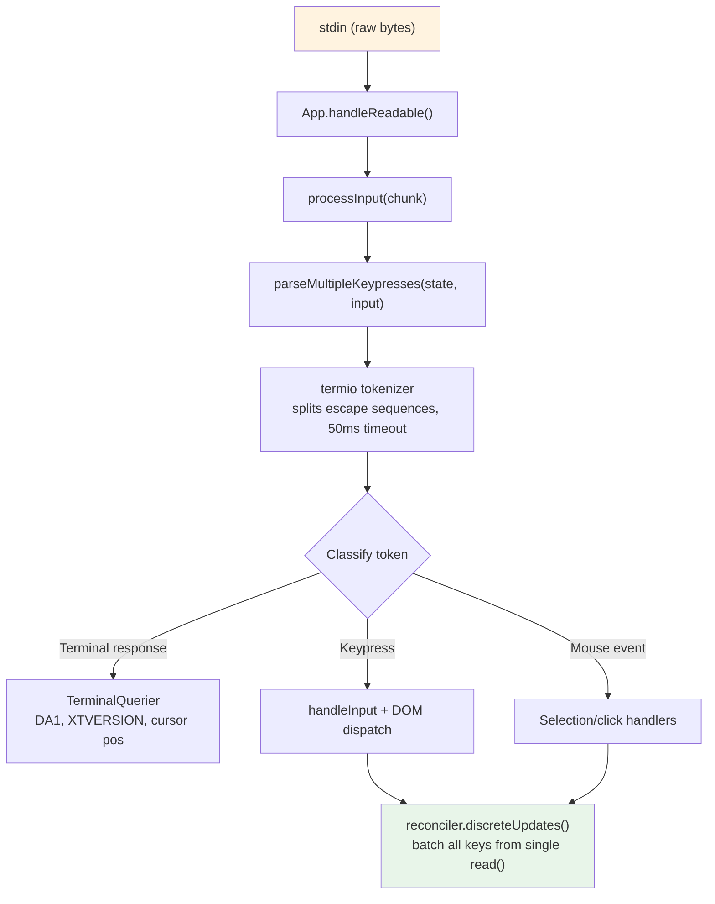
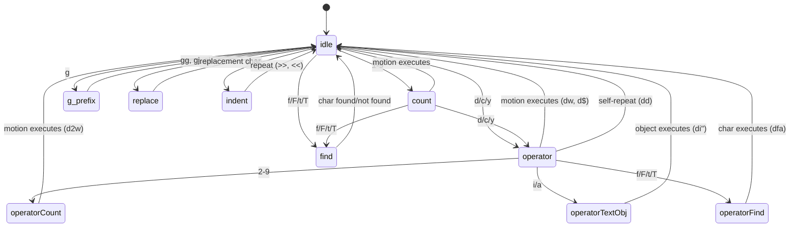

# 第十四章：輸入與互動

## 原始位元組，有意義的動作

當你在 Claude Code 中按下 Ctrl+X 接著 Ctrl+K 時，終端機會發送兩段位元組序列，中間相隔約 200 毫秒。第一段是 `0x18`（ASCII CAN）。第二段是 `0x0B`（ASCII VT）。這兩個位元組除了「控制字元」之外，本身不帶有任何固有含義。輸入系統必須識別出這兩個在超時時間窗口內依序到達的位元組構成了組合鍵 `ctrl+x ctrl+k`，對應到動作 `chat:killAgents`，用於終止所有正在執行的子代理。

從原始位元組到被終止的代理之間，六個系統依序啟動：一個分詞器拆分跳脫序列、一個解析器在五種終端機協定中分類它們、一個鍵綁定解析器根據上下文特定的綁定比對序列、一個組合鍵狀態機管理多鍵序列、一個處理器執行動作，以及 React 將產生的狀態更新批次合併為單一次渲染。

困難之處不在於這些系統中的任何一個，而在於終端機多樣性的組合爆炸。iTerm2 發送 Kitty 鍵盤協定序列。macOS Terminal 發送傳統 VT220 序列。Ghostty 透過 SSH 發送 xterm modifyOtherKeys。tmux 可能會吃掉、轉換或直接傳遞這些序列中的任何一個，取決於其配置。Windows Terminal 在 VT 模式下有自己的怪癖。輸入系統必須從所有這些來源產生正確的 `ParsedKey` 物件，因為使用者不需要知道他們的終端機使用的是哪種鍵盤協定。

本章追蹤從原始位元組到有意義動作的路徑，跨越整個終端機生態。

設計哲學是漸進增強搭配優雅降級。在支援 Kitty 鍵盤協定的現代終端機上，Claude Code 可獲得完整的修飾鍵偵測（Ctrl+Shift+A 與 Ctrl+A 是不同的）、super 鍵回報（Cmd 快捷鍵），以及無歧義的按鍵識別。在透過 SSH 連線的傳統終端機上，它會退回到可用的最佳協定，失去部分修飾鍵區分能力，但核心功能保持完整。使用者永遠不會看到關於終端機不受支援的錯誤訊息。他們可能無法使用 `ctrl+shift+f` 進行全域搜尋，但 `ctrl+r` 的歷史搜尋在任何環境都能運作。

---

## 按鍵解析管線

輸入以位元組區塊的形式到達 stdin。管線分階段處理它們：



分詞器是整個系統的基礎。終端機輸入是一道混合了可列印字元、控制碼和多位元組跳脫序列的位元組串流，沒有明確的分隔邊界。單次從 stdin 的 `read()` 可能回傳 `\x1b[1;5A`（Ctrl+上方向鍵），也可能在一次讀取中回傳 `\x1b`，在下一次讀取中才回傳 `[1;5A`，取決於位元組從 PTY 到達的速度。分詞器維護一個狀態機，緩衝不完整的跳脫序列，並輸出完整的 token。

不完整序列問題是根本性的。當分詞器看到一個孤立的 `\x1b` 時，它無法知道這是 Escape 鍵還是 CSI 序列的開頭。它會緩衝這個位元組並啟動一個 50ms 的計時器。如果沒有後續位元組到達，緩衝區會被清空，`\x1b` 便成為一個 Escape 按鍵事件。但在清空之前，分詞器會檢查 `stdin.readableLength`——如果有位元組在核心緩衝區中等待，計時器會重新啟動而非清空。這處理了事件迴圈被阻塞超過 50ms，而後續位元組已經被緩衝但尚未被讀取的情況。

對於貼上操作，超時時間延長到 500ms。貼上的文字可能很大，且分多個區塊到達。

來自單次 `read()` 的所有已解析按鍵在一次 `reconciler.discreteUpdates()` 呼叫中處理。這會批次合併 React 狀態更新，使得貼上 100 個字元只產生一次重新渲染，而非 100 次。這個批次處理至關重要：沒有它的話，貼上中的每個字元都會觸發一個完整的 reconciliation 週期——狀態更新、reconciliation、commit、Yoga 排版、渲染、差異比對、寫入。按每個週期 5ms 計算，100 個字元的貼上需要 500ms 處理。有了批次處理，同樣的貼上只需要一個 5ms 的週期。

### stdin 管理

`App` 元件透過引用計數來管理 raw mode。當任何元件需要原始輸入（提示、對話框、vim 模式）時，它呼叫 `setRawMode(true)`，遞增計數器。當它不再需要原始輸入時，呼叫 `setRawMode(false)`，遞減計數器。只有當計數器歸零時，raw mode 才會被真正停用。這防止了終端機應用程式中的一個常見 bug：元件 A 啟用 raw mode、元件 B 啟用 raw mode、元件 A 停用 raw mode，突然間元件 B 的輸入就壞了，因為 raw mode 被全域停用了。

當 raw mode 首次啟用時，App 會：

1. 停止早期輸入捕獲（在 React 掛載前收集按鍵的啟動階段機制）
2. 將 stdin 設為 raw mode（無行緩衝、無回顯、無信號處理）
3. 附加一個 `readable` 監聽器用於非同步輸入處理
4. 啟用 bracketed paste（使貼上文字可被識別）
5. 啟用焦點回報（使應用程式知道終端機視窗獲得/失去焦點）
6. 啟用擴展按鍵回報（Kitty 鍵盤協定 + xterm modifyOtherKeys）

停用時，所有這些操作按相反順序還原。仔細的排序防止跳脫序列洩漏——在停用 raw mode 之前先停用擴展按鍵回報，確保終端機不會在應用程式已停止解析 Kitty 編碼序列後繼續發送它們。

`onExit` 信號處理器（透過 `signal-exit` 套件）確保即使在非預期終止時也能進行清理。如果程序收到 SIGTERM 或 SIGINT，處理器會停用 raw mode、還原終端機狀態、退出替代螢幕（如果處於啟用狀態），並在程序退出前重新顯示游標。沒有這個清理機制，一個崩潰的 Claude Code 工作階段會讓終端機處於 raw mode 狀態，沒有游標也沒有回顯——使用者需要盲打 `reset` 才能恢復終端機。

---

## 多協定支援

終端機在如何編碼鍵盤輸入上無法達成一致。像 Kitty 這樣的現代終端模擬器會發送結構化序列，包含完整的修飾鍵資訊。透過 SSH 連線的傳統終端機則發送有歧義的位元組序列，需要上下文來解讀。Claude Code 的解析器同時處理五種不同的協定，因為使用者的終端機可能是其中任何一種。

**CSI u（Kitty 鍵盤協定）**是現代標準。格式：`ESC [ codepoint [; modifier] u`。範例：`ESC[13;2u` 是 Shift+Enter，`ESC[27u` 是沒有修飾鍵的 Escape。codepoint 可以明確地識別按鍵——Escape 作為按鍵與 Escape 作為序列前綴之間沒有歧義。修飾鍵字以位元為單位編碼 shift、alt、ctrl 和 super（Cmd）。Claude Code 在啟動時透過 `ENABLE_KITTY_KEYBOARD` 跳脫序列在支援的終端機上啟用此協定，並在退出時透過 `DISABLE_KITTY_KEYBOARD` 停用。協定透過查詢/回應交握來偵測：應用程式發送 `CSI ? u`，終端機回應 `CSI ? flags u`，其中 `flags` 表示支援的協定層級。

**xterm modifyOtherKeys** 是用於像 Ghostty 透過 SSH 這類終端機的備援方案，因為在這種情況下 Kitty 協定未被協商。格式：`ESC [ 27 ; modifier ; keycode ~`。注意參數順序與 CSI u 相反——修飾鍵在鍵碼之前，然後才是鍵碼。這是解析器 bug 的常見來源。此協定透過 `CSI > 4 ; 2 m` 啟用，由 Ghostty、tmux 和 xterm 在終端機的 TERM 識別未被偵測到時發出（在 SSH 上很常見，因為 `TERM_PROGRAM` 不會被轉發）。

**傳統終端機序列**涵蓋其他所有情況：透過 `ESC O` 和 `ESC [` 序列的功能鍵、方向鍵、數字鍵盤、Home/End/Insert/Delete，以及 40 年來 VT100/VT220/xterm 變體演化積累的完整動物園。解析器使用兩個正則表達式來比對這些：`FN_KEY_RE` 用於 `ESC O/N/[/[[` 前綴模式（比對功能鍵、方向鍵及其帶修飾鍵的變體），`META_KEY_CODE_RE` 用於 meta 按鍵碼（`ESC` 後跟一個英數字元，傳統的 Alt+key 編碼）。

傳統序列的挑戰在於歧義性。`ESC [ 1 ; 2 R` 可能是 Shift+F3，也可能是游標位置回報，取決於上下文。解析器透過私有標記檢查來解決這個問題：游標位置回報使用 `CSI ? row ; col R`（帶有 `?` 私有標記），而帶修飾鍵的功能鍵使用 `CSI params R`（不帶標記）。這就是為什麼 Claude Code 請求 DECXCPR（擴展游標位置回報）而非標準 CPR——擴展形式是沒有歧義的。

終端機識別增加了另一層複雜性。在啟動時，Claude Code 發送一個 `XTVERSION` 查詢（`CSI > 0 q`）來發現終端機的名稱和版本。回應（`DCS > | name ST`）可以穿越 SSH 連線——不像 `TERM_PROGRAM` 是一個不會透過 SSH 傳播的環境變數。知道終端機身分讓解析器能夠處理終端機特定的怪癖。例如，xterm.js（用於 VS Code 的整合終端機）與原生 xterm 有不同的跳脫序列行為，而識別字串（`xterm.js(X.Y.Z)`）讓解析器能夠考慮這些差異。

**SGR 滑鼠事件**使用格式 `ESC [ < button ; col ; row M/m`，其中 `M` 是按下，`m` 是釋放。按鈕碼編碼動作：0/1/2 分別對應左/中/右鍵點擊，64/65 對應滾輪上/下（0x40 與滾輪位元做 OR 運算），32+ 對應拖曳（0x20 與移動位元做 OR 運算）。滾輪事件被轉換為 `ParsedKey` 物件，這樣它們就能通過鍵綁定系統；點擊和拖曳事件則成為 `ParsedMouse` 物件，路由到選取處理器。

**Bracketed paste** 用 `ESC [200~` 和 `ESC [201~` 標記包裹貼上的內容。標記之間的所有內容都成為一個帶有 `isPasted: true` 的單一 `ParsedKey`，無論貼上的文字可能包含什麼跳脫序列。這防止貼上的程式碼被解讀為命令——當使用者貼上包含 `\x03`（作為原始位元組的 Ctrl+C）的程式碼片段時，這是一項關鍵的安全功能。

解析器的輸出類型構成一個清晰的判別聯合：

```typescript
type ParsedKey = {
  kind: 'key';
  name: string;        // 'return', 'escape', 'a', 'f1', etc.
  ctrl: boolean; meta: boolean; shift: boolean;
  option: boolean; super: boolean;
  sequence: string;    // Raw escape sequence for debugging
  isPasted: boolean;   // Inside bracketed paste
}

type ParsedMouse = {
  kind: 'mouse';
  button: number;      // SGR button code
  action: 'press' | 'release';
  col: number; row: number;  // 1-indexed terminal coordinates
}

type ParsedResponse = {
  kind: 'response';
  response: TerminalResponse;  // Routed to TerminalQuerier
}
```

`kind` 判別子確保下游程式碼明確處理每種輸入類型。按鍵不會被意外地當作滑鼠事件處理；終端機回應不會被意外地解讀為按鍵事件。`ParsedKey` 類型還攜帶原始 `sequence` 字串用於除錯——當使用者回報「按下 Ctrl+Shift+A 沒有反應」時，除錯日誌可以顯示終端機發送的確切位元組序列，使得診斷問題是在終端機的編碼、解析器的辨識，還是鍵綁定的配置成為可能。

`ParsedKey` 上的 `isPasted` 旗標對安全至關重要。當 bracketed paste 啟用時，終端機用標記序列包裹貼上的內容。解析器在產生的按鍵事件上設定 `isPasted: true`，鍵綁定解析器會跳過對已貼上按鍵的鍵綁定比對。沒有這個機制，貼上包含 `\x03`（作為原始位元組的 Ctrl+C）或跳脫序列的文字會觸發應用程式命令。有了它，無論貼上內容的位元組內容為何，都被視為文字輸入。

解析器也辨識終端機回應——終端機本身回答查詢而發送的序列。這些包括裝置屬性（DA1、DA2）、游標位置回報、Kitty 鍵盤旗標回應、XTVERSION（終端機識別），以及 DECRPM（模式狀態）。這些被路由到 `TerminalQuerier` 而非輸入處理器：

```typescript
type TerminalResponse =
  | { type: 'decrpm'; mode: number; status: number }
  | { type: 'da1'; params: number[] }
  | { type: 'da2'; params: number[] }
  | { type: 'kittyKeyboard'; flags: number }
  | { type: 'cursorPosition'; row: number; col: number }
  | { type: 'osc'; code: number; data: string }
  | { type: 'xtversion'; version: string }
```

**修飾鍵解碼**遵循 XTerm 慣例：修飾鍵字為 `1 + (shift ? 1 : 0) + (alt ? 2 : 0) + (ctrl ? 4 : 0) + (super ? 8 : 0)`。`ParsedKey` 中的 `meta` 欄位對應到 Alt/Option（位元 2）。`super` 欄位是獨立的（位元 8，macOS 上的 Cmd）。這個區分很重要，因為 Cmd 快捷鍵被作業系統保留，無法被終端機應用程式捕獲——除非終端機使用 Kitty 協定，它會回報其他協定會默默吞掉的 super 修飾鍵。

一個 stdin 間隙偵測器會在 5 秒無輸入後觸發終端機模式重新斷言。這處理了 tmux 重新附加和筆電喚醒的情境，在這些情況下終端機的鍵盤模式可能已被多工器或作業系統重置。當重新斷言觸發時，它重新發送 `ENABLE_KITTY_KEYBOARD`、`ENABLE_MODIFY_OTHER_KEYS`、bracketed paste 和焦點回報序列。沒有這個機制，從 tmux 工作階段分離再重新附加會默默地將鍵盤協定降級到傳統模式，在工作階段剩餘時間內破壞修飾鍵偵測。

### 終端機 I/O 層

解析器之下是 `ink/termio/` 中的結構化終端機 I/O 子系統：

- **csi.ts**——CSI（Control Sequence Introducer）序列：游標移動、清除、捲動區域、bracketed paste 啟用/停用、焦點事件啟用/停用、Kitty 鍵盤協定啟用/停用
- **dec.ts**——DEC 私有模式序列：替代螢幕緩衝區（1049）、滑鼠追蹤模式（1000/1002/1003）、游標可見性、bracketed paste（2004）、焦點事件（1004）
- **osc.ts**——Operating System Commands：剪貼簿存取（OSC 52）、標籤狀態、iTerm2 進度指示器、tmux/screen 多工器包裹（DCS passthrough，用於需要穿越多工器邊界的序列）
- **sgr.ts**——Select Graphic Rendition：ANSI 樣式碼系統（顏色、粗體、斜體、底線、反轉）
- **tokenize.ts**——用於跳脫序列邊界偵測的有狀態分詞器

多工器包裹值得一提。當 Claude Code 在 tmux 內執行時，某些跳脫序列（如 Kitty 鍵盤協定協商）必須傳遞到外部終端機。tmux 使用 DCS passthrough（`ESC P ... ST`）來轉發它不理解的序列。`osc.ts` 中的 `wrapForMultiplexer` 函式偵測多工器環境並適當地包裹序列。沒有這個機制，Kitty 鍵盤模式在 tmux 內會默默失效，使用者永遠不會知道為什麼他們的 Ctrl+Shift 綁定停止了運作。

### 事件系統

`ink/events/` 目錄實作了一個與瀏覽器相容的事件系統，具有七種事件類型：`KeyboardEvent`、`ClickEvent`、`FocusEvent`、`InputEvent`、`TerminalFocusEvent`，以及基底 `TerminalEvent`。每個事件攜帶 `target`、`currentTarget`、`eventPhase`，並支援 `stopPropagation()`、`stopImmediatePropagation()` 和 `preventDefault()`。

包裹 `ParsedKey` 的 `InputEvent` 是為了向後相容傳統的 `EventEmitter` 路徑而存在的，舊版元件可能仍在使用它。新元件使用帶有捕獲/冒泡階段的 DOM 風格鍵盤事件派發。兩條路徑都從同一個已解析按鍵觸發，因此它們始終一致——到達 stdin 的一個按鍵恰好產生一個 `ParsedKey`，它同時衍生出一個 `InputEvent`（用於傳統監聽器）和一個 `KeyboardEvent`（用於 DOM 風格派發）。這種雙路徑設計允許從 EventEmitter 模式到 DOM 事件模式的漸進遷移，而不會破壞現有元件。

---

## 鍵綁定系統

鍵綁定系統將三個常被糾纏在一起的關注點分離開來：什麼按鍵觸發什麼動作（綁定）、動作觸發時發生什麼（處理器），以及哪些綁定目前處於啟用狀態（上下文）。

### 綁定：宣告式配置

預設綁定在 `defaultBindings.ts` 中定義為一個 `KeybindingBlock` 物件陣列，每個都限定在一個上下文中：

```typescript
export const DEFAULT_BINDINGS: KeybindingBlock[] = [
  {
    context: 'Global',
    bindings: {
      'ctrl+c': 'app:interrupt',
      'ctrl+d': 'app:exit',
      'ctrl+l': 'app:redraw',
      'ctrl+r': 'history:search',
    },
  },
  {
    context: 'Chat',
    bindings: {
      'escape': 'chat:cancel',
      'ctrl+x ctrl+k': 'chat:killAgents',
      'enter': 'chat:submit',
      'up': 'history:previous',
      'ctrl+x ctrl+e': 'chat:externalEditor',
    },
  },
  // ... 14 more contexts
]
```

平台特定的綁定在定義時處理。圖片貼上在 macOS/Linux 上是 `ctrl+v`，但在 Windows 上是 `alt+v`（因為 `ctrl+v` 是系統貼上）。模式切換在支援 VT 模式的終端機上是 `shift+tab`，但在不支援的 Windows Terminal 上是 `meta+m`。功能旗標控制的綁定（快速搜尋、語音模式、終端機面板）是有條件地包含的。

使用者可以透過 `~/.claude/keybindings.json` 覆寫任何綁定。解析器接受修飾鍵別名（`ctrl`/`control`、`alt`/`opt`/`option`、`cmd`/`command`/`super`/`win`）、按鍵別名（`esc` -> `escape`、`return` -> `enter`）、組合鍵表示法（用空格分隔的步驟，如 `ctrl+k ctrl+s`），以及 null 動作來解除預設按鍵綁定。null 動作與不定義綁定不同——它明確阻止預設綁定觸發，這對於想要將某個按鍵收回給終端機使用的使用者很重要。

### 上下文：16 個活動範疇

每個上下文代表一種互動模式，其中一組特定的綁定適用：

| 上下文 | 何時啟用 |
|---------|----------|
| Global | 始終啟用 |
| Chat | 提示輸入處於焦點 |
| Autocomplete | 自動完成選單可見 |
| Confirmation | 權限對話框顯示中 |
| Scroll | 替代螢幕中有可捲動內容 |
| Transcript | 唯讀對話紀錄檢視器 |
| HistorySearch | 反向歷史搜尋（ctrl+r） |
| Task | 背景任務正在執行 |
| Help | 說明覆蓋層已顯示 |
| MessageSelector | 回溯對話框 |
| MessageActions | 訊息游標導覽 |
| DiffDialog | 差異比對檢視器 |
| Select | 通用選擇清單 |
| Settings | 設定面板 |
| Tabs | 標籤頁導覽 |
| Footer | 頁尾指示器 |

當按鍵到達時，解析器從目前啟用的上下文（由 React 元件狀態決定）建構一個上下文清單，去除重複項並保留優先順序，然後搜尋匹配的綁定。最後匹配的綁定勝出——這就是使用者覆寫如何優先於預設值的機制。上下文清單在每次按鍵時重新建構（成本很低：最多 16 個字串的陣列串接和去重），因此上下文變更立即生效，無需任何訂閱或監聽機制。

上下文設計處理了一個棘手的互動模式：巢狀模態對話框。當權限對話框在執行中的任務期間出現時，`Confirmation` 和 `Task` 上下文可能同時處於啟用狀態。`Confirmation` 上下文取得優先權（它在元件樹中較晚註冊），因此 `y` 觸發「核准」而非任何任務層級的綁定。當對話框關閉時，`Confirmation` 上下文停用，`Task` 綁定恢復。這種堆疊行為自然地從上下文清單的優先順序中產生——不需要特殊的模態處理程式碼。

### 保留的快捷鍵

並非所有東西都可以重新綁定。系統強制執行三個層級的保留：

**不可重新綁定**（硬編碼行為）：`ctrl+c`（中斷/退出）、`ctrl+d`（退出）、`ctrl+m`（在所有終端機中與 Enter 相同——重新綁定它會破壞 Enter）。

**終端機保留**（警告）：`ctrl+z`（SIGTSTP）、`ctrl+\`（SIGQUIT）。這些技術上可以被綁定，但在大多數配置中終端機會在應用程式看到它們之前就攔截。

**macOS 保留**（錯誤）：`cmd+c`、`cmd+v`、`cmd+x`、`cmd+q`、`cmd+w`、`cmd+tab`、`cmd+space`。作業系統在它們到達終端機之前就攔截了。綁定它們會建立一個永遠不會觸發的快捷鍵。

### 解析流程

當按鍵到達時，解析路徑為：

1. 建構上下文清單：元件已註冊的啟用上下文加上 Global，去重並保留優先順序
2. 對合併後的綁定表呼叫 `resolveKeyWithChordState(input, key, contexts)`
3. `match`（匹配）時：清除任何待處理的組合鍵，呼叫處理器，對事件呼叫 `stopImmediatePropagation()`
4. `chord_started`（組合鍵開始）時：儲存待處理的按鍵序列，停止傳播，啟動組合鍵超時
5. `chord_cancelled`（組合鍵取消）時：清除待處理的組合鍵，讓事件向下傳遞
6. `unbound`（已解除綁定）時：清除組合鍵——這是一個明確的解除綁定（使用者將動作設為 `null`），所以傳播被停止但不執行任何處理器
7. `none`（無匹配）時：向下傳遞到其他處理器

「最後匹配勝出」的解析策略意味著如果預設綁定和使用者綁定都在 `Chat` 上下文中定義了 `ctrl+k`，使用者的綁定會取得優先權。這在匹配時透過按定義順序迭代綁定並保留最後的匹配來評估，而非在載入時建構覆寫映射。優勢：上下文特定的覆寫能自然地組合。使用者可以覆寫 `Chat` 中的 `enter` 而不影響 `Confirmation` 中的 `enter`。

---

## 組合鍵支援

`ctrl+x ctrl+k` 綁定是一個組合鍵：兩次按鍵合在一起形成一個單一動作。解析器用一個狀態機來管理它。

當按鍵到達時：

1. 解析器將它附加到任何待處理的組合鍵前綴
2. 它檢查是否有任何綁定的組合鍵以此前綴開頭。如果有，回傳 `chord_started` 並儲存待處理的按鍵序列
3. 如果完整的組合鍵恰好匹配一個綁定，回傳 `match` 並清除待處理狀態
4. 如果組合鍵前綴什麼都不匹配，回傳 `chord_cancelled`

一個 `ChordInterceptor` 元件在組合鍵等待狀態期間攔截所有輸入。它有 1000ms 的超時——如果第二次按鍵沒有在一秒內到達，組合鍵被取消且第一次按鍵被丟棄。`KeybindingContext` 提供一個 `pendingChordRef` 用於同步存取待處理狀態，避免 React 狀態更新延遲可能導致第二次按鍵在第一次按鍵的狀態更新完成前就被處理。

組合鍵設計避免了遮蔽 readline 編輯鍵。沒有組合鍵的話，「終止代理」的鍵綁定可能是 `ctrl+k`——但那是 readline 的「刪除到行尾」，使用者在終端機文字輸入中期望這個功能。透過使用 `ctrl+x` 作為前綴（符合 readline 自身的組合鍵前綴慣例），系統獲得了一個不與單鍵編輯快捷鍵衝突的綁定命名空間。

實作處理了大多數組合鍵系統忽略的一個邊界情況：當使用者按下 `ctrl+x` 但隨後輸入一個不屬於任何組合鍵的字元時會發生什麼？如果處理不當，那個字元會被吞掉——組合鍵攔截器消費了輸入，組合鍵被取消，字元就消失了。Claude Code 的 `ChordInterceptor` 在這種情況下回傳 `chord_cancelled`，這導致待處理的輸入被丟棄，但允許不匹配的字元向下傳遞到正常的輸入處理。字元不會丟失；只有組合鍵前綴被丟棄。這符合使用者對 Emacs 風格組合鍵前綴的預期行為。

---

## Vim 模式

### 狀態機

vim 的實作是一個帶有窮盡型別檢查的純狀態機。型別就是文件：

```typescript
export type VimState =
  | { mode: 'INSERT'; insertedText: string }
  | { mode: 'NORMAL'; command: CommandState }

export type CommandState =
  | { type: 'idle' }
  | { type: 'count'; digits: string }
  | { type: 'operator'; op: Operator; count: number }
  | { type: 'operatorCount'; op: Operator; count: number; digits: string }
  | { type: 'operatorFind'; op: Operator; count: number; find: FindType }
  | { type: 'operatorTextObj'; op: Operator; count: number; scope: TextObjScope }
  | { type: 'find'; find: FindType; count: number }
  | { type: 'g'; count: number }
  | { type: 'operatorG'; op: Operator; count: number }
  | { type: 'replace'; count: number }
  | { type: 'indent'; dir: '>' | '<'; count: number }
```

這是一個包含 12 個變體的判別聯合。TypeScript 的窮盡檢查確保每個對 `CommandState.type` 的 `switch` 語句都處理了所有 12 種情況。向聯合中添加一個新狀態會導致每個不完整的 switch 產生編譯錯誤。狀態機不可能有死狀態或缺失的轉換——型別系統禁止了這一點。

注意每個狀態如何恰好攜帶下一次轉換所需的資料。`operator` 狀態知道哪個運算子（`op`）以及前面的計數。`operatorCount` 狀態添加了數字累加器（`digits`）。`operatorTextObj` 狀態添加了範疇（`inner` 或 `around`）。沒有任何狀態攜帶它不需要的資料。這不僅僅是好品味——它防止了一整類 bug，即處理器讀取到上一個命令的過時資料。如果你處於 `find` 狀態，你有一個 `FindType` 和一個 `count`。你沒有運算子，因為沒有待處理的運算子。型別使得不可能的狀態無法表示。

狀態圖說明了一切：



從 `idle` 開始，按下 `d` 進入 `operator` 狀態。從 `operator`，按下 `w` 以 `w` 動作執行 `delete`。再按一次 `d`（`dd`）觸發行刪除。按下 `2` 進入 `operatorCount`，所以 `d2w` 變成「刪除接下來的 2 個字」。按下 `i` 進入 `operatorTextObj`，所以 `di"` 變成「刪除引號內的內容」。每個中間狀態恰好攜帶下一次轉換所需的上下文——不多也不少。

### 作為純函式的轉換

`transition()` 函式根據目前狀態類型分派到 10 個處理函式之一。每個函式回傳一個 `TransitionResult`：

```typescript
type TransitionResult = {
  next?: CommandState;    // New state (omitted = stay in current)
  execute?: () => void;   // Side effect (omitted = no action yet)
}
```

副作用是被回傳的，而非被執行的。轉換函式是純的——給定一個狀態和一個按鍵，它回傳下一個狀態以及一個可選的執行動作的閉包。呼叫者決定何時執行效果。這使得狀態機可以輕易地測試：餵入狀態和按鍵，斷言回傳的狀態，忽略閉包。這也意味著轉換函式不依賴編輯器狀態、游標位置或緩衝區內容。這些細節在閉包建立時被捕獲，而非在狀態機轉換時被消費。

`fromIdle` 處理器是入口點，涵蓋完整的 vim 詞彙表：

- **計數前綴**：`1-9` 進入 `count` 狀態，累積數字。`0` 是特殊的——它是「行首」動作，而非計數數字，除非已經累積了數字
- **運算子**：`d`、`c`、`y` 進入 `operator` 狀態，等待一個動作或文字物件來定義範圍
- **尋找**：`f`、`F`、`t`、`T` 進入 `find` 狀態，等待要搜尋的字元
- **G 前綴**：`g` 進入 `g` 狀態，用於複合命令（`gg`、`gj`、`gk`）
- **取代**：`r` 進入 `replace` 狀態，等待取代字元
- **縮排**：`>`、`<` 進入 `indent` 狀態（用於 `>>` 和 `<<`）
- **簡單動作**：`h/j/k/l/w/b/e/W/B/E/0/^/$` 立即執行，移動游標
- **即時命令**：`x`（刪除字元）、`~`（切換大小寫）、`J`（合併行）、`p/P`（貼上）、`D/C/Y`（運算子快捷鍵）、`G`（跳到尾端）、`.`（點重複）、`;/,`（尋找重複）、`u`（復原）、`i/I/a/A/o/O`（進入插入模式）

### 動作、運算子與文字物件

**動作**是將按鍵對應到游標位置的純函式。`resolveMotion(key, cursor, count)` 將動作套用 `count` 次，如果游標停止移動則短路退出（你無法向左移動超過第 0 欄）。這個短路對於行尾的 `3w` 很重要——它停在最後一個字而非換行或報錯。

動作根據它們與運算子的互動方式分類：

- **排他的**（預設）——目的地處的字元不包含在範圍內。`dw` 刪除到下一個字的第一個字元之前（不包括該字元）
- **包含的**（`e`、`E`、`$`）——目的地處的字元包含在範圍內。`de` 刪除到當前字的最後一個字元（包括該字元）
- **行級的**（`j`、`k`、`G`、`gg`、`gj`、`gk`）——與運算子搭配使用時，範圍擴展到涵蓋完整的行。`dj` 刪除當前行和下一行，而非僅刪除兩個游標位置之間的字元

**運算子**套用於一個範圍。`delete` 移除文字並將其儲存到暫存器。`change` 移除文字並進入插入模式。`yank` 複製到暫存器但不做修改。`cw`/`cW` 的特殊情況遵循 vim 慣例：change-word 到當前字的末尾，而非下一個字的開頭（不同於 `dw`）。

一個有趣的邊界情況：`[Image #N]` 晶片對齊。當字動作落在圖片參考晶片（在終端機中渲染為單一視覺單元）內部時，範圍會擴展到涵蓋整個晶片。這防止了使用者感知為原子元素的部分刪除——你無法刪除 `[Image #3]` 的一半，因為動作系統將整個晶片視為單一個字。

額外命令涵蓋完整的預期 vim 詞彙表：`x`（刪除字元）、`r`（取代字元）、`~`（切換大小寫）、`J`（合併行）、`p`/`P`（貼上，具有行級/字元級感知）、`>>` / `<<`（縮排/取消縮排，以 2 格空格為單位）、`o`/`O`（在下方/上方開新行並進入插入模式）。

**文字物件**尋找游標周圍的邊界。它們回答的問題是：「游標所在的『東西』是什麼？」

字物件（`iw`、`aw`、`iW`、`aW`）將文字分割為字素，將每個字素分類為字元字元、空白或標點符號，並將選取範圍擴展到字的邊界。`i`（inner）變體只選取字本身。`a`（around）變體包含周圍的空白——優先選取尾隨空白，如果在行尾則退回到前導空白。大寫變體（`W`、`aW`）將任何非空白序列視為一個字，忽略標點邊界。

引號物件（`i"`、`a"`、`i'`、`a'`、`` i` ``、`` a` ``）在當前行上尋找成對引號。引號對按順序匹配（第一個和第二個引號構成一對，第三個和第四個構成下一對，依此類推）。如果游標位於第一個和第二個引號之間，那就是匹配。`a` 變體包含引號字元；`i` 變體排除它們。

括號物件（`ib`/`i(`、`ab`/`a(`、`i[`/`a[`、`iB`/`i{`/`aB`/`a{`、`i<`/`a<`）對匹配的分隔符進行深度追蹤搜尋。它們從游標向外搜尋，維護巢狀計數，直到找到深度為零的匹配對。這正確處理了巢狀括號——在 `foo((bar))` 中的 `d i (` 刪除 `bar`，而非 `(bar)`。

### 持久狀態與點重複

vim 模式維護一個跨命令存續的 `PersistentState`——讓 vim 有 vim 感覺的「記憶」：

```typescript
interface PersistentState {
  lastChange: RecordedChange;   // For dot-repeat
  lastFind: { type: FindType; char: string };  // For ; and ,
  register: string;             // Yank buffer
  registerIsLinewise: boolean;  // Paste behavior flag
}
```

每個修改命令都將自己記錄為一個 `RecordedChange`——一個涵蓋插入、運算子+動作、運算子+文字物件、運算子+尋找、取代、刪除字元、切換大小寫、縮排、開新行和合併行的判別聯合。`.` 命令從持久狀態重播 `lastChange`，使用記錄的計數、運算子和動作在當前游標位置重現完全相同的編輯。

尋找重複（`;` 和 `,`）使用 `lastFind`。`;` 命令在相同方向重複最後一次尋找。`,` 命令翻轉方向：`f` 變成 `F`，`t` 變成 `T`，反之亦然。這意味著在 `fa`（向前尋找 'a'）之後，`;` 向前尋找下一個 'a'，`,` 向後尋找下一個 'a'——使用者不需要記住他們搜尋的方向。

暫存器追蹤被複製和刪除的文字。當暫存器內容以 `\n` 結尾時，它被標記為行級的，這改變了貼上行為：`p` 在當前行下方插入（而非游標之後），`P` 在上方插入。這個區分對使用者來說是不可見的，但對於 vim 使用者經常依賴的「刪除一行，在其他地方貼上」的工作流程至關重要。

---

## 虛擬捲動

長時間的 Claude Code 工作階段會產生長對話。一個密集的除錯工作階段可能生成 200+ 則訊息，每則包含 Markdown、程式碼區塊、工具使用結果和權限紀錄。沒有虛擬化的話，React 會在記憶體中維護 200+ 個元件子樹，每個都有自己的狀態、效果和 memoization 快取。DOM 樹會包含數千個節點。Yoga 排版會在每一幀造訪所有節點。終端機將無法使用。

`VirtualMessageList` 元件透過只渲染視埠中可見的訊息加上上下方的小緩衝區來解決這個問題。在有數百則訊息的對話中，這是掛載 500 個 React 子樹（每個都帶有 Markdown 解析、語法高亮和工具使用區塊）與掛載 15 個之間的差異。

元件維護：

- 每則訊息的**高度快取**，在終端機欄數改變時失效
- 用於對話紀錄搜尋導覽的**跳轉控制柄**（跳轉到索引、下一個/上一個匹配）
- 具有暖快取支援的**搜尋文字提取**（當使用者輸入 `/` 時預先小寫化所有訊息）
- **置頂提示追蹤**——當使用者從輸入處捲開時，他們的最後提示文字出現在頂部作為上下文
- **訊息動作導覽**——用於回溯功能的基於游標的訊息選擇

`useVirtualScroll` hook 根據 `scrollTop`、`viewportHeight` 和累計訊息高度來計算要掛載哪些訊息。它在 `ScrollBox` 上維護捲動鉗制邊界，防止當突發的 `scrollTo` 呼叫超越 React 非同步重新渲染的速度時出現空白螢幕——這是虛擬化列表中捲動位置可能超越 DOM 更新的經典問題。

虛擬捲動與 Markdown token 快取之間的互動值得注意。當一則訊息捲出視埠時，它的 React 子樹被解除掛載。當使用者捲回時，子樹重新掛載。沒有快取的話，這意味著每次使用者捲過的訊息都要重新解析 Markdown。模組級的 LRU 快取（500 個條目，以內容雜湊為鍵）確保昂貴的 `marked.lexer()` 呼叫對於每段唯一的訊息內容最多只發生一次，無論元件掛載和解除掛載多少次。

`ScrollBox` 元件本身透過 `useImperativeHandle` 提供命令式 API：

- `scrollTo(y)`——絕對捲動，中斷置底捲動模式
- `scrollBy(dy)`——累積到 `pendingScrollDelta`，由渲染器以限速的速率消耗
- `scrollToElement(el, offset)`——透過 `scrollAnchor` 將位置讀取延遲到渲染時
- `scrollToBottom()`——重新啟用置底捲動模式
- `setClampBounds(min, max)`——約束虛擬捲動視窗

所有捲動變動直接作用於 DOM 節點屬性並透過微任務排程渲染，繞過 React 的 reconciler。`markScrollActivity()` 呼叫通知背景定時器（旋轉指示器、計時器）跳過下一個 tick，減少主動捲動期間的事件迴圈爭用。這是一種協作式排程模式：捲動路徑告訴背景工作「我正在執行延遲敏感的操作，請讓步」。背景定時器在排程下一個 tick 之前檢查此旗標，如果捲動正在進行則延遲一幀。結果是即使有多個旋轉指示器和計時器在背景執行，捲動也能保持一致的流暢。

---

## 實際應用：建構上下文感知的鍵綁定系統

Claude Code 的鍵綁定架構為任何具有模態輸入的應用程式提供了模板——編輯器、IDE、繪圖工具、終端機多工器。關鍵洞見：

**將綁定與處理器分離。**綁定是資料（哪個按鍵對應到哪個動作名稱）。處理器是程式碼（動作觸發時發生什麼）。將它們分開意味著綁定可以序列化為 JSON 供使用者自訂，而處理器保留在擁有相關狀態的元件中。使用者可以將 `ctrl+k` 重新綁定到 `chat:submit` 而不需要碰觸任何元件程式碼。

**上下文作為一等概念。**不是一個扁平的鍵映射，而是定義根據應用程式狀態啟用和停用的上下文。當對話框開啟時，`Confirmation` 上下文啟用，其綁定優先於 `Chat` 綁定。當對話框關閉時，`Chat` 綁定恢復。這消除了散布在事件處理器中的 `if (dialogOpen && key === 'y')` 條件湯。

**組合鍵狀態作為明確的狀態機。**多鍵序列（組合鍵）不是單鍵綁定的特殊情況——它們是一種不同類型的綁定，需要帶有超時和取消語義的狀態機。使其明確化（透過專門的 `ChordInterceptor` 元件和 `pendingChordRef`）防止了微妙的 bug，即組合鍵的第二次按鍵被不同的處理器消費，因為 React 的狀態更新尚未傳播。

**提早保留，清楚警告。**在定義時而非解析時識別無法重新綁定的按鍵（系統快捷鍵、終端機控制字元）。當使用者嘗試綁定 `ctrl+c` 時，在配置載入時顯示錯誤，而非默默接受一個永遠不會觸發的綁定。這是一個運作正常的鍵綁定系統與一個產生神秘 bug 報告的系統之間的差異。

**為終端機多樣性而設計。**Claude Code 的鍵綁定系統在綁定層級而非處理器層級定義平台特定的替代方案。圖片貼上是 `ctrl+v` 或 `alt+v`，取決於作業系統。模式切換是 `shift+tab` 或 `meta+m`，取決於 VT 模式支援。每個動作的處理器不管哪個按鍵觸發它都是相同的。這意味著測試涵蓋每個動作一條程式碼路徑，而非每個平台-按鍵組合一條。當新的終端機怪癖出現時（例如 Node 24.2.0 之前 Windows Terminal 缺少 VT 模式），修復是綁定定義中的單一條件式，而非處理器程式碼中散布的 `if (platform === 'windows')` 檢查。

**提供逃生口。**null 動作的解除綁定機制雖小但重要。在終端機多工器內執行 Claude Code 的使用者可能會發現 `ctrl+t`（切換待辦事項）與他們多工器的分頁切換快捷鍵衝突。透過在 keybindings.json 中添加 `{ "ctrl+t": null }`，他們完全停用該綁定。按鍵事件傳遞到多工器。沒有 null 解除綁定，使用者唯一的選擇是將 `ctrl+t` 重新綁定到他們不想要的其他動作，或重新配置他們的多工器——兩者都不是好的體驗。

vim 模式實作增加了另一個教訓：**讓型別系統強制執行你的狀態機**。12 個變體的 `CommandState` 聯合使得在 switch 語句中忘記一個狀態變為不可能。`TransitionResult` 型別將狀態變更與副作用分離，使得狀態機可以作為純函式來測試。如果你的應用程式有模態輸入，將模式表達為判別聯合，讓編譯器驗證窮盡性。花在定義型別上的時間會以消除的執行時 bug 來回報自己。

考慮替代方案：一個使用可變狀態和命令式條件的 vim 實作。`fromOperator` 處理器會是一堆 `if (mode === 'operator' && pendingCount !== null && isDigit(key))` 檢查的巢狀結構，每個分支都在修改共享變數。添加一個新狀態（例如巨集錄製模式）需要審計每個分支以確保新狀態被處理。使用判別聯合，編譯器會進行審計——添加新變體的 PR 在每個 switch 語句都處理它之前不會通過建置。

這就是 Claude Code 輸入系統更深層的教訓：在每一層——分詞器、解析器、鍵綁定解析器、vim 狀態機——架構都盡可能早地將非結構化輸入轉換為有型別、窮盡處理的結構。原始位元組在解析器邊界成為 `ParsedKey`。`ParsedKey` 在鍵綁定邊界成為動作名稱。動作名稱在元件邊界成為有型別的處理器。每次轉換都縮小了可能狀態的空間，每次縮小都由 TypeScript 的型別系統強制執行。當按鍵到達應用程式邏輯時，歧義已經消失。不會有「如果按鍵是 undefined 怎麼辦？」不會有「如果修飾鍵組合是不可能的怎麼辦？」型別已經禁止這些狀態的存在。

這兩章合在一起講述了同一個故事。第十三章展示了渲染系統如何消除不必要的工作——blit 未改變的區域、駐留重複的值、在儲存格層級做差異比對、追蹤損壞邊界。第十四章展示了輸入系統如何消除歧義——將五種協定解析為一個型別、根據上下文綁定解析按鍵、將模態狀態表達為窮盡的聯合。渲染系統回答「如何每秒 60 次繪製 24,000 個儲存格？」輸入系統回答「如何在一個碎片化的生態系統中將位元組串流轉變為有意義的動作？」兩個答案遵循同一個原則：將複雜性推到邊界，在那裡它可以被處理一次且正確地處理，使得下游的一切都能在乾淨、有型別、邊界明確的資料上運作。終端機是混沌的。應用程式是有序的。邊界程式碼完成了將一者轉換為另一者的艱難工作。

---

## 總結：兩個系統，一個設計哲學

第十三章和第十四章涵蓋了終端機介面的兩半：輸出和輸入。儘管它們關注的問題不同，兩個系統遵循相同的架構原則。

**駐留與間接引用。**渲染系統將字元、樣式和超連結駐留到池中，在熱路徑中用整數比較取代字串比較。輸入系統在解析器邊界將跳脫序列駐留為結構化的 `ParsedKey` 物件，在處理器路徑中用有型別的欄位存取取代位元組層級的模式比對。

**分層消除工作。**渲染系統堆疊了五層最佳化（髒標記、blit、損壞矩形、儲存格層級差異比對、補丁最佳化），每層消除一類不必要的計算。輸入系統堆疊了三層（分詞器、協定解析器、鍵綁定解析器），每層消除一類歧義。

**純函式與有型別的狀態機。**vim 模式是一個帶有型別轉換的純狀態機。鍵綁定解析器是從（按鍵、上下文、組合鍵狀態）到解析結果的純函式。渲染管線是從（DOM 樹、前一個螢幕）到（新螢幕、補丁）的純函式。副作用發生在邊界——寫入 stdout、派發到 React——而非核心邏輯中。

**跨環境的優雅降級。**渲染系統適應終端機大小、替代螢幕支援和同步更新協定可用性。輸入系統適應 Kitty 鍵盤協定、xterm modifyOtherKeys、傳統 VT 序列和多工器 passthrough 需求。兩個系統都不要求特定的終端機才能運作；在更有能力的終端機上兩者都表現更好。

這些原則不限於終端機應用程式。它們適用於任何必須處理高頻輸入並在多樣化的執行環境中產生低延遲輸出的系統。終端機恰好是一個約束足夠尖銳的環境，違反這些原則會產生立即可見的退化——掉幀、被吞掉的按鍵、閃爍。這種尖銳性使其成為一位出色的老師。

下一章從 UI 層轉向協定層：Claude Code 如何實作 MCP——讓任何外部服務成為一等工具的通用工具協定。終端機 UI 處理使用者體驗的最後一哩——將資料結構轉換為螢幕上的像素，將按鍵轉換為應用程式動作。MCP 處理可擴展性的第一哩——發現、連接和執行位於代理自身程式碼庫之外的工具。在它們之間，記憶系統（第十一章）和技能/hook 系統（第十二章）定義了智慧和控制層。整個系統的品質上限取決於全部四者：再多的模型智慧也無法彌補遲緩的 UI，再多的渲染效能也無法彌補一個無法存取所需工具的模型。
