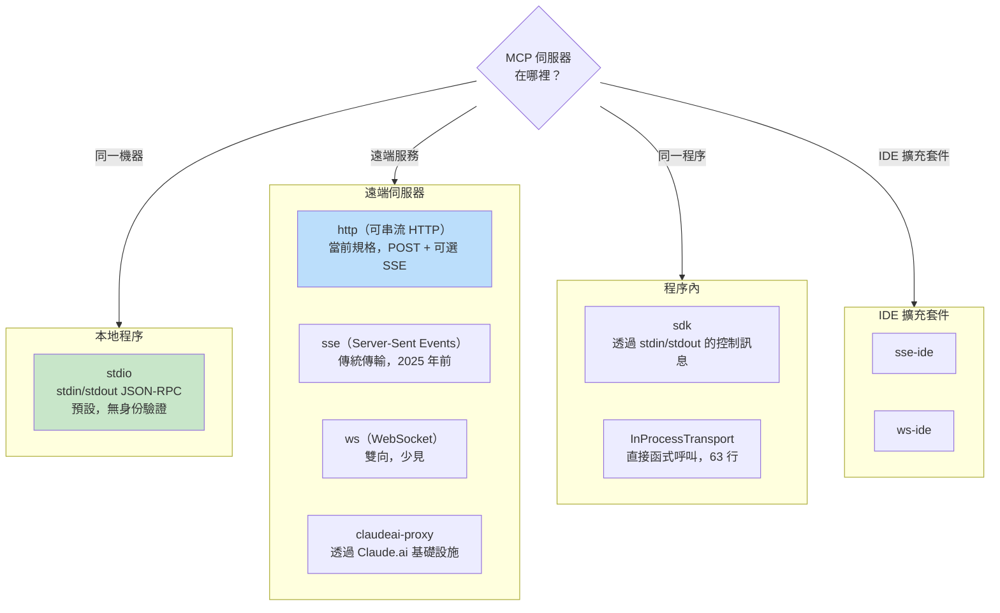
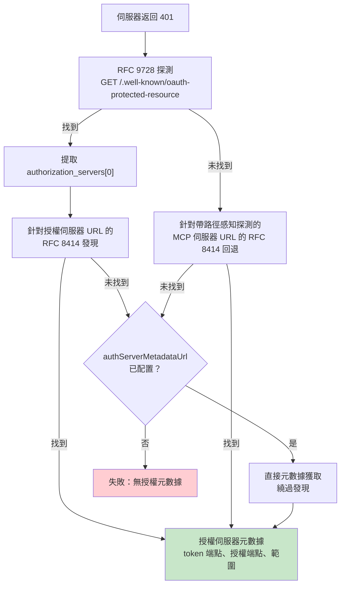

# 第十五章：MCP -- 通用工具協定

## 為什麼 MCP 對 Claude Code 之外的領域也很重要

本書其他章節都是關於 Claude Code 的內部實作。這一章不同。模型上下文協定（MCP）是任何 agent 都可以實作的開放規格，Claude Code 的 MCP 子系統是現存最完整的生產級客戶端之一。如果你正在建構一個需要呼叫外部工具的 agent——任何 agent，任何語言，任何模型——本章的模式可以直接遷移。

核心主張很簡單：MCP 定義了一個 JSON-RPC 2.0 協定，用於客戶端（agent）和伺服器（工具提供者）之間的工具發現和調用。客戶端發送 `tools/list` 來發現伺服器提供的功能，然後發送 `tools/call` 來執行。伺服器用名稱、描述和 JSON Schema 描述每個工具的輸入。這就是整個契約。其他所有東西——傳輸選擇、身份驗證、配置載入、工具名稱標準化——是將乾淨的規格轉化為能在真實世界存活的實作所需的工程工作。

Claude Code 的 MCP 實作跨越四個核心檔案：`types.ts`、`client.ts`、`auth.ts` 和 `InProcessTransport.ts`。它們共同支援八種傳輸類型、七個配置範圍、跨兩個 RFC 的 OAuth 發現，以及一個讓 MCP 工具與內建工具無法區分的工具包裝層——與第六章介紹的相同 `Tool` 介面。本章逐層介紹。

---

## 八種傳輸類型

任何 MCP 整合的第一個設計決策是客戶端如何與伺服器通訊。Claude Code 支援八種傳輸配置：



三個設計選擇值得注意。第一，`stdio` 是預設值——當 `type` 被省略時，系統假設是本地子程序。這向後相容最早的 MCP 配置。第二，fetch 包裝器疊加：超時包裝在步進偵測外面，在基礎 fetch 外面。每個包裝器處理一個關注點。第三，`ws-ide` 分支有 Bun/Node 執行時分割——Bun 的 `WebSocket` 原生接受代理和 TLS 選項，而 Node 需要 `ws` 套件。

**何時使用哪種。** 對於本地工具（檔案系統、資料庫、自訂腳本），使用 `stdio`——無網路，無身份驗證，只有管道。對於遠端服務，`http`（可串流 HTTP）是當前規格推薦。`sse` 是傳統的但廣泛部署的。`sdk`、IDE 和 `claudeai-proxy` 類型對其各自的生態系統是內部的。

---

## 配置載入和範圍

MCP 伺服器配置從七個範圍載入，合併並去重：

| 範圍 | 來源 | 信任 |
|------|------|------|
| `local` | 工作目錄中的 `.mcp.json` | 需要使用者批准 |
| `user` | `~/.claude.json` 的 mcpServers 欄位 | 使用者管理 |
| `project` | 專案級配置 | 共享的專案設定 |
| `enterprise` | 受管企業配置 | 由組織預先批准 |
| `managed` | Plugin 提供的伺服器 | 自動發現 |
| `claudeai` | Claude.ai 網頁介面 | 透過網頁預先授權 |
| `dynamic` | 執行時注入（SDK） | 程式化添加 |

**去重是基於內容的，而非基於名稱的。** 兩個名稱不同但命令或 URL 相同的伺服器被識別為同一伺服器。`getMcpServerSignature()` 函式計算規範鍵：本地伺服器是 `stdio:["command","arg1"]`，遠端伺服器是 `url:https://example.com/mcp`。其簽名匹配手動配置的 plugin 提供伺服器將被抑制。

---

## 工具包裝：從 MCP 到 Claude Code

當連接成功時，客戶端呼叫 `tools/list`。每個工具定義被轉換為 Claude Code 的內部 `Tool` 介面——與內建工具使用的相同介面。包裝後，模型無法區分內建工具和 MCP 工具。

包裝過程有四個階段：

**1. 名稱標準化。** `normalizeNameForMCP()` 用底線替換無效字元。完全限定名稱遵循 `mcp__{serverName}__{toolName}`。

**2. 描述截斷。** 上限為 2,048 個字元。觀察到 OpenAPI 生成的伺服器將 15-60KB 放入 `tool.description`——每輪大約每個工具 15,000 個 token。

**3. Schema 透傳。** 工具的 `inputSchema` 直接傳遞給 API。包裝時無轉換，無驗證。Schema 錯誤在呼叫時而非註冊時顯示。

**4. 注釋映射。** MCP 注釋映射到行為標誌：`readOnlyHint` 標記工具可安全並發執行（如第七章的串流執行器所討論），`destructiveHint` 觸發額外的權限審查。這些注釋來自 MCP 伺服器——惡意伺服器可以將破壞性工具標記為只讀。這是一個被接受的信任邊界，但值得理解：使用者選擇加入該伺服器，惡意伺服器將破壞性工具標記為只讀是真實的攻擊向量。系統接受這個取捨，因為另一個選擇——完全忽略注釋——將阻止合法伺服器改善使用者體驗。

---

## MCP 伺服器的 OAuth

遠端 MCP 伺服器通常需要身份驗證。Claude Code 實現了帶有基於 RFC 的發現、跨應用存取（Cross-App Access）和錯誤主體標準化的完整 OAuth 2.0 + PKCE 流程。

### 發現鏈



`authServerMetadataUrl` 逃生艙口存在是因為某些 OAuth 伺服器兩個 RFC 都不實現。

### 跨應用存取（XAA）

當 MCP 伺服器配置有 `oauth.xaa: true` 時，系統透過身份提供者執行聯合 token 交換——一次 IdP 登入解鎖多個 MCP 伺服器。

### 錯誤主體標準化

`normalizeOAuthErrorBody()` 函式處理違反規格的 OAuth 伺服器。Slack 對錯誤回應返回 HTTP 200，錯誤埋在 JSON 主體中。函式查看 2xx POST 回應主體，當主體匹配 `OAuthErrorResponseSchema` 但不匹配 `OAuthTokensSchema` 時，將回應重寫為 HTTP 400。它還將 Slack 特定的錯誤碼（`invalid_refresh_token`、`expired_refresh_token`、`token_expired`）標準化為標準的 `invalid_grant`。

---

## 程序內傳輸

並非每個 MCP 伺服器都需要是單獨的程序。`InProcessTransport` 類使得在同一個程序中運行 MCP 伺服器和客戶端成為可能：

```typescript
class InProcessTransport implements Transport {
  async send(message: JSONRPCMessage): Promise<void> {
    if (this.closed) throw new Error('Transport is closed')
    queueMicrotask(() => { this.peer?.onmessage?.(message) })
  }
  async close(): Promise<void> {
    if (this.closed) return
    this.closed = true
    this.onclose?.()
    if (this.peer && !this.peer.closed) {
      this.peer.closed = true
      this.peer.onclose?.()
    }
  }
}
```

整個檔案是 63 行。兩個設計決策值得關注。第一，`send()` 透過 `queueMicrotask()` 傳遞，以防止同步請求/回應循環中的堆疊深度問題。第二，`close()` 級聯到對等方，防止半開狀態。Chrome MCP 伺服器和 Computer Use MCP 伺服器都使用這個模式。

---

## 連接管理

### 連接狀態

每個 MCP 伺服器連接存在於五種狀態之一：`connected`、`failed`、`needs-auth`（帶有 15 分鐘 TTL 快取，防止 30 個伺服器各自發現相同的過期 token）、`pending` 或 `disabled`。

### Session 過期偵測

MCP 的可串流 HTTP 傳輸使用 session ID。當伺服器重啟時，請求返回帶有 JSON-RPC 錯誤碼 -32001 的 HTTP 404。`isMcpSessionExpiredError()` 函式檢查這兩個信號——注意它在錯誤訊息上使用字串包含來偵測錯誤碼，這是務實的但脆弱的：

```typescript
export function isMcpSessionExpiredError(error: Error): boolean {
  const httpStatus = 'code' in error ? (error as any).code : undefined
  if (httpStatus !== 404) return false
  return error.message.includes('"code":-32001') ||
    error.message.includes('"code": -32001')
}
```

偵測到時，連接快取清除，呼叫重試一次。

### 批次連接

本地伺服器以 3 個一批連接（產生程序可能耗盡檔案描述符），遠端伺服器以 20 個一批。React 上下文提供者 `MCPConnectionManager.tsx` 管理生命週期，將當前連接與新配置進行差分。

---

## Claude.ai 代理傳輸

`claudeai-proxy` 傳輸說明了一個常見的 agent 整合模式：透過中間人連接。Claude.ai 訂閱者透過網頁介面配置 MCP「連接器」，CLI 透過 Claude.ai 的基礎設施路由，後者處理供應商端的 OAuth。

`createClaudeAiProxyFetch()` 函式在請求時而非 401 後重新讀取時捕獲 `sentToken`。在來自多個連接器的並發 401 下，另一個連接器的重試可能已經刷新了 token。函式即使在刷新處理器返回 false 時也會檢查並發刷新——另一個連接器贏得鎖定文件競爭的「ELOCKED 競爭」情況。

---

## 超時架構

MCP 超時是分層的，每層防護不同的故障模式：

| 層 | 持續時間 | 防護 |
|----|----------|------|
| 連接 | 30 秒 | 無法到達或啟動緩慢的伺服器 |
| 每請求 | 60 秒（每請求全新） | 陳舊超時信號 bug |
| 工具呼叫 | 約 27.8 小時 | 合法的長時間操作 |
| 身份驗證 | 每個 OAuth 請求 30 秒 | 無法到達的 OAuth 伺服器 |

每請求超時值得強調。早期實現在連接時建立單個 `AbortSignal.timeout(60000)`。60 秒空閒後，下一個請求會立即中止——信號已經過期了。修復：`wrapFetchWithTimeout()` 為每個請求建立全新的超時信號。它還將 `Accept` 標頭標準化為最後一步防禦，以對抗丟棄它的執行時和代理。

---

## 應用實踐：將 MCP 整合到你自己的 Agent

**從 stdio 開始，之後再增加複雜性。** `StdioClientTransport` 處理一切：產生、管道、殺死。一行配置，一個傳輸類，你就有了 MCP 工具。

**標準化名稱並截斷描述。** 名稱必須匹配 `^[a-zA-Z0-9_-]{1,64}$`。以 `mcp__{serverName}__` 作為前綴以避免衝突。將描述限制在 2,048 個字元——OpenAPI 生成的伺服器否則會浪費上下文 token。

**延遲處理身份驗證。** 不要在伺服器返回 401 之前嘗試 OAuth。大多數 stdio 伺服器不需要身份驗證。

**對內建伺服器使用程序內傳輸。** `createLinkedTransportPair()` 消除了你控制的伺服器的子程序開銷。

**遵守工具注釋並清理輸出。** `readOnlyHint` 啟用並發執行。清理回應中的惡意 Unicode（雙向覆蓋、零寬連字符），這些可能會誤導模型。

MCP 協定是刻意最小化的——兩個 JSON-RPC 方法。這兩個方法與生產部署之間的一切都是工程：八種傳輸、七個配置範圍、兩個 OAuth RFC 和超時分層。Claude Code 的實現展示了規模化後的工程是什麼樣子。

下一章將檢視 agent 達到 localhost 之外時發生什麼：讓 Claude Code 在雲端容器中運行、接受來自網頁瀏覽器的指令，以及透過注入憑證的代理隧道傳輸 API 流量的遠端執行協定。
