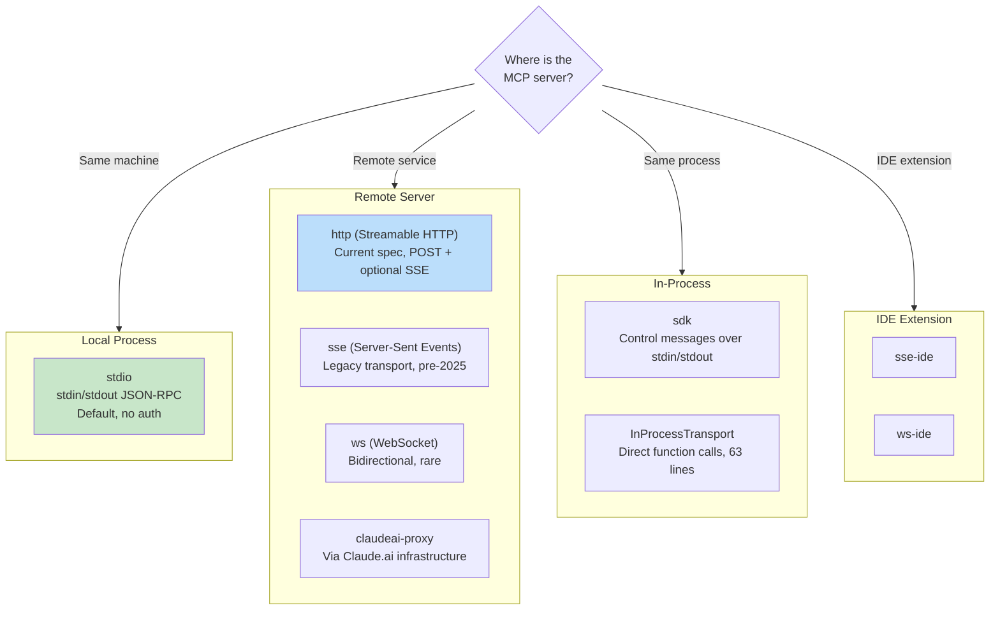
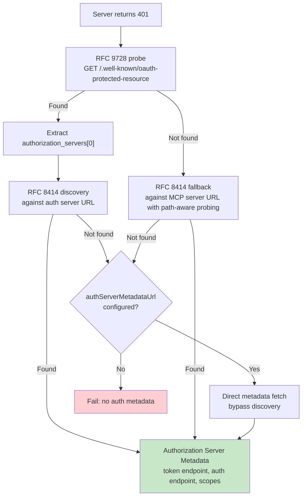

# 第十五章：MCP — 通用工具協議

## 為何 MCP 的重要性超越 Claude Code

本書其他每一章都在討論 Claude Code 的內部機制。這一章不同。Model Context Protocol 是一個開放規格，任何 agent 都可以實作，而 Claude Code 的 MCP 子系統是目前最完整的正式環境用戶端之一。如果你正在建構一個需要呼叫外部工具的 agent——任何 agent、任何語言、任何模型——本章中的模式都可以直接套用。

核心主張很直接：MCP 定義了一個 JSON-RPC 2.0 協議，用於用戶端（agent）與伺服器（工具提供者）之間的工具探索與呼叫。用戶端發送 `tools/list` 來探索伺服器提供的功能，然後發送 `tools/call` 來執行。伺服器以名稱、描述和 JSON Schema 來描述每個工具的輸入。這就是整個合約。其餘一切——傳輸選擇、認證、設定載入、工具名稱正規化——都是將一份乾淨的規格轉化為能在現實世界中存活的實作工程。

Claude Code 的 MCP 實作橫跨四個核心檔案：`types.ts`、`client.ts`、`auth.ts` 和 `InProcessTransport.ts`。它們共同支援八種傳輸類型、七個設定範圍、跨兩個 RFC 的 OAuth 探索，以及一個工具包裝層，使 MCP 工具與內建工具無法區分——與第六章介紹的 `Tool` 介面相同。本章將逐層說明。

---

## 八種傳輸類型

任何 MCP 整合中的第一個設計決策是：用戶端如何與伺服器溝通。Claude Code 支援八種傳輸設定：



有三個設計選擇值得注意。首先，`stdio` 是預設值——當 `type` 被省略時，系統假設為本地子行程。這與最早期的 MCP 設定保持向後相容。其次，fetch 包裝器是堆疊的：逾時包裝在最外層，其次是 step-up 偵測，最內層是基礎 fetch。每個包裝器只處理一個關注點。第三，`ws-ide` 分支有 Bun/Node 執行環境的差異——Bun 的 `WebSocket` 原生接受 proxy 和 TLS 選項，而 Node 則需要 `ws` 套件。

**何時使用哪種。** 對於本地工具（檔案系統、資料庫、自訂腳本），使用 `stdio`——無需網路、無需認證，只用管道。對於遠端服務，`http`（Streamable HTTP）是目前規格的建議選項。`sse` 是舊版但部署廣泛。`sdk`、IDE 和 `claudeai-proxy` 類型各自屬於其對應的生態系統內部使用。

---

## 設定載入與範圍

MCP 伺服器設定從七個範圍載入，經過合併與去重：

| 範圍 | 來源 | 信任層級 |
|------|------|----------|
| `local` | 工作目錄中的 `.mcp.json` | 需要使用者核准 |
| `user` | `~/.claude.json` 的 mcpServers 欄位 | 使用者管理 |
| `project` | 專案層級設定 | 共用專案設定 |
| `enterprise` | 企業託管設定 | 由組織預先核准 |
| `managed` | 外掛提供的伺服器 | 自動探索 |
| `claudeai` | Claude.ai 網頁介面 | 透過網頁預先授權 |
| `dynamic` | 執行階段注入（SDK） | 程式化新增 |

**去重是基於內容的，而非基於名稱。** 兩個名稱不同但 command 或 URL 相同的伺服器會被識別為同一台伺服器。`getMcpServerSignature()` 函式計算一個正規化的鍵：本地伺服器為 `stdio:["command","arg1"]`，遠端伺服器為 `url:https://example.com/mcp`。外掛提供的伺服器若其簽章與手動設定相符，則會被抑制。

---

## 工具包裝：從 MCP 到 Claude Code

當連線成功時，用戶端呼叫 `tools/list`。每個工具定義都會被轉換為 Claude Code 的內部 `Tool` 介面——與內建工具使用的介面相同。包裝完成後，模型無法區分內建工具與 MCP 工具。

包裝過程分為四個階段：

**1. 名稱正規化。** `normalizeNameForMCP()` 將無效字元替換為底線。完整限定名稱遵循 `mcp__{serverName}__{toolName}` 格式。

**2. 描述截斷。** 上限為 2,048 個字元。根據觀察，OpenAPI 生成的伺服器會將 15-60KB 的內容傾倒到 `tool.description` 中——單一工具每回合大約消耗 15,000 個 token。

**3. Schema 直通。** 工具的 `inputSchema` 直接傳遞給 API。不做轉換，包裝時不做驗證。Schema 錯誤會在呼叫時才浮現，而非註冊時。

**4. 標註對映。** MCP 標註對映到行為旗標：`readOnlyHint` 將工具標記為可安全並行執行（如第七章串流執行器中所討論的），`destructiveHint` 觸發額外的權限審查。這些標註來自 MCP 伺服器——惡意伺服器可能會將破壞性工具標記為唯讀。這是一個被接受的信任邊界，但值得理解：使用者選擇接入該伺服器，而惡意伺服器將破壞性工具標記為唯讀是一個真實的攻擊向量。系統接受這個取捨，因為替代方案——完全忽略標註——會阻止合法伺服器改善使用者體驗。

---

## MCP 伺服器的 OAuth

遠端 MCP 伺服器通常需要認證。Claude Code 實作了完整的 OAuth 2.0 + PKCE 流程，包含基於 RFC 的探索、Cross-App Access 以及錯誤回應本體正規化。

### 探索鏈



`authServerMetadataUrl` 逃生口的存在，是因為某些 OAuth 伺服器未實作任何一個 RFC。

### Cross-App Access（XAA）

當 MCP 伺服器設定中有 `oauth.xaa: true` 時，系統會透過 Identity Provider 執行聯邦 token 交換——一次 IdP 登入即可解鎖多個 MCP 伺服器。

### 錯誤回應本體正規化

`normalizeOAuthErrorBody()` 函式處理違反規格的 OAuth 伺服器。Slack 對錯誤回應返回 HTTP 200，錯誤資訊埋在 JSON 本體中。該函式會窺視 2xx POST 回應本體，當本體符合 `OAuthErrorResponseSchema` 但不符合 `OAuthTokensSchema` 時，將回應改寫為 HTTP 400。它也會將 Slack 特有的錯誤碼（`invalid_refresh_token`、`expired_refresh_token`、`token_expired`）正規化為標準的 `invalid_grant`。

---

## 行程內傳輸

不是每個 MCP 伺服器都需要是獨立的行程。`InProcessTransport` 類別使 MCP 伺服器和用戶端能在同一個行程中執行：

```typescript
class InProcessTransport implements Transport {
  async send(message: JSONRPCMessage): Promise<void> {
    if (this.closed) throw new Error('Transport is closed')
    queueMicrotask(() => { this.peer?.onmessage?.(message) })
  }
  async close(): Promise<void> {
    if (this.closed) return
    this.closed = true
    this.onclose?.()
    if (this.peer && !this.peer.closed) {
      this.peer.closed = true
      this.peer.onclose?.()
    }
  }
}
```

整個檔案只有 63 行。有兩個設計決策值得關注。首先，`send()` 透過 `queueMicrotask()` 傳遞，以防止同步請求/回應循環中的堆疊深度問題。其次，`close()` 會級聯到對等端，防止半開狀態。Chrome MCP 伺服器和 Computer Use MCP 伺服器都使用此模式。

---

## 連線管理

### 連線狀態

每個 MCP 伺服器連線存在於五種狀態之一：`connected`、`failed`、`needs-auth`（帶有 15 分鐘的 TTL 快取，以防止 30 個伺服器各自獨立地探索到同一個過期的 token）、`pending` 或 `disabled`。

### Session 過期偵測

MCP 的 Streamable HTTP 傳輸使用 session ID。當伺服器重啟時，請求會返回 HTTP 404 和 JSON-RPC 錯誤碼 -32001。`isMcpSessionExpiredError()` 函式會檢查這兩個信號——注意它使用字串包含比對來偵測錯誤碼在錯誤訊息中的位置，這很務實但也很脆弱：

```typescript
export function isMcpSessionExpiredError(error: Error): boolean {
  const httpStatus = 'code' in error ? (error as any).code : undefined
  if (httpStatus !== 404) return false
  return error.message.includes('"code":-32001') ||
    error.message.includes('"code": -32001')
}
```

偵測到過期後，連線快取會清除，並重試一次呼叫。

### 批次連線

本地伺服器以每批 3 個的方式連線（產生行程可能耗盡檔案描述符），遠端伺服器以每批 20 個的方式連線。React context provider `MCPConnectionManager.tsx` 管理生命週期，將當前連線與新設定進行差異比對。

---

## Claude.ai Proxy 傳輸

`claudeai-proxy` 傳輸展示了一種常見的 agent 整合模式：透過中介者連線。Claude.ai 訂閱者透過網頁介面設定 MCP「連接器」，而 CLI 透過 Claude.ai 的基礎設施路由，由後者處理供應商端的 OAuth。

`createClaudeAiProxyFetch()` 函式在請求時擷取 `sentToken`，而非在 401 之後重新讀取。在來自多個連接器的並發 401 情況下，另一個連接器的重試可能已經刷新了 token。該函式也會在重新整理處理器返回 false 時檢查並發重新整理——即「ELOCKED 競爭」情況，也就是另一個連接器贏得了鎖檔競爭。

---

## 逾時架構

MCP 逾時是分層的，每一層防護不同的故障模式：

| 層級 | 時長 | 防護對象 |
|------|------|----------|
| 連線 | 30 秒 | 無法到達或啟動緩慢的伺服器 |
| 每次請求 | 60 秒（每次請求重新計算） | 過時的逾時信號錯誤 |
| 工具呼叫 | 約 27.8 小時 | 合理的長時間執行操作 |
| 認證 | 每次 OAuth 請求 30 秒 | 無法到達的 OAuth 伺服器 |

每次請求的逾時值得特別強調。早期實作在連線時建立單一的 `AbortSignal.timeout(60000)`。在閒置 60 秒後，下一次請求會立即中止——因為信號已經過期。修正方式：`wrapFetchWithTimeout()` 為每次請求建立全新的逾時信號。它也會正規化 `Accept` 標頭，作為防止執行環境和 proxy 丟棄標頭的最後一道防線。

---

## 實際應用：將 MCP 整合到你自己的 Agent

**從 stdio 開始，之後再增加複雜度。** `StdioClientTransport` 處理一切：產生行程、管道、終止。一行設定、一個傳輸類別，你就擁有了 MCP 工具。

**正規化名稱並截斷描述。** 名稱必須符合 `^[a-zA-Z0-9_-]{1,64}$`。使用 `mcp__{serverName}__` 前綴以避免衝突。將描述上限設為 2,048 個字元——否則 OpenAPI 生成的伺服器會浪費上下文 token。

**延遲處理認證。** 在伺服器返回 401 之前不要嘗試 OAuth。大多數 stdio 伺服器不需要認證。

**對內建伺服器使用行程內傳輸。** `createLinkedTransportPair()` 消除了你所控制的伺服器的子行程開銷。

**尊重工具標註並清理輸出。** `readOnlyHint` 啟用並行執行。清理回應中的惡意 Unicode（雙向覆寫字元、零寬度連接符），這些可能誤導模型。

MCP 協議刻意保持最小化——兩個 JSON-RPC 方法。從這些方法到正式部署之間的一切都是工程：八種傳輸、七個設定範圍、兩個 OAuth RFC，以及逾時分層。Claude Code 的實作展示了這種工程在規模化時的樣貌。

下一章將探討當 agent 超越 localhost 時會發生什麼：遠端執行協議讓 Claude Code 可以在雲端容器中執行、接受來自網頁瀏覽器的指令，以及透過注入憑證的 proxy 通道傳輸 API 流量。
