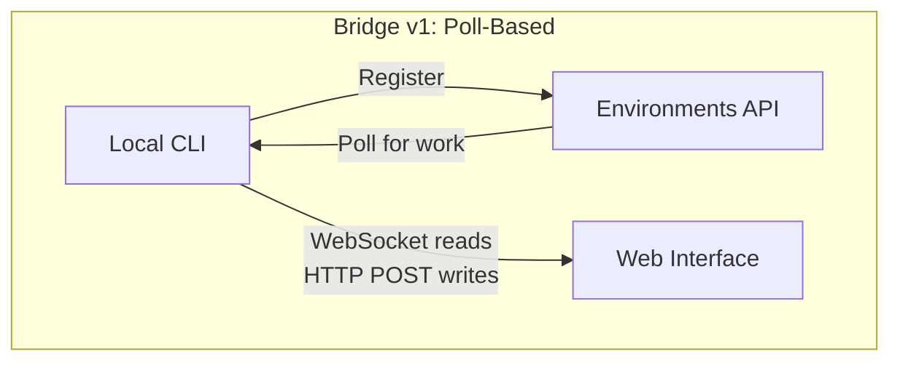
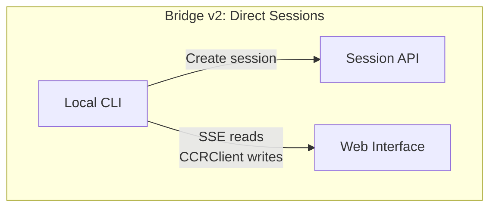
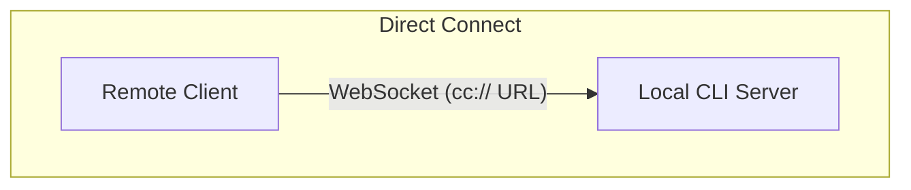
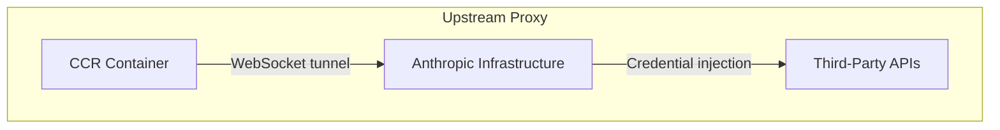

# 第十六章：遠端控制與雲端執行

## Agent 超越 Localhost

到目前為止，每一章都假設 Claude Code 運行在程式碼所在的同一台機器上。終端機是本地的。檔案系統是本地的。模型回應串流回到一個同時擁有鍵盤和工作目錄的程序。

當你想從瀏覽器控制 Claude Code、在雲端容器中運行它，或將其作為區域網路上的服務暴露時，這個假設就不成立了。Agent 需要一種方式來接收來自網頁瀏覽器、行動應用程式或自動化管線的指令——將權限提示轉發給不在終端機前的人，並透過可能代為注入憑證或終止 TLS 的基礎設施來隧道傳輸其 API 流量。

Claude Code 透過四個系統解決這個問題，每個系統對應不同的拓撲架構：

<div class="diagram-grid">









</div>

這些系統共享一個共同的設計哲學：讀取和寫入是非對稱的，重新連線是自動的，故障會優雅降級。

---

## Bridge v1：輪詢、分派、衍生

v1 bridge 是基於環境的遠端控制系統。當開發者執行 `claude remote-control` 時，CLI 會向 Environments API 註冊、輪詢工作，並為每個 session 衍生一個子程序。

在註冊之前，會執行一系列預檢查：執行環境功能閘門、OAuth token 驗證、組織政策檢查、失效 token 偵測（在使用同一個過期 token 連續失敗三次後的跨程序退避機制），以及主動 token 刷新——這消除了約 9% 本來會在首次嘗試時失敗的註冊。

註冊完成後，bridge 進入長輪詢迴圈。工作項目以 session 的形式到達（其中 `secret` 欄位包含 session token、API base URL、MCP 配置和環境變數）或以健康檢查的形式到達。Bridge 會將「無工作」的日誌訊息節流至每 100 次空輪詢輸出一次。

每個 session 會衍生一個子 Claude Code 程序，透過 stdin/stdout 上的 NDJSON 進行通訊。權限請求透過 bridge transport 流向網頁介面，由使用者核准或拒絕。整個往返必須在大約 10-14 秒內完成。

---

## Bridge v2：直連 Session 與 SSE

v2 bridge 完全消除了 Environments API 層——不需要註冊、不需要輪詢、不需要確認、不需要心跳、不需要註銷。動機在於：v1 要求伺服器在分派工作之前了解機器的能力。V2 將生命週期壓縮為三個步驟：

1. **建立 session**：使用 OAuth 憑證執行 `POST /v1/code/sessions`。
2. **連接 bridge**：`POST /v1/code/sessions/{id}/bridge`。回傳 `worker_jwt`、`api_base_url` 和 `worker_epoch`。每次 `/bridge` 呼叫都會遞增 epoch——它本身就是註冊。
3. **開啟 transport**：SSE 用於讀取，`CCRClient` 用於寫入。

Transport 抽象層（`ReplBridgeTransport`）將 v1 和 v2 統一在一個共同介面之後，因此訊息處理不需要知道它正在與哪一代通訊。

當 SSE 連線因 401 而中斷時，transport 會使用來自新 `/bridge` 呼叫的新憑證重建連線，同時保留序列號游標——不會遺失任何訊息。寫入路徑使用每個實例的 `getAuthToken` 閉包，而非全程序範圍的環境變數，防止 JWT 在並行 session 之間洩漏。

### FlushGate

一個微妙的排序問題：bridge 需要在發送對話歷史的同時接受來自網頁介面的即時寫入。如果在歷史紀錄刷新期間有即時寫入到達，訊息可能會被亂序傳送。`FlushGate` 會在刷新 POST 期間將即時寫入排入佇列，並在完成時依序排放。

### Token 刷新與 Epoch 管理

v2 bridge 會在 worker JWT 過期之前主動刷新。新的 epoch 告訴伺服器這是同一個 worker 但擁有新的憑證。Epoch 不匹配（409 回應）會被積極處理：兩個連線都會關閉，並且一個例外會展開呼叫堆疊，防止腦裂場景。

---

## 訊息路由與回聲去重

兩代 bridge 共享 `handleIngressMessage()` 作為中央路由器：

1. 解析 JSON，正規化控制訊息的鍵名。
2. 將 `control_response` 路由到權限處理器，將 `control_request` 路由到請求處理器。
3. 對照 `recentPostedUUIDs`（回聲去重）和 `recentInboundUUIDs`（重複投遞去重）檢查 UUID。
4. 轉發經過驗證的使用者訊息。

### BoundedUUIDSet：O(1) 查詢，O(capacity) 記憶體

Bridge 有一個回聲問題——訊息可能在讀取串流上回聲，或在 transport 切換期間被重複投遞。`BoundedUUIDSet` 是一個 FIFO 有界集合，底層使用環形緩衝區：

```typescript
class BoundedUUIDSet {
  private buffer: string[]
  private set: Set<string>
  private head = 0

  add(uuid: string): void {
    if (this.set.size >= this.capacity) {
      this.set.delete(this.buffer[this.head])
    }
    this.buffer[this.head] = uuid
    this.set.add(uuid)
    this.head = (this.head + 1) % this.capacity
  }

  has(uuid: string): boolean { return this.set.has(uuid) }
}
```

兩個實例平行運行，每個容量為 2000。透過 Set 實現 O(1) 查詢，透過環形緩衝區淘汰機制實現 O(capacity) 記憶體使用，無需計時器或 TTL。未知的控制請求子類型會收到錯誤回應，而非沉默——防止伺服器等待一個永遠不會到來的回應。

---

## 非對稱設計：持久讀取，HTTP POST 寫入

CCR 協定使用非對稱 transport：讀取透過持久連線（WebSocket 或 SSE）流動，寫入透過 HTTP POST 進行。這反映了通訊模式中的一個根本性非對稱。

讀取是高頻率、低延遲、伺服器主動發起的——在 token 串流期間每秒數百條小訊息。持久連線是唯一合理的選擇。寫入是低頻率、客戶端主動發起的，且需要確認——每分鐘幾條訊息，而非每秒。HTTP POST 提供可靠投遞、透過 UUID 實現冪等性，以及與負載平衡器的自然整合。

試圖將它們統一在單一 WebSocket 上會產生耦合：如果 WebSocket 在寫入期間斷開，你需要重試邏輯，且必須區分「未發送」與「已發送但確認遺失」。分離的通道讓每個通道都能獨立最佳化。

---

## 遠端 Session 管理

`SessionsWebSocket` 管理 CCR WebSocket 連線的客戶端。它的重新連線策略會區分不同的故障類型：

| 故障 | 策略 |
|---------|----------|
| 4003（未授權） | 立即停止，不重試 |
| 4001（session 未找到） | 最多重試 3 次，線性退避（壓縮期間的暫時性故障） |
| 其他暫時性故障 | 指數退避，最多 5 次嘗試 |

`isSessionsMessage()` 型別守衛接受任何具有字串 `type` 欄位的物件——刻意設計得寬鬆。硬編碼的允許清單會在客戶端更新之前靜默丟棄新的訊息類型。

---

## Direct Connect：本地伺服器

Direct Connect 是最簡單的拓撲架構：Claude Code 作為伺服器運行，客戶端透過 WebSocket 連接。沒有雲端中介，沒有 OAuth token。

Session 有五種狀態：`starting`、`running`、`detached`、`stopping`、`stopped`。中繼資料持久化到 `~/.claude/server-sessions.json`，以便在伺服器重啟後恢復。`cc://` URL 方案為本地連線提供了簡潔的定址方式。

---

## Upstream Proxy：容器中的憑證注入

Upstream proxy 運行在 CCR 容器內部，解決一個特定問題：在 agent 可能執行不受信任命令的容器中，將組織憑證注入到外送的 HTTPS 流量中。

設定序列的順序經過精心安排：

1. 從 `/run/ccr/session_token` 讀取 session token。
2. 透過 Bun FFI 設定 `prctl(PR_SET_DUMPABLE, 0)`——阻止同一 UID 對程序堆記憶體進行 ptrace。沒有這一步，一個被提示注入的 `gdb -p $PPID` 就能從記憶體中擷取 token。
3. 下載 upstream proxy CA 憑證並與系統 CA 套件串接。
4. 在臨時埠上啟動本地 CONNECT 轉 WebSocket 的中繼。
5. 刪除 token 檔案連結——token 現在僅存在於堆記憶體中。
6. 為所有子程序匯出環境變數。

每一步都是開放式失敗：錯誤會停用 proxy 而非終止 session。這是正確的取捨——proxy 失敗意味著某些整合功能將無法運作，但核心功能仍然可用。

### Protobuf 手動編碼

通過隧道的位元組被封裝在 `UpstreamProxyChunk` protobuf 訊息中。Schema 很簡單——`message UpstreamProxyChunk { bytes data = 1; }`——Claude Code 用十行程式碼手動編碼，而非引入一個 protobuf 執行環境：

```typescript
export function encodeChunk(data: Uint8Array): Uint8Array {
  const varint: number[] = []
  let n = data.length
  while (n > 0x7f) { varint.push((n & 0x7f) | 0x80); n >>>= 7 }
  varint.push(n)
  const out = new Uint8Array(1 + varint.length + data.length)
  out[0] = 0x0a  // field 1, wire type 2
  out.set(varint, 1)
  out.set(data, 1 + varint.length)
  return out
}
```

十行程式碼取代了完整的 protobuf 執行環境。一個單欄位訊息不值得引入一個依賴——位元操作的維護負擔遠低於供應鏈風險。

---

## 實踐應用：設計遠端 Agent 執行

**分離讀取和寫入通道。** 當讀取是高頻串流而寫入是低頻 RPC 時，將它們統一會產生不必要的耦合。讓每個通道獨立地失敗和恢復。

**限定你的去重記憶體。** BoundedUUIDSet 模式提供固定記憶體的去重功能。任何至少一次投遞的系統都需要一個有界的去重緩衝區，而非無界的 Set。

**使重新連線策略與故障訊號成正比。** 永久性故障不應重試。暫時性故障應以退避方式重試。模糊不清的故障應以較低的上限重試。

**在對抗性環境中將機密資訊僅保留在堆記憶體中。** 從檔案讀取 token、停用 ptrace、然後刪除檔案連結——這消除了檔案系統和記憶體檢查兩種攻擊向量。

**輔助系統採用開放式失敗。** Upstream proxy 採用開放式失敗，因為它提供的是增強功能（憑證注入），而非核心功能（模型推論）。

遠端執行系統編碼了一個更深層的原則：agent 的核心迴圈（第五章）應該對指令的來源和結果的去向保持不可知。Bridge、Direct Connect 和 upstream proxy 都是傳輸層。它們之上的訊息處理、工具執行和權限流程是完全相同的，無論使用者是坐在終端機前還是在 WebSocket 的另一端。

下一章將探討另一個運維關注點：效能——Claude Code 如何在啟動、渲染、搜尋和 API 成本方面讓每一毫秒和每一個 token 都發揮價值。
