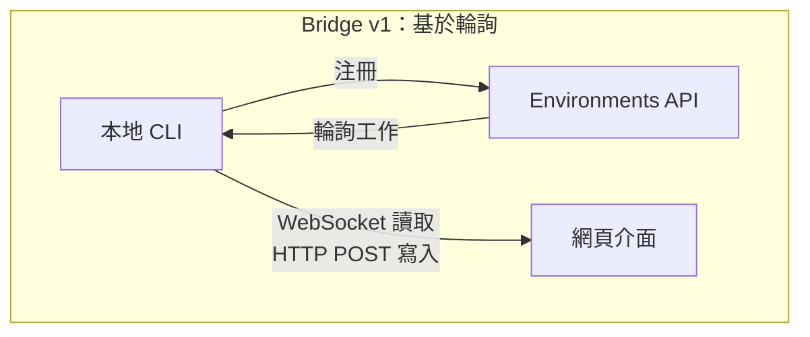
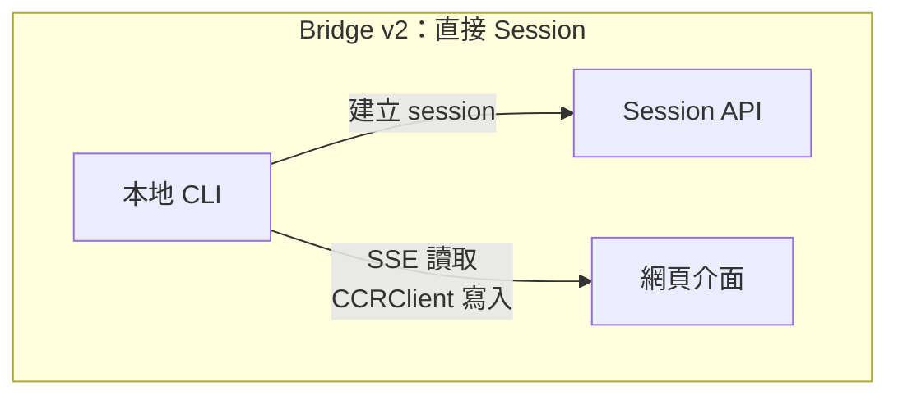
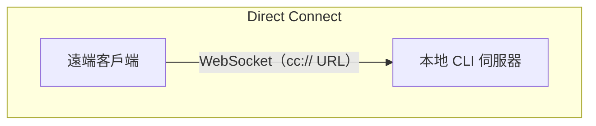
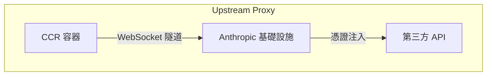

# 第十六章：遠端控制與雲端執行

## Agent 觸及 Localhost 之外

到目前為止，每一章都假設 Claude Code 運行在程式碼所在的同一台機器上。終端是本地的。檔案系統是本地的。模型回應串流回一個同時擁有鍵盤和工作目錄的程序。

一旦你想從瀏覽器控制 Claude Code、在雲端容器中運行它，或將其暴露為 LAN 上的服務，這個假設就會破裂。Agent 需要一種方式來接收來自網頁瀏覽器、行動應用或自動化管線的指令——將權限提示轉發給不在終端旁邊的人，並透過可能注入憑證或代理 TLS 的基礎設施隧道傳輸其 API 流量。

Claude Code 用四個系統解決了這個問題，每個針對不同的拓撲：









這些系統共享一個共同的設計理念：讀取和寫入是不對稱的，重新連接是自動的，故障優雅降級。

---

## Bridge v1：輪詢、分發、產生

v1 bridge 是基於環境的遠端控制系統。當開發者運行 `claude remote-control` 時，CLI 向 Environments API 注冊，輪詢工作，並為每個 session 產生子程序。

在注冊之前，會運行一系列預飛檢查：執行時功能閘門、OAuth token 驗證、組織政策檢查、死 token 偵測（在相同過期 token 連續三次失敗後的跨程序退避），以及積極的 token 刷新，消除大約 9% 本來會在第一次嘗試時失敗的注冊。

注冊後，bridge 進入長輪詢迴圈。工作項目作為 session（帶有包含 session token、API 基礎 URL、MCP 配置和環境變數的 `secret` 欄位）或健康檢查到達。bridge 將「無工作」日誌訊息限制為每 100 次空輪詢一條。

每個 session 產生一個透過 stdin/stdout 上的 NDJSON 通訊的子 Claude Code 程序。權限請求透過 bridge 傳輸流向網頁介面，使用者在那裡批准或拒絕。往返必須在大約 10-14 秒內完成。

---

## Bridge v2：直接 Session 和 SSE

v2 bridge 完全消除了 Environments API 層——無注冊、無輪詢、無確認、無心跳、無登出。動機：v1 要求伺服器在分發工作之前知道機器的能力。v2 將生命週期折疊為三個步驟：

1. **建立 session**：帶 OAuth 憑證的 `POST /v1/code/sessions`。
2. **連接 bridge**：`POST /v1/code/sessions/{id}/bridge`。返回 `worker_jwt`、`api_base_url` 和 `worker_epoch`。每次 `/bridge` 呼叫都會推進 epoch——它就是注冊。
3. **開啟傳輸**：讀取用 SSE，寫入用 `CCRClient`。

傳輸抽象（`ReplBridgeTransport`）在一個共同介面後統一了 v1 和 v2，因此訊息處理不需要知道它在與哪一代通訊。

當 SSE 連接因 401 而斷開時，傳輸用來自新 `/bridge` 呼叫的全新憑證重建，同時保留序列號游標——不遺失任何訊息。寫入路徑使用每實例的 `getAuthToken` closure，而非程序範圍的環境變數，防止 JWT 在並發 session 之間洩漏。

### FlushGate

一個微妙的排序問題：bridge 需要在接受來自網頁介面的即時寫入的同時發送對話歷史。如果即時寫入在歷史刷新期間到達，訊息可能會亂序傳遞。`FlushGate` 在刷新 POST 期間對即時寫入進行排隊，並在完成時按順序排空。

### Token 刷新和 Epoch 管理

v2 bridge 在到期之前積極刷新 worker JWT。新的 epoch 告訴伺服器這是帶有全新憑證的同一個 worker。Epoch 不匹配（409 回應）被積極處理：兩個連接都關閉，一個異常解除呼叫者的堆疊，防止腦裂場景。

---

## 訊息路由和 Echo 去重

兩個 bridge 世代共享 `handleIngressMessage()` 作為中央路由器：

1. 解析 JSON，標準化控制訊息鍵。
2. 將 `control_response` 路由到權限處理器，`control_request` 路由到請求處理器。
3. 對照 `recentPostedUUIDs`（echo 去重）和 `recentInboundUUIDs`（重複傳遞去重）檢查 UUID。
4. 轉發經過驗證的使用者訊息。

### BoundedUUIDSet：O(1) 查找，O(capacity) 記憶體

bridge 有 echo 問題——訊息可能在讀取串流上 echo 回來，或在傳輸切換期間被傳遞兩次。`BoundedUUIDSet` 是由循環緩衝區支援的 FIFO 有界集合：

```typescript
class BoundedUUIDSet {
  private buffer: string[]
  private set: Set<string>
  private head = 0

  add(uuid: string): void {
    if (this.set.size >= this.capacity) {
      this.set.delete(this.buffer[this.head])
    }
    this.buffer[this.head] = uuid
    this.set.add(uuid)
    this.head = (this.head + 1) % this.capacity
  }

  has(uuid: string): boolean { return this.set.has(uuid) }
}
```

兩個實例並行運行，每個容量 2000。透過 Set 的 O(1) 查找，透過循環緩衝區驅逐的 O(capacity) 記憶體，無計時器或 TTL。未知的控制請求子類型得到錯誤回應，而非沉默——防止伺服器等待永遠不會來的回應。

---

## 不對稱設計：持久讀取，HTTP POST 寫入

CCR 協定使用不對稱傳輸：讀取透過持久連接流動（WebSocket 或 SSE），寫入透過 HTTP POST 進行。這反映了通訊模式中的根本不對稱性。

讀取是高頻、低延遲、伺服器發起的——在 token 串流期間每秒數百條小訊息。持久連接是唯一合理的選擇。寫入是低頻、客戶端發起的，並且需要確認——每分鐘幾條訊息，而非每秒。HTTP POST 提供可靠的傳遞、透過 UUID 的冪等性，以及與負載均衡器的自然整合。

試圖在單個 WebSocket 上統一它們會產生耦合：如果 WebSocket 在寫入期間斷開，你需要重試邏輯，並且必須區分「未發送」和「已發送但確認遺失」。單獨的通道讓每個可以獨立最佳化。

---

## 遠端 Session 管理

`SessionsWebSocket` 管理 CCR WebSocket 連接的客戶端。其重新連接策略區分失敗類型：

| 失敗 | 策略 |
|------|------|
| 4003（未授權） | 立即停止，不重試 |
| 4001（session 未找到） | 最多 3 次重試，線性退避（壓縮期間的暫態） |
| 其他暫態 | 指數退避，最多 5 次嘗試 |

`isSessionsMessage()` 類型守衛接受任何具有字串 `type` 欄位的物件——刻意寬鬆。硬編碼的許可名單會在客戶端更新之前靜默丟棄新訊息類型。

---

## Direct Connect：本地伺服器

Direct Connect 是最簡單的拓撲：Claude Code 作為伺服器運行，客戶端透過 WebSocket 連接。無雲端中間人，無 OAuth token。

Session 有五種狀態：`starting`、`running`、`detached`、`stopping`、`stopped`。元數據持久化到 `~/.claude/server-sessions.json`，跨伺服器重啟恢復。`cc://` URL 方案為本地連接提供乾淨的定址。

---

## Upstream Proxy：容器中的憑證注入

upstream proxy 在 CCR 容器內運行，解決了一個特定問題：將組織憑證注入到容器中 agent 可能執行不受信任命令的出站 HTTPS 流量。

設置順序是謹慎排列的：

1. 從 `/run/ccr/session_token` 讀取 session token。
2. 透過 Bun FFI 設置 `prctl(PR_SET_DUMPABLE, 0)`——阻止對程序堆的同 UID ptrace。沒有這個，提示注入的 `gdb -p $PPID` 可以從記憶體中抓取 token。
3. 下載 upstream proxy CA 證書並與系統 CA 套件連接。
4. 在臨時端口上啟動本地 CONNECT-to-WebSocket 中繼。
5. 刪除 token 文件——token 現在只存在於堆上。
6. 為所有子程序匯出環境變數。

每個步驟都是開放失敗的：錯誤停用 proxy 而非終止 session。正確的取捨——失敗的 proxy 意味著某些整合不起作用，但核心功能仍然可用。

### Protobuf 手動編碼

透過隧道的位元組被包裝在 `UpstreamProxyChunk` protobuf 訊息中。Schema 很簡單——`message UpstreamProxyChunk { bytes data = 1; }`——Claude Code 用十行手動編碼它，而不是引入 protobuf 執行時：

```typescript
export function encodeChunk(data: Uint8Array): Uint8Array {
  const varint: number[] = []
  let n = data.length
  while (n > 0x7f) { varint.push((n & 0x7f) | 0x80); n >>>= 7 }
  varint.push(n)
  const out = new Uint8Array(1 + varint.length + data.length)
  out[0] = 0x0a  // 欄位 1，wire 類型 2
  out.set(varint, 1)
  out.set(data, 1 + varint.length)
  return out
}
```

十行替換了完整的 protobuf 執行時。單欄位訊息不值得引入依賴——位元操作的維護負擔遠低於供應鏈風險。

---

## 應用實踐：設計遠端 Agent 執行

**分離讀取和寫入通道。** 當讀取是高頻串流而寫入是低頻 RPC 時，統一它們會造成不必要的耦合。讓每個通道獨立失敗和恢復。

**限制去重記憶體。** BoundedUUIDSet 模式提供固定記憶體的去重。任何至少一次傳遞系統都需要有界的去重緩衝區，而非無界的 Set。

**讓重新連接策略與失敗信號成比例。** 永久性失敗不應重試。暫態失敗應帶退避重試。模糊失敗應帶低上限重試。

**在對抗環境中保持 secret 僅在堆上。** 從文件讀取 token、停用 ptrace 和刪除文件，同時消除文件系統和記憶體檢查攻擊向量。

**對輔助系統開放失敗。** upstream proxy 開放失敗是因為它提供增強功能（憑證注入），而非核心功能（模型推理）。

遠端執行系統編碼了一個更深的原則：agent 的核心迴圈（第五章）應該對指令從哪裡來以及結果去哪裡不關心。bridge、Direct Connect 和 upstream proxy 是傳輸層。它們之上的訊息處理、工具執行和權限流程，無論使用者是坐在終端前還是在 WebSocket 的另一端，都是相同的。

下一章檢視另一個操作關注點：效能——Claude Code 如何在啟動、渲染、搜尋和 API 成本上讓每一毫秒和 token 都有所值。
