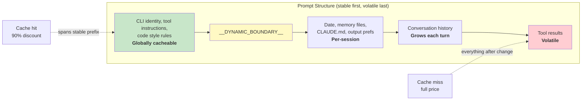

# 第十七章：效能 — 每一毫秒與 Token 都很重要

## 資深工程師的實戰手冊

在代理式系統中，效能最佳化不是一個問題，而是五個：

1. **啟動延遲** — 從按下按鍵到產生第一個有用輸出的時間。使用者會放棄啟動感覺緩慢的工具。
2. **Token 效率** — context window 中有用內容相對於額外開銷所佔的比例。Context window 是最受限的資源。
3. **API 成本** — 每一輪對話的花費金額。Prompt caching 可以降低 90% 的成本，但前提是系統必須在各輪對話之間維持 cache 的穩定性。
4. **渲染吞吐量** — 串流輸出期間的每秒幀數。第十三章已涵蓋渲染架構；本章涵蓋的是維持其高速運作的效能量測與最佳化。
5. **搜尋速度** — 在每次按鍵時，於包含 270,000 個路徑的程式碼庫中找到一個檔案所需的時間。

Claude Code 以從顯而易見（memoization）到精巧細緻（用於模糊搜尋預過濾的 26-bit bitmap）等技術，全面攻克這五個問題。關於方法論的說明：這些並非理論上的最佳化。Claude Code 內建 50 多個啟動效能分析檢查點，對 100% 的內部使用者與 0.5% 的外部使用者進行取樣。以下每一項最佳化都是由此儀器化數據所驅動，而非憑直覺。

---

## 節省啟動時的毫秒

### 模組層級的 I/O 平行化

進入點 `main.tsx` 刻意違反了「模組作用域不應有副作用」的原則：

```typescript
profileCheckpoint('main_tsx_entry');
startMdmRawRead();       // fires plutil/reg-query subprocesses
startKeychainPrefetch();  // fires both macOS keychain reads in parallel
```

兩個 macOS keychain 項目若循序同步呼叫，會花費約 65ms。透過在模組層級以 fire-and-forget promise 的方式同時啟動兩者，它們就能與約 135ms 的模組載入過程平行執行，而在這段時間內 CPU 原本會處於閒置狀態。

### API 預連線

`apiPreconnect.ts` 在初始化期間向 Anthropic API 發送一個 `HEAD` 請求，將 TCP+TLS 交握（100-200ms）與設定工作重疊進行。在互動模式下，重疊是不受限的 — 連線在使用者打字時暖身。該請求在 `applyExtraCACertsFromConfig()` 和 `configureGlobalAgents()` 之後發送，確保暖身的連線使用正確的傳輸設定。

### 快速路徑派發與延遲匯入

CLI 進入點包含針對特定子指令的提前返回路徑 — `claude mcp` 不會載入 React REPL，`claude daemon` 不會載入工具系統。重量級模組僅在需要時才透過動態 `import()` 載入：OpenTelemetry（約 400KB + 約 700KB gRPC）、事件記錄、錯誤對話框、上游代理。`LazySchema` 將 Zod schema 的建構延遲到第一次驗證時才執行，把成本推到啟動之後。

---

## 節省 Context Window 中的 Token

### Slot 保留：預設 8K，截斷時提升至 64K

影響最大的單一最佳化：

預設輸出 slot 保留為 8,000 個 token，在截斷時提升至 64,000。API 會為模型的回應保留 `max_output_tokens` 的容量。SDK 的預設值為 32K-64K，但生產環境數據顯示 p99 輸出長度為 4,911 個 token。預設值過度保留了 8-16 倍，每一輪浪費 24,000-59,000 個 token。Claude Code 將上限設為 8K，並在罕見的截斷發生時（不到 1% 的請求）以 64K 重試。對於 200K 的 window 而言，這是 12-28% 的可用 context 改善 — 而且完全免費。

### 工具結果的預算控制

| 限制 | 值 | 用途 |
|------|-----|------|
| 每個工具的字元數 | 50,000 | 超過時將結果持久化到磁碟 |
| 每個工具的 token 數 | 100,000 | 約 400KB 文字的上限 |
| 每則訊息的總計 | 200,000 字元 | 防止 N 個平行工具在一輪中耗盡預算 |

每則訊息的總計限制是關鍵洞察。沒有它的話，「讀取 src/ 中的所有檔案」可能產生 10 個平行讀取，每個回傳 40K 字元。

### Context Window 大小調整

預設的 200K token window 可透過模型名稱上的 `[1m]` 後綴或實驗分組擴展至 1M。當使用量接近上限時，一個四層壓縮系統會逐步摘要較舊的內容。Token 計數以 API 實際的 `usage` 欄位為基準，而非客戶端估算 — 以正確反映 prompt caching 折扣、thinking token 以及伺服器端轉換。

---

## 節省 API 呼叫的費用

### Prompt Cache 架構



Anthropic 的 prompt cache 基於精確的前綴匹配運作。如果前綴中有任何一個 token 發生變化，其後的所有內容都會是 cache miss。Claude Code 將整個 prompt 結構化，使穩定的部分在前、易變的部分在後。

當 `shouldUseGlobalCacheScope()` 回傳 true 時，dynamic boundary 之前的 system prompt 項目會獲得 `scope: 'global'` — 使用相同 Claude Code 版本的兩個使用者可以共享前綴 cache。當存在 MCP 工具時，global scope 會被停用，因為 MCP schema 是各使用者各異的。

### 黏性鎖定欄位

五個布林欄位使用「一旦開啟就不關閉」的模式 — 一旦為 true，在整個工作階段中保持 true：

| 鎖定欄位 | 它防止的問題 |
|----------|-------------|
| `promptCache1hEligible` | 工作階段中途的用量超額翻轉改變 cache TTL |
| `afkModeHeaderLatched` | Shift+Tab 切換導致 cache 失效 |
| `fastModeHeaderLatched` | 冷卻期進入/退出導致 cache 雙重失效 |
| `cacheEditingHeaderLatched` | 工作階段中途的設定切換導致 cache 失效 |
| `thinkingClearLatched` | 在確認 cache miss 後翻轉 thinking 模式 |

每一個都對應一個 header 或參數，若在工作階段中途變更，會使約 50,000-70,000 個 token 的已快取 prompt 失效。這些鎖定機制犧牲了工作階段中途的切換能力，以保全 cache。

### Memoize 過的工作階段日期

```typescript
const getSessionStartDate = memoize(getLocalISODate)
```

沒有這個的話，日期會在午夜變更，導致整個已快取的前綴失效。過時的日期只是外觀問題；cache 失效則會重新處理整段對話。

### 區段 Memoization

System prompt 區段使用兩層快取。大部分內容使用 `systemPromptSection(name, compute)`，快取直到 `/clear` 或 `/compact` 為止。核彈級選項 `DANGEROUS_uncachedSystemPromptSection(name, compute, reason)` 每一輪都重新計算 — 命名慣例迫使開發者記錄為何需要打破快取。

---

## 節省渲染時的 CPU

第十三章已深入探討渲染架構 — 緊湊的型別陣列、基於物件池的 interning、雙重緩衝以及 cell 層級的差異比對。這裡我們聚焦於維持其高速運作的效能量測與自適應行為。

終端渲染器透過 `throttle(deferredRender, FRAME_INTERVAL_MS)` 以 60fps 進行節流。當終端失去焦點時，間隔加倍至 30fps。捲動消化幀以四分之一間隔運行以達到最大捲動速度。這種自適應節流確保渲染永遠不會消耗超出必要的 CPU。

React Compiler（`react/compiler-runtime`）在整個程式碼庫中自動 memoize 元件渲染。手動的 `useMemo` 和 `useCallback` 容易出錯；compiler 從構造上就能正確處理。預分配的凍結物件（`Object.freeze()`）消除了常見渲染路徑值的記憶體配置 — 在 alt-screen 模式下每幀省下一次配置，經過數千幀的累積效果顯著。

完整的渲染管線細節 — `CharPool`/`StylePool`/`HyperlinkPool` interning 系統、blit 最佳化、損壞矩形追蹤、OffscreenFreeze 元件 — 請參閱第十三章。

---

## 節省搜尋時的記憶體與時間

模糊檔案搜尋在每次按鍵時執行，搜尋 270,000 個以上的路徑。三個最佳化層將其控制在數毫秒以內。

### Bitmap 預過濾器

每個已索引的路徑都獲得一個 26-bit bitmap，表示它包含哪些小寫字母：

```typescript
// Pseudocode — illustrates the 26-bit bitmap concept
function buildCharBitmap(filepath: string): number {
  let mask = 0
  for (const ch of filepath.toLowerCase()) {
    const code = ch.charCodeAt(0)
    if (code >= 97 && code <= 122) mask |= 1 << (code - 97)
  }
  return mask  // Each bit represents presence of a-z
}
```

搜尋時：`if ((charBits[i] & needleBitmap) !== needleBitmap) continue`。任何缺少查詢字母的路徑都會立即失敗 — 只需一次整數比較，無需任何字串操作。拒絕率：像 "test" 這樣的寬泛查詢約 10%，包含罕見字母的查詢則超過 90%。成本：每個路徑 4 bytes，270,000 個路徑約 1MB。

### 分數上限拒絕與融合式 indexOf 掃描

通過 bitmap 的路徑在進行昂貴的邊界/camelCase 評分之前，會先面對分數上限檢查。如果最佳情況的分數無法超過當前 top-K 閾值，該路徑就會被跳過。

實際的匹配過程使用 `String.indexOf()` 將位置查找與間距/連續加分計算融合在一起，該方法在 JSC（Bun）和 V8（Node）中都經過 SIMD 加速。引擎最佳化過的搜尋比手動的逐字元迴圈快得多。

### 非同步索引與部分可查詢性

對於大型程式碼庫，`loadFromFileListAsync()` 每約 4ms 的工作後讓出事件迴圈（基於時間而非計數 — 自適應於機器速度）。它回傳兩個 promise：`queryable`（在第一個區塊時 resolve，允許立即的部分搜尋結果）和 `done`（完整索引建構完成）。使用者可以在檔案列表可用後的 5-10ms 內開始搜尋。

讓出檢查使用 `(i & 0xff) === 0xff` — 一個無分支的 modulo-256 運算，以攤銷 `performance.now()` 的呼叫成本。

---

## 記憶體相關性的旁路查詢

有一項最佳化位於 token 效率與 API 成本的交叉點。如第十一章所述，記憶體系統使用輕量級的 Sonnet 模型呼叫 — 而非主要的 Opus 模型 — 來選擇要納入哪些記憶體檔案。其成本（在快速模型上最多 256 個輸出 token）相較於不納入無關記憶體檔案所節省的 token 而言微不足道。一個無關的 2,000 token 記憶體檔案所浪費的 context 成本，比旁路查詢的 API 呼叫成本還高。

---

## 推測性工具執行

`StreamingToolExecutor` 在工具於串流中出現時就開始執行，無需等待完整回應完成。唯讀工具（Glob、Grep、Read）可以平行執行；寫入工具需要獨佔存取。`partitionToolCalls()` 函式將連續的安全工具分組為批次：[Read, Read, Grep, Edit, Read, Read] 變成三個批次 — [Read, Read, Grep] 並行、[Edit] 序列、[Read, Read] 並行。

結果始終按照原始工具順序產出，以確保模型推理的確定性。一個同級的 abort controller 會在 Bash 工具發生錯誤時終止平行子程序，防止資源浪費。

---

## 串流處理與原始 API

Claude Code 使用原始串流 API，而非 SDK 的 `BetaMessageStream` 輔助工具。該輔助工具會在每個 `input_json_delta` 上呼叫 `partialParse()` — 在工具輸入長度上是 O(n^2) 的。Claude Code 累積原始字串，在區塊完成時才進行一次解析。

一個串流看門狗（`CLAUDE_STREAM_IDLE_TIMEOUT_MS`，預設 90 秒）會在沒有收到任何 chunk 時中止並重試，並在代理失敗時回退到非串流的 `messages.create()`。

---

## 實踐應用：代理式系統的效能

**稽核你的 context window 預算。** 你的 `max_output_tokens` 保留量與實際 p99 輸出長度之間的差距就是浪費的 context。設定一個緊湊的預設值，並在截斷時才提升。

**為 cache 穩定性而設計。** 你 prompt 中的每個欄位不是穩定的就是易變的。穩定的放前面，易變的放後面。將任何對話中途對穩定前綴的變更視為有金錢成本的 bug。

**平行化啟動 I/O。** 模組載入是 CPU 密集的。Keychain 讀取和網路交握是 I/O 密集的。在匯入之前啟動 I/O。

**使用 bitmap 預過濾器進行搜尋。** 一個廉價的預過濾器在昂貴的評分之前拒絕 10-90% 的候選項目，以每個條目 4 bytes 的成本帶來顯著的效能提升。

**在重要的地方量測。** Claude Code 有 50 多個啟動檢查點，對內部 100% 取樣、對外部 0.5% 取樣。沒有量測的效能工作只是猜測。

---

最後一點觀察：這些最佳化大多數在演算法上並不複雜。Bitmap 預過濾器、環形緩衝區、memoization、interning — 這些都是資訊科學的基礎。精妙之處在於知道在哪裡應用它們。啟動效能分析器告訴你毫秒花在哪裡。API usage 欄位告訴你 token 花在哪裡。Cache 命中率告訴你錢花在哪裡。先量測，再最佳化，始終如此。
