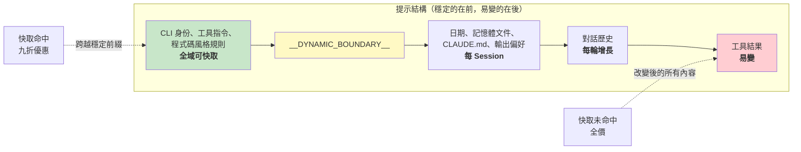

# 第十七章：效能 -- 每一毫秒和 Token 都很重要

## 資深工程師的攻略

agentic 系統中的效能最佳化不是一個問題。而是五個：

1. **啟動延遲** -- 從按鍵到第一個有用輸出的時間。使用者會放棄感覺啟動緩慢的工具。
2. **Token 效率** -- context window 中被有用內容消耗的比例，相對於開銷。context window 是最受限的資源。
3. **API 成本** -- 每輪的美元金額。提示快取可以減少 90%，但只有在系統保持跨輪次的快取穩定性時才行。
4. **渲染吞吐量** -- 串流輸出時的幀率。第十三章涵蓋了渲染架構；本章涵蓋保持其快速的效能測量和最佳化。
5. **搜尋速度** -- 在每次按鍵時，在 270,000 個路徑的程式碼庫中找到文件的時間。

Claude Code 用從顯而易見（memoization）到微妙（用於模糊搜尋預過濾的 26 位元位圖）的技術攻擊所有五個問題。方法論說明：這些不是理論上的最佳化。Claude Code 附帶 50 多個啟動剖析檢查點，在 100% 的內部使用者和 0.5% 的外部使用者中採樣。以下每個最佳化都由來自這個儀表化的數據驅動，而非直覺。

---

## 在啟動時節省毫秒

### 模組級別的 I/O 平行

入口點 `main.tsx` 刻意違反「模組範圍中無副作用」：

```typescript
profileCheckpoint('main_tsx_entry');
startMdmRawRead();       // 啟動 plutil/reg-query 子程序
startKeychainPrefetch();  // 平行啟動兩個 macOS keychain 讀取
```

否則兩個 macOS keychain 項目會花費約 65ms 的順序同步產生。透過在模組層級以即發即忘 promise 的方式啟動兩者，它們在模組載入的約 135ms 期間平行執行，而這段時間 CPU 否則會閒置。

### API 預連接

`apiPreconnect.ts` 在初始化期間向 Anthropic API 觸發一個 `HEAD` 請求，將 TCP+TLS 握手（100-200ms）與設置工作重疊。在互動模式下，重疊是無界的——連接在使用者輸入時預熱。請求在 `applyExtraCACertsFromConfig()` 和 `configureGlobalAgents()` 之後觸發，因此預熱的連接使用正確的傳輸配置。

### 快速路徑分發和延遲 Import

CLI 入口點包含專用子命令的提前返回路徑——`claude mcp` 從不載入 React REPL，`claude daemon` 從不載入工具系統。重型模組只在需要時透過動態 `import()` 載入：OpenTelemetry（約 400KB + 約 700KB gRPC）、事件日誌、錯誤對話框、upstream proxy。`LazySchema` 將 Zod schema 建構推遲到第一次驗證，將成本推過啟動。

---

## 在 Context Window 中節省 Token

### 槽位保留：預設 8K，升級 64K

最具影響力的單個最佳化：

預設輸出槽位保留是 8,000 個 token，在截斷時升級到 64,000。API 為模型的回應保留 `max_output_tokens` 的容量。預設 SDK 值是 32K-64K，但生產數據顯示 p99 輸出長度是 4,911 個 token。預設過度保留了 8-16 倍，每輪浪費 24,000-59,000 個 token。Claude Code 上限為 8K，並在少數截斷時（<1% 的請求）以 64K 重試。對於 200K 視窗，這是可用上下文的 12-28% 改善——免費的。

### 工具結果預算

| 限制 | 值 | 目的 |
|------|-----|------|
| 每工具字元 | 50,000 | 超出時結果持久化到磁碟 |
| 每工具 token | 100,000 | 約 400KB 文字上限 |
| 每訊息聚合 | 200,000 字元 | 防止 N 個並行工具在一輪中超出預算 |

每訊息聚合是關鍵洞察。沒有它，「讀取 src/ 中的所有文件」可能產生 10 個並行讀取，每個返回 40K 字元。

### Context Window 大小

預設 200K token 視窗可透過模型名稱上的 `[1m]` 後綴或實驗處理擴展到 1M。當使用量接近限制時，一個 4 層壓縮系統逐步總結較舊的內容。Token 計數錨定在 API 的實際 `usage` 欄位，而非客戶端估算——考慮了提示快取積分、thinking token 和伺服器端轉換。

---

## 在 API 呼叫上節省金錢

### 提示快取架構



Anthropic 的提示快取基於精確的前綴匹配。如果中間前綴有單個 token 改變，其後所有內容都是快取未命中。Claude Code 結構化整個提示，使穩定部分在前，易變部分在後。

當 `shouldUseGlobalCacheScope()` 返回 true 時，動態邊界之前的系統提示條目得到 `scope: 'global'`——運行相同 Claude Code 版本的兩個使用者共享前綴快取。當 MCP 工具存在時，Global scope 停用，因為 MCP schema 是每使用者的。

### 黏性鎖定欄位

五個 boolean 欄位使用「黏性啟用」模式——一旦為 true，在 session 的剩餘時間內保持為 true：

| 鎖定欄位 | 防止什麼 |
|----------|---------|
| `promptCache1hEligible` | session 中期超額翻轉改變快取 TTL |
| `afkModeHeaderLatched` | Shift+Tab 切換破壞快取 |
| `fastModeHeaderLatched` | 冷卻進入/退出雙重破壞快取 |
| `cacheEditingHeaderLatched` | session 中期配置切換破壞快取 |
| `thinkingClearLatched` | 在確認的快取未命中後翻轉 thinking 模式 |

每個對應一個標頭或參數，如果在 session 中期改變，將破壞約 50,000-70,000 個快取的提示 token。鎖定犧牲了 session 中期切換以保護快取。

### Memoize Session 日期

```typescript
const getSessionStartDate = memoize(getLocalISODate)
```

沒有這個，日期會在午夜改變，破壞整個快取前綴。陳舊的日期是表面的；快取破壞重新處理整個對話。

### Section Memoization

系統提示 section 使用兩層快取。大多數內容使用 `systemPromptSection(name, compute)`，快取到 `/clear` 或 `/compact`。核選項 `DANGEROUS_uncachedSystemPromptSection(name, compute, reason)` 每輪重新計算——命名慣例強制開發者說明為什麼快取破壞是必要的。

---

## 在渲染中節省 CPU

第十三章深入涵蓋了渲染架構——緊湊的 typed array、基於池的內化、雙緩衝和格級差分。這裡我們重點關注保持其快速的效能測量和自適應行為。

終端渲染器透過 `throttle(deferredRender, FRAME_INTERVAL_MS)` 以 60fps 節流。當終端失焦時，間隔加倍到 30fps。捲動排空幀以四分之一間隔運行以達到最大捲動速度。這種自適應節流確保渲染從不消耗超過必要的 CPU。

React Compiler（`react/compiler-runtime`）在整個程式碼庫中自動 memoize 元件渲染。手動的 `useMemo` 和 `useCallback` 容易出錯；編譯器通過建構得到正確。預分配的凍結物件（`Object.freeze()`）消除了常見渲染路徑值的分配——在 alt-screen 模式下每幀節省一次分配，在數千幀中累積。

關於完整的渲染管線細節——`CharPool`/`StylePool`/`HyperlinkPool` 內化系統、blit 最佳化、損壞矩形追蹤、OffscreenFreeze 元件——請見第十三章。

---

## 在搜尋中節省記憶體和時間

模糊文件搜尋在每次按鍵時運行，搜尋 270,000 多個路徑。三個最佳化層將其保持在幾毫秒以內。

### 位圖預過濾

每個索引路徑獲得一個包含 26 位元的位圖，表示它包含哪些小寫字母：

```typescript
// 偽程式碼 — 說明 26 位元位圖概念
function buildCharBitmap(filepath: string): number {
  let mask = 0
  for (const ch of filepath.toLowerCase()) {
    const code = ch.charCodeAt(0)
    if (code >= 97 && code <= 122) mask |= 1 << (code - 97)
  }
  return mask  // 每個位元代表 a-z 的存在
}
```

搜尋時：`if ((charBits[i] & needleBitmap) !== needleBitmap) continue`。任何缺少查詢字母的路徑立即失敗——一次整數比較，無字串操作。拒絕率：廣泛查詢如「test」約 10%，含有稀有字母的查詢 90% 以上。成本：每路徑 4 位元組，270,000 個路徑約 1MB。

### 分數上限拒絕和融合 indexOf 掃描

通過位圖的路徑在昂貴的邊界/駝峰命名評分之前面臨分數上限檢查。如果最佳情況分數無法超過當前 top-K 閾值，路徑被跳過。

實際匹配使用 `String.indexOf()` 融合位置查找與間隙/連續獎勵計算，在 JSC（Bun）和 V8（Node）中都有 SIMD 加速。引擎的最佳化搜尋明顯快於手動字元迴圈。

### 帶部分可查詢性的非同步索引

對於大型程式碼庫，`loadFromFileListAsync()` 每約 4ms 工作（基於時間，而非計數——適應機器速度）向事件迴圈讓步。它返回兩個 promise：`queryable`（在第一塊時解析，立即啟用部分結果）和 `done`（完整索引完成）。使用者可以在文件列表可用後 5-10ms 內開始搜尋。

讓步檢查使用 `(i & 0xff) === 0xff`——無分支的 modulo-256 以分攤 `performance.now()` 的成本。

---

## 記憶體相關性旁查詢

一個最佳化位於 token 效率和 API 成本的交叉點。如第十一章所述，記憶體系統使用輕量的 Sonnet 模型呼叫——而非主要的 Opus 模型——來選擇要包含哪些記憶體文件。成本（快速模型上 256 個最大輸出 token）與不包含不相關記憶體文件節省的 token 相比是微不足道的。單個不相關的 2,000 token 記憶體在浪費的上下文中的成本，超過了旁查詢在 API 呼叫上的成本。

---

## 推測性工具執行

`StreamingToolExecutor` 在工具串流時就開始執行，在完整回應完成之前。唯讀工具（Glob、Grep、Read）可以並行執行；寫入工具需要獨佔存取。`partitionToolCalls()` 函式將連續的安全工具分組為批次：[Read, Read, Grep, Edit, Read, Read] 變成三批——[Read, Read, Grep] 並發，[Edit] 序列，[Read, Read] 並發。

結果始終以原始工具順序產生，以確保模型推理的確定性。當 Bash 工具報錯時，兄弟 abort 控制器終止並行子程序，防止資源浪費。

---

## 串流和原始 API

Claude Code 使用原始串流 API，而非 SDK 的 `BetaMessageStream` 輔助工具。輔助工具在每個 `input_json_delta` 上呼叫 `partialParse()`——工具輸入長度的 O(n^2)。Claude Code 累積原始字串，並在區塊完成時一次性解析。

串流看門狗（`CLAUDE_STREAM_IDLE_TIMEOUT_MS`，預設 90 秒）在沒有塊到達時中止並重試，在代理失敗時退回到非串流的 `messages.create()`。

---

## 應用實踐：agentic 系統的效能

**審計你的 context window 預算。** 你的 `max_output_tokens` 保留與實際 p99 輸出長度之間的差距是浪費的上下文。設置緊湊的預設值並在截斷時升級。

**為快取穩定性設計。** 你提示中的每個欄位都是穩定的或易變的。穩定的放在前面，易變的放在後面。將對話中期對穩定前綴的任何改變視為帶有美元成本的 bug。

**平行化啟動 I/O。** 模組載入是 CPU 密集型的。Keychain 讀取和網路握手是 I/O 密集型的。在 import 之前啟動 I/O。

**使用位圖預過濾進行搜尋。** 在昂貴評分之前拒絕 10-90% 的候選者的廉價預過濾器，每個條目 4 位元組是顯著的勝利。

**在重要的地方測量。** Claude Code 有 50 多個啟動檢查點，在內部 100% 採樣，外部 0.5% 採樣。沒有測量的效能工作是猜測。

---

最後一個觀察：這些最佳化中的大多數在算法上並不複雜。位圖預過濾、循環緩衝區、memoization、內化——這些是 CS 基礎知識。複雜性在於知道在哪裡應用它們。啟動剖析器告訴你毫秒在哪裡。API 使用欄位告訴你 token 在哪裡。快取命中率告訴你錢在哪裡。先測量，後最佳化，始終如此。
